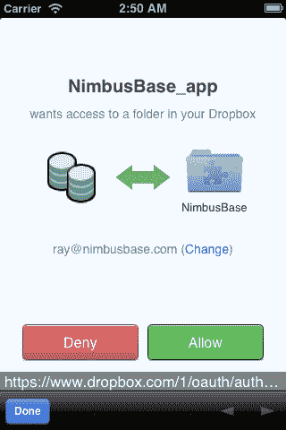
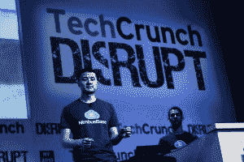
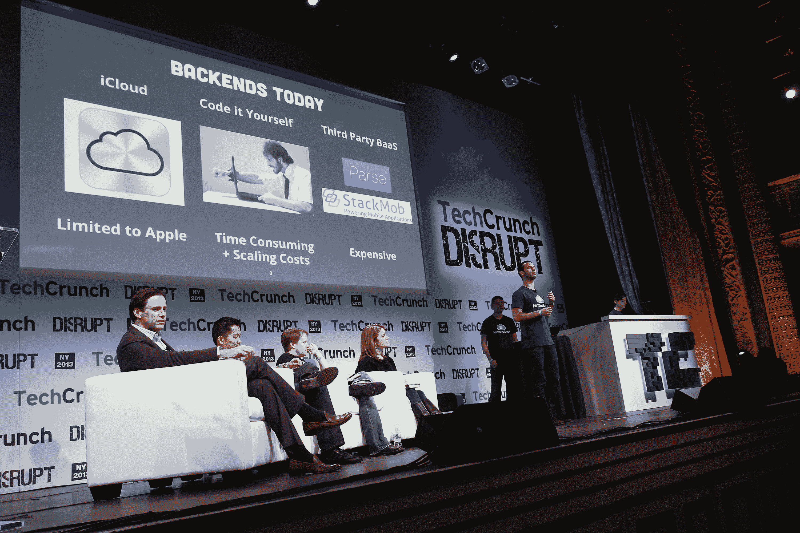
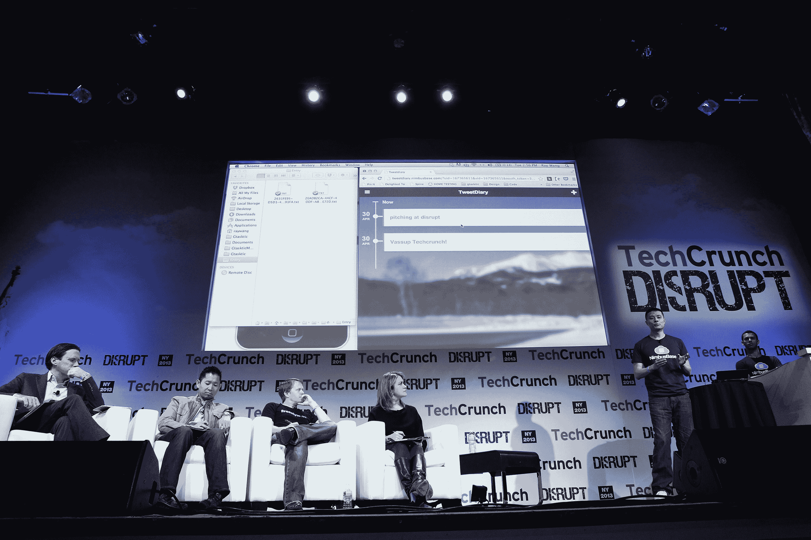

# NimbusBase 在 Disrupt NY 推出适用于任何平台的 iCloud

> 原文：<https://web.archive.org/web/https://techcrunch.com/2013/04/30/nimbusbase-launches-an-icloud-for-any-platform-at-disrupt-ny-lets-users-store-their-data-on-dropbox-or-google-drive/>

很难衡量苹果的 iCloud 到底有多受欢迎，但其背后的想法是可靠的:给开发者一个保存用户数据的地方，让用户控制这些数据，并允许开发者专注于他们的应用而不是存储。今天在 TechCrunch Disrupt NY 2013 上发布的 NimbusBase 正是基于这一点，巧妙的将数据存储在用户选择的云中。目前，NimbusBase 支持 Dropbox 和 Google Drive，SkyDrive 和其他提供商预计将在不久的将来推出。

NimbusBase 的纽约创始人 Ray Wang(首席技术官)和 Alex Volodarsky(首席运营官)告诉我，开发人员目前有三种选择。他们可以使用 iCloud，但那仅限于 iOS 他们可以构建自己的存储基础架构，然后为服务器空间付费；或者他们可以使用专门的后端服务，但这些服务往往会收取额外的存储费用。

 借助 NimbusBase，开发人员可以轻松地将他们从这些工具中获得的相同功能集成到他们自己的应用程序中，而没有任何麻烦，因为云存储提供商为开发人员和用户处理所有的存储基础架构。开始时，开发者只需要在他们的应用程序中添加几行代码，剩下的交给 NimbusBase 处理。目前，NimbusBase 仅适用于网络应用，但该团队计划很快发布其 Android 和 iOS 集成。

当然，像 Dropbox 这样的服务并不是为应用程序设计的存储后端，应用程序通常使用数据库来存储用户的数据。NimbusBase 通过首先将数据存储在本地 SQLite 数据库(或本地文件)中，然后将数据分割成与用户存储服务同步的小文件来解决这个问题。

除了存储，这些云存储提供商还充当应用程序的事实上的用户帐户——只需用你的 DropBox 或 SkyDrive 帐户登录——因此开发人员也不必担心这一点。

 对于用户来说，这也意味着他们对自己的数据保持完全的控制权。不喜欢这个应用了吗？只需清除 Dropbox 帐户中的目录，就大功告成了。你可以试试 NimbusBase 的[演示应用](https://web.archive.org/web/20221209053245/http://tweetdiary.nimbusbase.com/)，看看这在实践中是如何运作的。

为了确保 Dropbox 和谷歌在 NimbusBase 如何使用他们的服务方面不会有任何问题，该团队与这两家公司进行了交谈，以解释其服务，并获得了他们的许可。

目前，NimbusBase 提供了一个免费计划——其所谓的“黑客计划”——开发者可以使用该计划来构建和测试他们的应用。一旦他们准备好推出他们的服务，他们将不得不为企业计划支付 500 美元/年。该团队告诉我，对于一个受欢迎的应用程序来说，这应该是一个“显而易见”的事情，因为无论该应用程序有 1000 或 100 万用户，或者这些用户是否保存了一些文本文件或高分辨率照片，他们都只需支付固定费用。当然，用户将不得不在某个时候开始向他们的云存储提供商付费。

NimbusBase 只适用于网络应用。该公司的下一个路线图是一个 Android 版本，允许 Android 开发者在谷歌平台上复制 iCloud 的数据同步功能。该团队还在考虑向 NimbusBase 的功能集添加加密功能。

到目前为止，王和沃洛达斯基已经启动了他们去年 8 月成立的公司。这两家公司正在积极寻找额外的资金来雇佣更多的工程师，并将 NimbusBase 扩展到 Drive 和 Dropbox 之外。

**扰乱问&答**:

**问**:定价是多少？
**答**:先免费，然后是年费。

问:从现在起一年后，这将走向何方？
**答**:最初，将专注于移动开发者，并开始支持更多平台。

**问**:这个有多难做？
**答**:“我们认为这很难，因为对于希望与每个云提供商集成的人来说，这很难做到。”与个人云同步并不简单。

问:你能告诉我这个问题的范围吗？
**答**:构建基础设施对开发者来说很难，用户想要控制他们的数据。

问:你的销售策略是什么？
**答**:开发者工具是病毒性的。开发者一旦使用，就会互相告知，会主动联系其他人。

