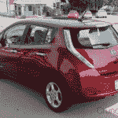
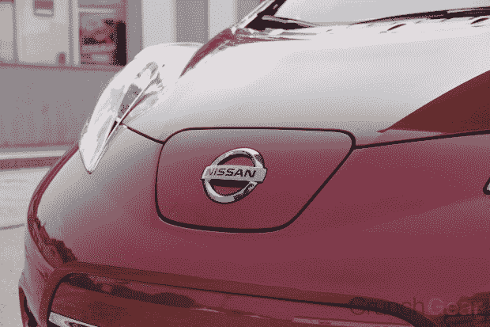
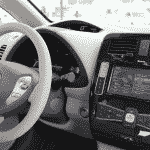
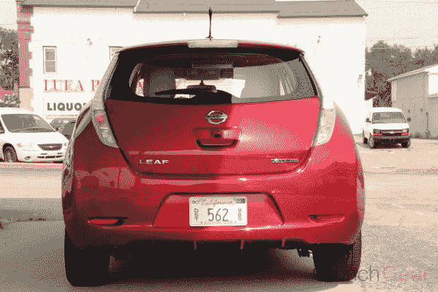

# 日产 Leaf Review:面向大众的有趣且实用的电动汽车 

> 原文：<https://web.archive.org/web/http://techcrunch.com/2011/06/29/nissan-leaf-review/>

如果道路足够平坦，当你以每小时 35 英里的速度行驶时，你可以听到鸟儿的鸣叫。打开窗户。日产聆风就是这么安静。当车速低于 30 英里/小时时，动力系统只会发出轻微的电动呜呜声，超过 45 英里/小时时，车轮会发出持续的嗡嗡声。但是在 30 岁和 45 岁之间有一个特殊的点，这两者以一种相互抵消的方式结合在一起，你会发现自己在听大自然母亲的配乐。

在过去的一周里，尼桑 Leaf 一直在我的生活中。我已经在轮胎上跑了几百英里，还在方向盘后面吃了几顿饭，试图了解她。你看，虽然我很痛苦地说(后面会有更多的内容)Leaf 是一辆真正的车。它感觉不像是一辆美化了的高尔夫球车或仅仅用于运输的工具。这是一辆车，随之而来的是怪癖、缺陷，但最重要的是，一种个性和灵魂。

叶子现在是无与伦比的。世界上没有一种交通工具可以让树叶称之为伙伴，或者，如果你愿意，可以称之为竞争对手。这是目前世界上唯一一款量产的电动汽车。伏特吗？这是一种不同类型的车辆，实际上是一种混合动力车辆，确实有电动模式，但它仅限于 40 英里的纯电动行驶，在电动马达熄火后，一台燃气发动机会启动为其提供动力。特斯拉？当然，跑车是远程电动汽车，但价格超过 10 万美元，还有一长串的等待名单。对于那些寻求完全抛弃汽油，同时又不牺牲标准的物质享受或货物空间的买家来说，Leaf 是唯一的选择。

 
日产在十个国家销售不同装饰水平的聆风。我驾驶的是美国的 SL 车型，它基本上是一个 940 美元的配件包，伪装成不同的装饰水平。SL 车型没有任何额外的硬件来扩大电动车的有限范围；虽然在后扰流板上有一个小小的太阳能电池板，但它只是用来保持附件电池处于关闭状态。

走进树叶，你会发誓你在任何一个日本经济盒子里。柔软的织物和许多中性颜色的塑料被用于整个不伦不类的内部。它很宽敞，有很多净空高度。后排座椅有点紧，但位置比前排高(它们坐在电池上面)，这给人一种居高临下的感觉。你不会从外观设计上猜到这一点，但实际上后座后面有一吨的货物空间，堪比许多较小的跨界车。与雪佛兰的 Volt 不同，日产显然不遗余力地让 Leaf 没有攻击性，从内部看起来像任何其他汽车。

 后一种说法不适用于外观设计。这是…独一无二的，我不知道是不是好的方面。它泡沫丰富，但同时又棱角分明。后尾灯比凯迪拉克上发现的任何东西都更高更锐利，微笑的前仪表板似乎来自皮克斯电影*汽车*。我不是粉丝。

但我不得不说这个设计令人难忘。乍一看，它可能像一个新的日产 Versa，甚至是一个普锐斯。然后，强烈的设计线索成为焦点:高而尖的尾灯，流动的大灯，以及包括充电端口的双引擎罩设计。树叶当然是不同的。

不过，这款车的设计并不重要。世界各地的人们并不是因为它的外观而购买它。不，他们买它是因为它是一种实用的电动汽车。

电动汽车并不是什么新鲜事。费迪南德·保时捷在 1899 年制造了第一辆电动汽车，此后几乎每家汽车制造商都生产了好几辆。通用汽车的 EV1 是世界上第一款大规模生产的电动汽车，从 1996 年到 1999 年租赁。丰田销售 RAV4 电动汽车已有数年，与特斯拉汽车公司的合作将使其回归。此外，还有数不清的教练制造的电动汽车，由世界各地的几十家公司生产。

叶子很简单。它宣传的行驶里程为 100 英里，和其他汽车一样。“保持简单，愚蠢”的口号让日产能够在十个不同的市场向所有类型的买家有效地销售这款车。内部没有感应按钮或完全不同的仪表组(如雪佛兰 Volt)或大规模的 Nvidia 驱动的触摸屏信息娱乐系统(如特斯拉 Model S)。Leaf 只是另一辆汽车，但它是用电而不是汽油驱动的。

在我使用 leaf 的一周时间里，我花了一个下午测试 Leaf 的城市驾驶范围，发现电池在 Eco 模式下可以持续 90 英里。这比宣传的范围少 10 英镑，但据我所知，这种情况很普遍。互联网上充斥着关于 Leaf 不符合日产声明的报道。在我的测试中，我在拥堵的城市道路上连续行驶了四个小时，从未超过 45 英里/小时。我相信大部分时间我都在 20 到 30 英里/小时之间。

虽然 10%的正负方差是合适的，但我完全袖手旁观这 90 英里的索赔。我进行测试的目标是从电池中挤出每英里的电量。我开车时没有前灯或气候控制系统。我甚至把收音机的音量调得很低，尽管车载电池表显示这毫无意义，也不会减少电池的消耗；我想确保我给了这片叶子一个公平的机会。

90 英里是一个不错的距离，但我认为 4 小时的城市驾驶是一个更好的衡量标准。我开车跑遍了整个县。我花时间参观了我的城市中我从来没有理由去参观的部分。我无处可去。正是这个时间长度，而不是实际的距离，让我相信了 Leaf 的真正能力。

叶子知道它并不适合每个人。有限的范围限制了它在国内的旅行。但它不介意在镇上闲逛。上下班，跑腿，上学；叶子可以处理所有这些。它就是为这一切而建造的。

我住在密歇根州弗林特的郊区。我上面的小测试主要是在市区进行的，这不是我的正常区域或驾驶条件。我住在道路漫长而空旷的地方。弗林特也是空的，但在我的小镇，这是故意的，不是因为贫穷。在这里，树叶也能保持原样。没有太多的走走停停，通过再生制动给电池充电，所以持续时间不长。但是在我和 Leaf 在一起的一周里，我从来没有感觉到我会耗尽电池的电量。

高速公路巡航会更快地耗尽电池。虽然由于时间有限，我没有在公路范围内进行专门的测试，但在我使用 Leaf 的一周内，我发现在 70 英里/小时的限速下，电池电量会下降到 50-60 英里。那个量表不像煤气表那样是一个确定的计数器。它告诉司机根据*当前*的驾驶条件，Leaf 还会行驶多长时间。因此，在我的几次高速公路旅行中，当我以 70 英里/小时的速度行驶时，计价器显示 50 英里，当我离开高速公路并降低速度时，它会提高 10 英里左右。

给树叶充电相当简单。它配有 25 英尺 110/120V 充电电缆，但所有者应该投资 220/240 站，以三分之一的时间为 Leaf 充电。给完全没电的电池充电，110 需要 22 小时，而 220v 只需要 7 小时 30 分钟。我在给树叶充电时遇到了问题，但这完全是我的车库的错。叶子需要接地插座，而我的插座显然没有。这是在你购买之前值得考虑的事情，否则像我一样，你可能会有一根电缆从你的厨房窗户垂下一个星期。

暂时忘记范围。有很多次旅行，我知道我有很多，比如说，油箱里的电压。树叶很有趣。电动动力系统提供了充足的扭矩，所以叶片实际上是灵活的。小轮胎不是高性能橡胶，所以在交通中颠簸不是最好的主意，但如果你踩油门，你的头会很快找到头枕。日产没有提供 0-60 统计，但许多人发现它在 7 秒左右达到 60 英里每小时。真快。

 不过叶子也不是没有瑕疵。高姿态和小轮胎使得有些不稳定，笨拙的驾驶特性。这不是周末赛车。尽管前轮驱动配置有助于纠正过度补偿，但在转弯时踩电动马达将导致“OMG 我翻车了”的反应。感觉更多的能量来自扭矩电机。

无害的内部在某种程度上实际上是令人讨厌的——至少对我来说是这样。它是灰色中的灰色，带有一丝个性。它看起来真的像是过去 10 年里制造的每一辆日本经济型汽车的混搭。唯一的一点乐趣来自齿轮选择器，这是一个小的四向蓝色冰球。它实际上看起来有点格格不入，虽然低调的设计效果很好。

 
车载信息娱乐系统至少是发达的。大触摸屏具有导航、媒体控制和大量关于电气系统的信息。钥匙信息屏幕(如上图所示)显示了电机和电气系统的电池电流消耗。想知道开空调对电池的影响有多大？屏幕上写着(上图中 5 英里)。

收音机和媒体功能就像现代技术装备的轿车一样。有 XM/Sirius、AM/FM、蓝牙音频流和 CD 播放器。这些扬声器平淡无奇，毫无生气——并不是说任何人都希望科顿茅斯国王队离开他们的舞台。

Leaf 生态系统的一个有趣部分是一个配套的 iOS 应用程序。这个轻量级的应用程序允许车主管理  g 次，并监控电池寿命。他们还可以安排关于可用范围和充电状态的通知。不过奇怪的是，这款应用不允许像通用汽车上的应用那样远程解锁或锁定车辆。只是为了电动力总成。一款 Android 风格的应用显然正在开发中，但目前它只是一款 iOS 应用。

尽管我很喜欢 Leaf，但它显然是一款低价车，但动力系统很昂贵。这款车缺少很多价格超过 3 万美元的汽车的传统标准功能。在许多次要项目中，值得注意的是丢失了电动可调座椅、伸缩式转向柱、可调踏板和电动举升门。这些选项中的一些可能被作为减轻重量的措施而被排除在外，但买家应该知道，在相同的价格点上，Leaf 并不具备相同的功能。

未来的车型至少会增加加热方向盘和座椅。正如一位日产代表告诉我的，这些选项比传统的客舱加热系统使用更少的电池。加热正确的接触点，你就加热了身体，他说。切弗也知道这一点。Volt 具有这两种标准配置，也是通用汽车销售的唯一一款带有加热布座椅的汽车。

我完全被树叶迷住了。在我看来，这是完美的第二辆车。我有两个小孩，他们碰巧坐在宽大的汽车座椅上。它们很适合叶子。这是一个很好的旅客捷运系统。但是没有比免费在城里跑来跑去更好的了。这才是我真正喜欢的。

上周我在树叶上画了 355 英里。我的道奇 Magnum 在市区每加仑能跑 17 英里，我会用掉大约 20 加仑的汽油；按照每加仑 3.5 美元的价格，这相当于 70 美元左右。Leaf 的电池容量为 24kW，我当地的电力公司每千瓦时收费 0.072567 美元。这意味着我只需花费约 1.74 美元就可以将 Leaf 从空充满电，我一共充了三次电，只充了几次电——但为了简化计算，我们假设充了四次电。这意味着这辆聆风只花了我 7.01 美元就能行驶 350 英里——或者，你可以把它想象成每 1 美元行驶 50 英里。当然，这是我的价格，你的里程会根据电费的不同而不同，但应该在几美元之内，肯定不会像汽油那么多。

Leaf 并不完美，其 33，000 美元的车窗贴纸是主要缺点之一。它很贵，但内部感觉很便宜。但它很有趣，实用，如果你看看汽油的后端成本，这辆车是相当划算的。许多城市司机可能只为节省的汽油买单。只要购买者知道他们不会得到他们习惯的所有物质享受，那么 Leaf 就是一辆好车。

至少叶子没有错过任何有趣的部分。电动马达有足够的魅力让大多数人微笑，同时让人们在镇上跑来跑去。它配备了 XM、蓝牙流媒体等所有媒体功能，所有这些都是通过一个大触摸屏完成的。

所以我在这里，咽下我的骄傲，推荐叶子。你看，就像我说的几个帖子，我应该是一个雪佛兰伏特球迷。我来自美好的城市弗林特，这里恰好是通用汽车的诞生地，我一直在为 Volt 的无限续航里程辩护，为 4 万美元的价格辩护，同时嘲笑我的编辑同事 Devin 报道了我认为是蹩脚的叶子。这一承认并没有削弱 Volt 的优势，但 Leaf 的纯电动动力系统运行成本几乎为零，使其成为完美的城市汽车。**强烈推荐。**