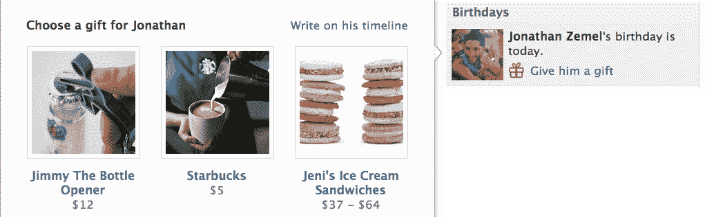
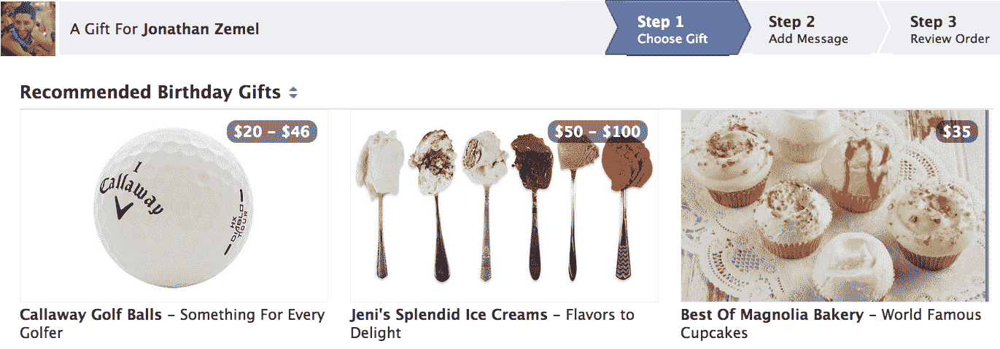

# 想象一下脸书没有广告。如果您尝试 TechCrunch，这很容易

> 原文：<https://web.archive.org/web/https://techcrunch.com/2012/09/30/no-ads-on-facebook/>

脸书必须展示更多的广告来赚更多的钱，对吗？不对。或者至少不一定。如果它扩展其新的[异地广告网络](https://web.archive.org/web/20221005181147/https://beta.techcrunch.com/2012/09/18/facebook-mobile-ad-network/)和[礼品电子商务产品](https://web.archive.org/web/20221005181147/https://www.facebook.com/about/gifts)，它可以依靠数据，而不是流量来增加收入。这将使其网站和应用程序保持整洁，旨在最大限度地增加乐趣、分享量和我们的联系感，而不是页面浏览量。

你可能会说我是个梦想家…

直到一个月前，世界还认为脸书被困在一块正在下沉的岩石和一个难以赚钱的地方之间。事实是[用户群正在从桌面](https://web.archive.org/web/20221005181147/https://beta.techcrunch.com/2012/05/11/time-spent-on-facebook-mobile/)转移到微小的移动屏幕，在桌面[脸书可以每页显示多达十个广告](https://web.archive.org/web/20221005181147/http://www.insidefacebook.com/2012/07/10/facebook-now-displays-up-to-10-ads-on-a-single-page/)并收取 30%的游戏费用。

这对投资者来说是可怕的，对用户体验来说是个坏兆头。许多人认为，脸书唯一的解决办法是在手机上展示大量广告。华尔街甚至不相信用户会点击它们或者广告商会购买它们。事实证明[脸书的移动广告点击率令人印象深刻](https://web.archive.org/web/20221005181147/https://beta.techcrunch.com/2012/06/19/facebook-mobile-ads/)和[广告商正在为它们排队](https://web.archive.org/web/20221005181147/https://beta.techcrunch.com/2012/09/27/cheapest-way-to-buy-facebook-fans/)，但是社交网络仍然需要用广告淹没来自我们朋友的有机新闻内容。

但是脸书动作很快。这是在 Zynga.com 测试场外网络展示广告，这是建立广告网络的第一步。几周前，它透露将开始让广告商付费给它，让它使用我们丰富的传记和社交数据，更好地在非脸书移动网站和应用程序上显示广告——本质上是一个脸书移动广告网络。

然后在周四[脸书推出了 Gifts](https://web.archive.org/web/20221005181147/https://beta.techcrunch.com/2012/09/27/facebook-gifts/) ，它进入电子商务市场，建议并让用户为朋友购买真正的礼物和电子礼品卡。它从每笔销售中赚取一定比例的利润。

#### 更少的广告，更多的收入

凭借这两种产品，脸书开辟了通往财务成功的第二条道路。

最初的途径:将用户在网站和应用上花费的**惊人的时间货币化。**

新的第二条路:货币化**难以置信的数据量**当用户在别处消磨时间时，it 必须向他们投放广告，并向他们推荐相关的商品。

第二条道路的两个分支都将帮助脸书避免一个根本性的陷阱。广告支持服务面临的妥协是:“我们如何完成我们的使命，提供尽可能好的服务，同时用尽可能多的广告分散人们的注意力，干扰服务？”

自推出以来，脸书令人称道地向有利于用户体验的方向倾斜，尽量减少广告的出现，并专注于使它们尽可能相关。但是上市带来了挣更多钱的压力。重新调整收支平衡有可能让脸书变得更糟。

但第二条道路更微妙，它将赚钱与让世界变得更加开放和互联联系在一起。它所需要的是你分享，你感觉和你的朋友很亲近。

很多网络广告都是不相干的打扰。但脸书的广告网络允许它使用你的性别、年龄、位置、工作经历、兴趣、朋友和应用活动来帮助其他网站和应用向你展示你想要的东西的广告。这意味着它不用展示更多的广告就能赚更多的广告费。

Gifts 分析您选择购买礼物的人的个人资料，并向具有类似特征的用户推荐其他人赠送的产品。脸书对你了解得越多，它就能越好地向你的朋友推荐该给你买什么。脸书越了解谁是你最好的朋友，他们的生日等重要时刻是什么时候，它就越能准确地建议你应该给谁买礼物。

我并不是说脸书上的广告会很快消失，甚至永远消失，但这是它可能前进的方向。少放广告或者至少不多放广告有很大的好处。也就是说，一个没有广告的脸书体验将不会那么烦人，并且会鼓励更多的浏览和分享。

有一个条件。对于大多数人来说，脸书悄悄地利用他们的数据来改善场外广告和现场电子商务不会是太大的交易。否则他们甚至不会真正明白发生了什么。然而，直言不讳的少数人可能会大声反对他们的脸书数据被用于针对他们的广告，这些广告如此相关，以至于看起来令人毛骨悚然。但是脸书总是不得不与这些人打交道，到目前为止还没有造成太大的问题。

因此，当你现在想到脸书时，请记住用户体验和广告量之间的平衡不是零和游戏。事实上，如果脸书的数据处理得当，它展示的广告数量有朝一日可能会接近零。

“世界将合而为一。”抱歉，[约翰](https://web.archive.org/web/20221005181147/http://www.johnlennon.com/)。