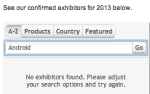

# 没有可爱的安卓胸针，没有施密特，没有幻灯片:谷歌今年在 MWC 低调亮相 TechCrunch

> 原文：<https://web.archive.org/web/https://techcrunch.com/2013/02/18/no-cute-android-pins-no-schmidt-no-slide-google-tones-down-its-presence-at-mwc-this-year/>

我们现在离[世界移动通信大会](https://web.archive.org/web/20221124021527/http://www.mobileworldcongress.com/)还有大约一周的时间，这是由 GSM 协会举办的大型年度欧洲移动通信活动，被视为无线行业进步的晴雨表。在规划 TechCrunch 本周在巴塞罗那将做什么和看什么时，我们注意到了一个缺口:谷歌，特别是其移动操作系统 Android，基本上没有出现。

在过去的几年里，MWC 的安卓区抢尽了风头:这是一个根本不适合“展台”这个词的大空间，它充满了网络公司的花里胡哨，比如[奶昔机、滑梯和机器人](https://web.archive.org/web/20221124021527/http://on.aol.com/video/google-android-booth-at-mwc-2012--smoothies--robots--slides--oh-my---video--517340099)。但这也是谷歌展示安卓通过手机、平板电脑等多种方式进入移动行业的文鼎的地方。我们听说这项工作花费了谷歌大约 500 万美元的投资来建立和运行。传递的信息是巨大而清晰的:我们在这里；我们正在给这个缓慢的、由现任领导的世界带来一些不同的东西；我们不会走的。

然而，今年，它发生了。在 MWC 的参展商名单上搜索没有谷歌或安卓的结果；一位发言人向 TechCrunch 证实了这一点；其他人也听到了同样的信息:谷歌不会在活动中表明立场，而是支持它的合作伙伴。这些公司包括三星、HTC、华为、LG 和其他开发基于安卓系统的手机和平板电脑的大小设备制造商。(这还不包括那些不是官方合作伙伴，但开发基于分叉版本操作系统的设备的人。)

这不仅仅是 Android 的立场，这也是谷歌对其(缺乏)员工所做的声明。

Eric Schmidt 在过去三年的 MWC 上发表了主题演讲( [2010](https://web.archive.org/web/20221124021527/http://www.youtube.com/watch?v=ClkQA2Lb_iE) 、 [2011](https://web.archive.org/web/20221124021527/http://www.youtube.com/watch?v=S80hf4kp25c) 、 [2012](https://web.archive.org/web/20221124021527/http://www.youtube.com/watch?v=4DKLSO8wYzk) )，每次都花一个多小时来发表他的最新想法，然后回答随机挑选的拥挤观众的问题。比谷歌/移动战略更伟大的想法仍然令人印象深刻，看到他指挥房间，成为谷歌无处不在的人的面孔。(这种感人的效果也体现在其他方面。去年，我早早溜进大厅找了个好座位，结果坐在了前排，旁边是一群面带微笑的谷歌员工。看起来，他们中的许多人已经来到巴塞罗纳参加这个会议和更大的 MWC 会议。)

今年——除非会有一个意外的、计划外的露面——施密特不在公开的日程表上。根据 GSMA 的发言人名单，该公司将派出两人参加官方会议，在小组讨论会上发言:谷歌钱包产品管理总监彼得·黑兹勒赫斯特(他也在 CES 上)；以及谷歌北欧和中欧移动和社交广告销售总监伊恩·卡林顿(Ian Carrington)；没有人具体到 Android 的努力。据我们所知，*将会派人去那里，但只是以一种不那么公开的方式。*

那么这是什么原因呢？似乎有一些。

我们从消息来源得知，谷歌最近不太热衷于强调 Android 品牌——见证了 Android Market 在近一年前(在上次 MWC 之后)更名为 Google Play。远离强大的存在感可能会导致这种情况。“Nexus 和 Galaxy 是品牌；Android 不是，”这是这里的思路。这与几年前大不相同，当时谷歌在大会上有一个专门的网站，并向粉丝和那些希望有一天在易贝大赚一笔的人分发其广受欢迎的 Android pins 码(甚至制作了一个关于它们的视频)。

你也可以辩称，谷歌不需要大力推进 MWC 的部分原因是，它已经取得了市场主导地位。在分析师发布的最新智能手机市场份额报告中， [IDC](https://web.archive.org/web/20221124021527/https://beta.techcrunch.com/2013/01/24/huawei-was-top-third-smartphone-vendor-in-q4-after-samsung-apple-says-idc/) 、 [Gartner](https://web.archive.org/web/20221124021527/https://beta.techcrunch.com/2013/02/13/gartner-huawei-takes-3rd-place-in-global-smartphone-rankings-in-q4-2012-top-two-samsung-apple-dominate-with-52-share/) 和[科纳仕公司](https://web.archive.org/web/20221124021527/https://beta.techcrunch.com/2013/02/07/huawei-zte-and-lenovo-moved-into-the-top-5-global-smartphone-vendors-in-q4-says-canalys/)都认为 Android 在智能手机出货量中的份额在第四季度将超过 70%。以目前世界上最受欢迎的智能手机制造商三星为首，有太多的手机制造商开发应用程序，这并不太令人惊讶，但可能是一个迹象，表明谷歌不需要太多地自吹自擂。从这个意义上说，缺席是力量，而不是弱点。

还有一个长期的争论是，如今像 MWC 这样笨重的会议(同上 [CES](https://web.archive.org/web/20221124021527/https://www.google.com/search?q=is+ces+relevant&aq=f&oq=is+ces+relevant&aqs=chrome.0.57j0j60l2j62l2.6995&sourceid=chrome&ie=UTF-8) )是否真的有那么重要，因为公司更喜欢举办自己的活动，从而更好地控制信息。

我们没有谷歌，但我们也没有其他公司:三星也在 MWC 会议上没有泄露秘密；HTC 本周将在巴塞罗那之前举办一场手机活动——尽管两家公司仍将有高管在会议上发言，并站在活动现场展示他们的产品；脸书有两位高管出现在公开会议议程上，他们是合作伙伴副总裁 Dan Rose 和移动合作伙伴副总裁 Vaughan Smith。

脸书今年将会有一个展台——我们认为这是第一次——这将会让一些人想知道，这是否会为传说中的脸书手机带来更多惊喜。

不言而喻，苹果不会在 MWC 做什么大事——但它曾经做过吗？

然而，诺基亚将举行一场新闻发布会，Mozilla 和其他公司也是如此。鉴于 Mozilla 现在正在大力进军移动领域，并利用 MWC 作为先锋，这可能最终会引发一些活动的讨论。

事实上，今年的活动在距离市中心几英里远的一个新的更大的场地举行，这可能也刺激了更多场外边缘活动的产生，并促使一些人以小型会议、私人简报和小型活动的形式与人们建立更直接的联系。也许不仅仅是谷歌的焦点在改变。