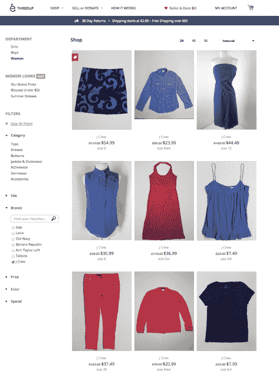

# 网上寄售店 ThredUP 不再仅仅面向儿童，而是扩展到了女装领域 TechCrunch

> 原文：<https://web.archive.org/web/https://techcrunch.com/2013/04/29/no-longer-just-for-kids-online-consignment-shop-thredup-expands-into-womens-apparel/>

网上童装寄售店 ThredUP T1 今天推出了一个新的垂直领域，即[一家女性二手服装店 T3。在年初宣布将](https://web.archive.org/web/20221207081138/http://www.thredup.com/women)[业务扩展到青少年服装](https://web.archive.org/web/20221207081138/https://beta.techcrunch.com/2013/01/28/online-kids-clothing-consignment-service-thredup-opens-its-next-new-vertical-juniors/)之后，这一举措使这项服务与像 Poshmark 和 Threadflip 这样的竞争对手展开竞争。这个女性网站已经在二月份进入了测试阶段，允许顾客把他们的衣服送去转售，但是还没有向顾客开放。

当时，ThredUP 表示，推出测试版的决定与女装尺寸的复杂性和其他库存管理障碍有关，但当然，商店也需要时间从顾客那里招揽商品。正如其在儿童服装领域的努力一样，这家新的女装店也是如此:用户要求一个“清理”包，免费送货，可以装上不需要的但质量好的衣服，然后退还(邮资已付)给 ThredUP。这些衣服被检查是否符合公司的标准，被拍照，然后放到网上出售。根据服装的质量，卖家可以得到转卖价格的 10-40%。

虽然现在 ThredUP 正在进入女性垂直市场，但其商业模式使其不同于 Poshmark、Threadflip、Twice 等点对点二手市场，因为用户不会直接向彼此出售他们的衣柜内容。这降低了卖家的利润，但也消除了自己销售的麻烦。在儿童服装领域，父母经常会很快被穿不下的衣服淹没，并感谢任何人从他们手中拿走这些物品，威胁是很有意义的。对于女装来说，这可能更棘手，因为那些认为自己穿过的衣服值得出售，而不是捐赠的人，通常希望赚点小钱。出于这个原因，他们可能会选择留在这些 P2P 网站上，那里支付的佣金通常只有 20%左右，这让他们可以保留 80%。

如下图所示，这些公司已经成为 ThredUP 的有力竞争对手:

自从一年多前 ThredUP 重新专注于服装交易[以来，ThredUP 一直在增长，现在它有 50 万注册用户，从 2012 年 2 月到 2013 年 3 月，商品销售额增长了 970%，订单销售额每月增长 28%。收入详情不可用。然而，该公司已经从投资者那里筹集了 2300 万美元，最近一次是通过去年秋天](https://web.archive.org/web/20221207081138/https://beta.techcrunch.com/2012/03/08/thredup-shuts-down-kids-clothes-swapping-service-in-favor-of-online-consignment/)[的 1450 万美元的 C 轮融资](https://web.archive.org/web/20221207081138/https://beta.techcrunch.com/2012/10/03/kids-clothing-service-thredup-raises-14-5m-series-c-plans-expansion-into-teen-adult-apparel/)，由新投资者[高地资本合伙人](https://web.archive.org/web/20221207081138/http://www.crunchbase.com/financial-organization/highland-capital-partners)牵头，现有投资者[三一投资](https://web.archive.org/web/20221207081138/http://www.crunchbase.com/financial-organization/trinity-ventures)和[红点投资](https://web.archive.org/web/20221207081138/http://www.crunchbase.com/financial-organization/redpoint-ventures)。

该公司现在每天接收和处理 8000 到 10000 件商品，比二月份的 5000 件有所增加。它的儿童服装店有来自约 9000 个品牌的 15 万件商品出售，在发布会上，新的女装垂直系列将展示来自约 4000 个品牌的 3 万件商品。

此外，ThredUP 还采取了一项措施来解决一些用户的担忧，即当 ThredUP 认为这些商品不符合其质量标准时，他们会发现自己没有什么可展示的。在过去，这些只是捐赠给慈善机构。但是对于那些感兴趣的人来说，现在有了一个“[退货保证](https://web.archive.org/web/20221207081138/http://support.thredup.com/entries/23249038-What-is-Return-Assurance-)”选项，允许用户选择退货。这项服务的价格是 9.99 美元，所以你必须有一个很大的清理袋，以使它值得支付运费。

新的女装店现在在 www.thredup.com/women 开张了。