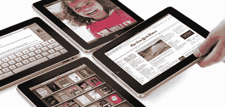

# 没人预测到 iPad 的增长。没人。

> 原文：<https://web.archive.org/web/http://techcrunch.com/2011/01/19/nobody-predicted-ipad-growth/>

# 没人预测到 iPad 的增长。没人。

苹果去年售出了近 1500 万台 iPads。它的销量超过了 MAC 电脑，收入也在接近。仅在 12 月份的季度中，售出的 730 万台 iPads 就比 9 月份的季度增长了 75 %, 46 亿美元的收入则同比增长了 65%。(4 月推出的 iPad [)。无论如何，对于一个全新的计算产品来说，这都是一个不可思议的进步。这太令人吃惊了，以至于没有人预测到这一点——乐观的华尔街分析师，甚至是眼光独到的博客作者都没有预测到。](https://web.archive.org/web/20230130010729/https://techcrunch.com/2010/04/01/ipad-line/)

Asymco 上的一篇帖子总结了华尔街分析师和科技博客作者对 iPad 销量的所有早期预测。iPAd 最终在 2010 年卖出了 1480 万台。华尔街 4 月份的最高估计是 700 万(Broadpoint AmTech 的 Brian Marshall)。高盛的大卫·贝利预测为 620 万。就连苹果平板电脑巨头吉恩·蒙斯特最初也认为他们只会卖出 350 万台 iPads。列出的 14 位分析师的平均预测是 330 万。

科技博客做得稍微好一点。福克斯主播克莱顿·莫里斯(他是博主吗？)预测了 900 万，其次是约翰·格鲁伯预测了 800 万。列出的 8 个博客作者的平均人数是 550 万。

换句话说，iPad 的销量是科技博客平均预测的三倍，是华尔街分析师平均预测的五倍。下次你看到科技领域的任何预测时，想想这一点。越新，越少人知道。

以下是 Asymco 的细分数据:

专业分析师的第一年 iPad 销量[预测](https://web.archive.org/web/20230130010729/http://www.asymco.com/2010/05/03/analysts-predict-ipad-sales/)(来源于 TMO 金融委员会)

*   Brian Marshall，Broadpoint AmTech 7.0
*   大卫·贝利，高盛 6.2
*   凯瑟琳·休伯蒂，摩根士丹利 6.0
*   萧武，考夫曼兄弟 5.0
*   Mike Abramsky，加拿大皇家银行资本市场 5.0 版
*   吉恩·蒙斯特，Piper Jaffray 3.5
*   本·瑞兹，巴克莱资本 2.9
*   基思·巴克曼，蒙特利尔银行资本 2.5
*   杰夫·菲达卡罗，萨斯奎哈纳 2.1
*   克里斯·惠特莫尔，德意志银行 2.0 版
*   斯科特·克雷格，美林证券 1.2
*   彼得·米塞克，加拿大亚当斯 1.2
*   道格·里德，托马斯·韦塞尔 1.1
*   奥本海默·耶尔·赖纳 1.1

以下是来自科技博客的预测:

*   克莱顿·莫里斯:9
*   约翰·格鲁伯:8
*   霍勒斯·德迪乌:6
*   纳塔丽·德尔·孔戴:5 人
*   罗斯·鲁宾:5
*   迈克·罗斯:4.5-5
*   杰森·斯内尔:3
*   安迪·伊纳特科:3