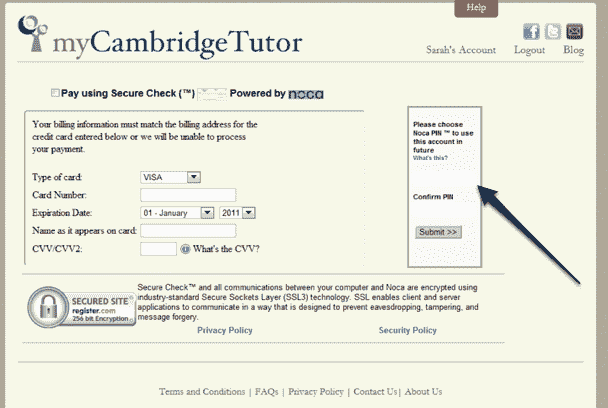

# Noca 推出新的信用卡支付服务 TechCrunch，挑战 PayPal

> 原文：<https://web.archive.org/web/http://techcrunch.com/2011/08/31/noca-takes-on-paypal-with-new-credit-card-payments-offering/>

# Noca 推出新的信用卡支付服务，挑战 PayPal

你可能还记得 [Noca，](https://web.archive.org/web/20230203140516/http://www.noca.com/)一家初创公司，[希望用一款承诺为商户提供低交易费用的借记交易产品来颠覆](https://web.archive.org/web/20230203140516/https://techcrunch.com/2009/02/09/is-noca-the-next-paypal/)支付行业。今天，该公司首次推出其信用卡产品，旨在为商家和消费者提供安全的支付体验。

它是这样工作的。消费者可以在结账时选择一个 PIN(称为 Noca PIN)，允许通过输入 PIN 完成所有后续交易，而不是在典型的信用卡或支票交易中输入 80-90 个字符。您在第一次交易时输入您的信用卡信息，然后在其他交易中只需输入 pin。

对于商家来说，Noca 的产品承诺让消费者购买更容易，从而创造更多的交易，减少废弃的购物车。Noca 的支付系统不需要消费者注册账户。这家初创公司表示，Noca 的系统只需几行代码就可以集成到一个网站中。Noca 的费用是[3.5%](https://web.archive.org/web/20230203140516/http://www.noca.com/rates)(高于 PayPal)，但没有固定的每笔交易费用。

考虑到易贝所有的公司已经达到的范围，在在线支付领域挑战 PayPal 是雄心勃勃的。但 Noca 是由 PJ·古普塔创建的，他曾是 Visa 的首席建筑师，因此该公司有支付经验。

