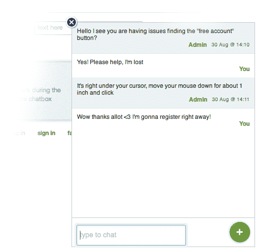
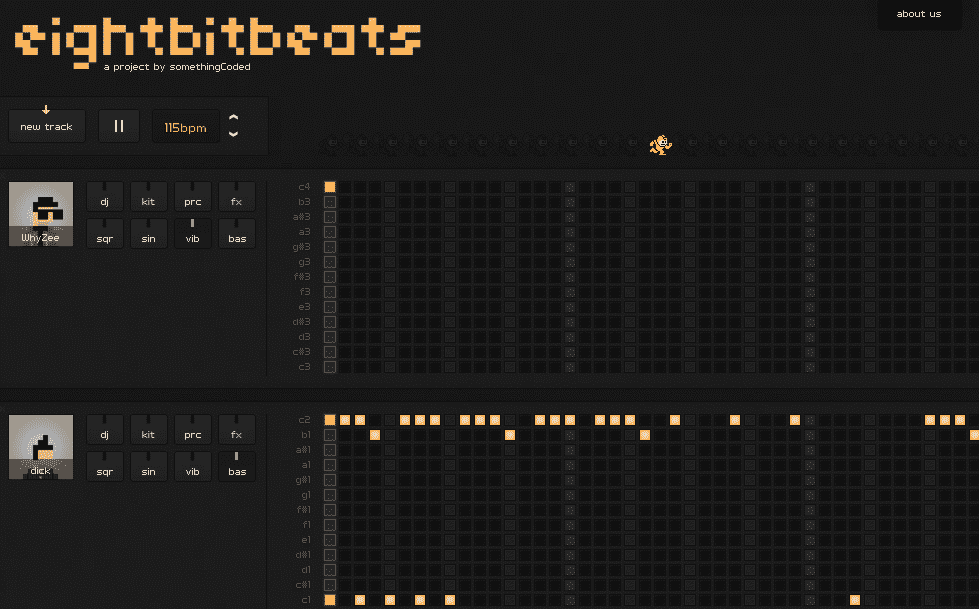
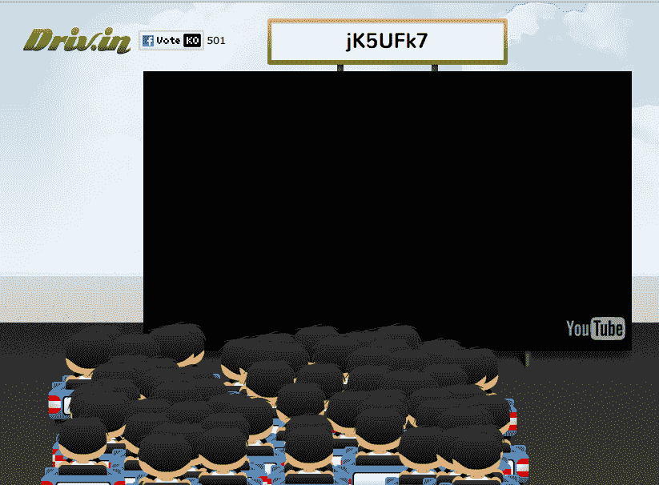
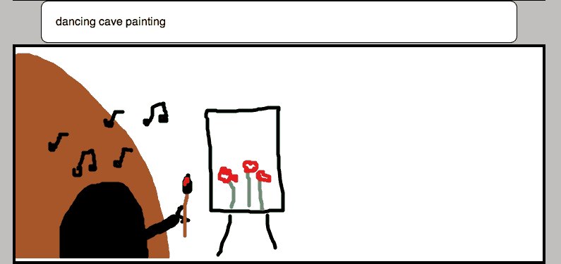
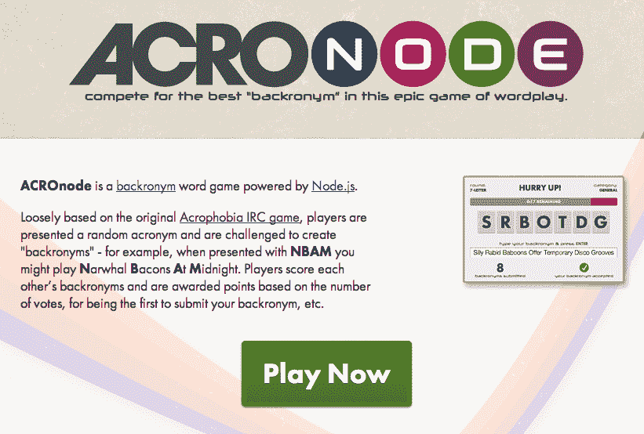
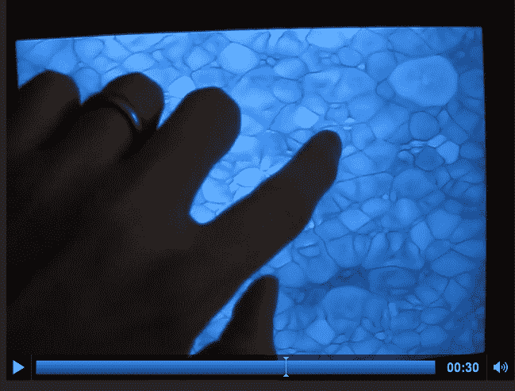
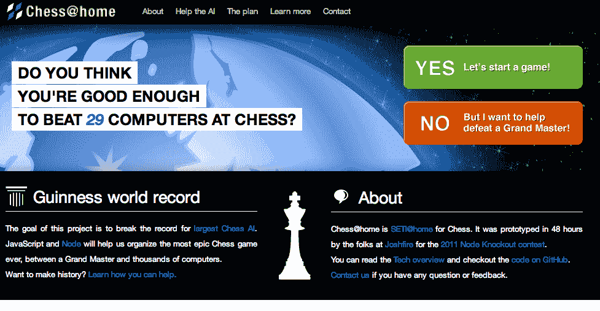

# Node.js 淘汰赛 2011 获奖者揭晓 

> 原文：<https://web.archive.org/web/https://techcrunch.com/2011/09/09/node-js-knockout-2011-winners-revealed/>

Joyent 公布了其赞助的年度 [Node.js](https://web.archive.org/web/20230203051513/http://nodejs.org/) 黑客大赛 [Node Knockout](https://web.archive.org/web/20230203051513/http://nodeknockout.com/) 的获胜者。今年的黑客马拉松鼓励开发人员使用越来越受欢迎的服务器端 JavaScript 环境 Node.js 构建应用程序，包括 320 多个团队，700 多人参赛。与 2010 年的 100 个团队和 250 名参与者相比，这是一个巨大的飞跃。

最终的赢家是一群不同的人，包括从游戏和 YouTube 战斗派对(我们将解释…)到帮助网站设计和游戏开发的实用工具。

以下是今年的获奖者:

**总冠军&单飞冠军:观察者**

**[Observer](https://web.archive.org/web/20230203051513/http://observer.no.de/) 是一款工具，旨在通过实时观察网站访问者浏览您的网站，帮助您更好地了解他们的行为。你可以看到用户正在键入什么，他们正在点击什么，甚至他们正在使用什么键盘快捷键。您还可以立即开始与需要帮助的网站访问者聊天。**

 **

如果您没有时间跟踪所有用户，您可以存储会话供以后播放。所有这些功能都可以通过简单的一个脚本安装来实现。

**团体总冠军:8 位节拍**

[八位节拍](https://web.archive.org/web/20230203051513/http://somethingcoded.nko2.nodeknockout.com/)是一个协作、社交节拍和旋律音序器。在加载网站时，你输入你的名字/句柄，选择一个声卡(DJ，架子鼓，特效等等。)然后开始将音乐添加到与其他人合作制作的曲目中。

【T2

**大众人气赢家:Driv.in**

如果想获得更多乐趣，可以去 YouTube 的战斗派对 [Driv.in](https://web.archive.org/web/20230203051513/http://driv.in/) 看看。这个想法是你在网站上创建房间，这样你和你的朋友可以一起实时观看视频。在之前，我们在哪里听说过类似的事情？

是的，它和 [Chill](https://web.archive.org/web/20230203051513/http://www.chill.com/) 差不多，有同步视频观看、视频 DJ、内置聊天等等。唯一的区别是这个“房间”看起来像一个免下车电影院，而不是《Chill》中的电影院。哦，免下车餐馆还有一个额外的好处，那就是可以向你讨厌的视频扔西红柿。接招吧，丽贝卡·布莱克！

**最实用/有趣的赢家:涂鸦或死亡**

[涂鸦或死亡](https://web.archive.org/web/20230203051513/http://doodle.no.de/)基本上是对图片猜谜的迭代，给你一些东西来画，你必须猜别人画了什么。该网站非常简单，但该团队正致力于将该项目进一步发展为一款名为 [Doodleblast](https://web.archive.org/web/20230203051513/http://doodleblast.com/) 的 iPad /iPhone/Android 应用。

**最佳设计奖得主:ACROnode.com**

ACROnode 是一款比上面略具智力挑战性的游戏，它大致基于最初的[恐高 IRC 游戏](https://web.archive.org/web/20230203051513/http://en.wikipedia.org/wiki/Acrophobia_(game))。玩家会得到一个随机的首字母缩写词，并被要求创造“backronyms”。例如，当播放“NBAM”时，你可能会播放“午夜独角鲸”

玩家根据投票数为彼此的 backronym 评分并获得分数，并奖励第一个提交 back ronym 的玩家。它很古怪、有趣，而且正如获奖所表明的那样，看起来也很漂亮。

【T2

**最具创新奖:蓝色 GPU Lava**

回到更实际的条目， [Blue Lava](https://web.archive.org/web/20230203051513/http://minimason.no.de/) 是一个展示 node-webgl 库的小演示。入口是开源库本身，而不是可视化/演示。有了它，开发人员可以使用 Node.js 为现代平台创建高级视频游戏。该库专门针对 HP TouchPad。但是，它可以在其他平台上运行。[这是运行中的演示](https://web.archive.org/web/20230203051513/http://creationix.com/minimason.m4v)。

**最完整赢家:Chess@home**

[Chess@home](https://web.archive.org/web/20230203051513/http://joshfire.nko2.nodeknockout.com/) 是一个项目，其目标是打破[最大的国际象棋人工智能的当前世界纪录](https://web.archive.org/web/20230203051513/http://www.guinnessworldrecords.com/records-3000/largest-networked-chess-computer/)。它将使用 JavaScript 和 Node 在未来的“D 日”组织有史以来最大的国际象棋，让国际象棋大师对抗数千台计算机。问题是，基于 JavaScript 的 AI 能打败一代宗师吗？还是人类会打败机器？

在此期间，您可以与联网的机器进行游戏，以测试自己的技能。

 这些都是今年的获奖者，但如果你对黑客马拉松中出现的其他项目感到好奇，你可以在这里查看[完整的参赛项目列表。](https://web.archive.org/web/20230203051513/http://nodeknockout.com/)**