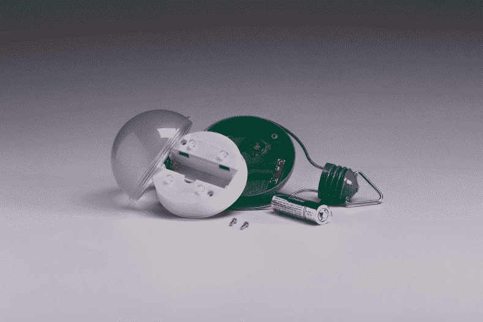
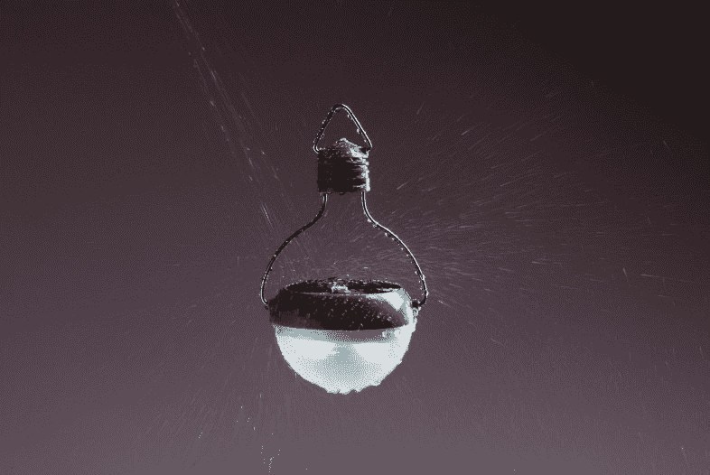

# 太阳能灯泡在天黑后提供照明 

> 原文：<https://web.archive.org/web/http://techcrunch.com/2011/09/16/nokero-solar-power-bulb/>

# 太阳能灯泡在天黑后提供光线

太阳能灯泡听起来可能有点矛盾(只有在太阳出来的时候才工作的灯泡有什么意义？)，但一家名为 [Nokero](https://web.archive.org/web/20230205045317/http://www.nokero.com/) 的公司正在研发一种可以给灯泡中的电池充电的原型，使其在日落后仍然有用。

总部位于丹佛的 Nokero，是 No 煤油的缩写，希望为数百万没有可靠能源供应的人提供一个安全的光源。普通的非电光源，如蜡烛、木炭、木材和煤油，在室内经常使用时会产生烟雾，是一个主要的健康威胁。

蜡烛和煤油通常也相对昂贵，Nokero 估计，在没有可靠电力的地方，家庭收入的 20%可以用来购买蜡烛和照明燃料。Nokero 希望提供一种负担得起且对肺友好的替代方案。定价约 20 美元，减少了对燃料的需求，该公司表示，其灯泡在 3-8 周内开始为大多数家庭省钱。

该公司的设计以灯笼的形式出现，可以悬挂或放在桌子上。N200 型号的灯泡包含四个 led，通过嵌入式太阳能电池板充电，该电池板连接到镍氢 AA 尺寸的电池，寿命为两年。灯泡背面的电源开关也可以改变光线的强度，从高到低，灯泡本身由耐用的聚碳酸酯制成，类似于汽车前灯中使用的材料。

该公司正在与非营利组织合作，帮助在国内分发灯泡，如向纳瓦霍部落的离网公民，以及在国际上向海地，巴基斯坦，墨西哥和日本等国家分发灯泡。

这个[视频](https://web.archive.org/web/20230205045317/http://www.nokero.com/videos.php?id=3)展示了灯泡的动作:

拉里·波利格的照片