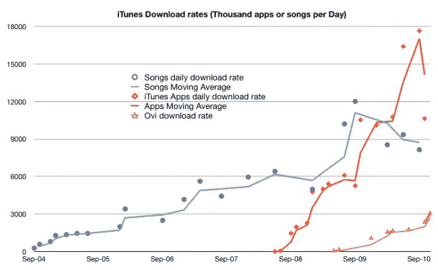

# 诺基亚:每天从 Ovi 商店下载 300 万个应用程序，1.65 亿 Ovi 用户 

> 原文：<https://web.archive.org/web/https://techcrunch.com/2010/11/18/nokia-3-million-apps-downloaded-from-ovi-store-every-day-165-million-ovi-users/>

# 诺基亚:每天从 Ovi 商店下载 300 万个应用程序，1.65 亿 Ovi 用户

今天早上,[诺基亚](https://web.archive.org/web/20221207034601/http://www.crunchbase.com/company/nokia)的的[大数据出来了。该公司表示，其应用商店](https://web.archive.org/web/20221207034601/http://conversations.nokia.com/2010/11/18/ovi-store-3-million-downloads-a-day/) [Ovi 商店](https://web.archive.org/web/20221207034601/http://store.ovi.com/)继续增长，本周达到每天 300 万次下载的里程碑，高于今年年初的每天 100 万次下载和上个月的每天 230 万次下载[。](https://web.archive.org/web/20221207034601/http://www.mobilecrunch.com/2010/10/01/nokia-on-ovi-200k-daily-sign-ups-2-3m-app-downloads-per-day-140-million-users/)

此外，诺基亚透露，Ovi 的用户总数现已超过 190 多个国家的 1.65 亿人。此外，诺基亚表示，它每天新增约 25 万 Ovi 用户，这意味着每月新增约 750 万用户。

**更新:** [asymco](https://web.archive.org/web/20221207034601/http://www.asymco.com/2010/11/18/nokias-ovi-store-downloads-hit-3-million-a-day/) 将该数字与 iTunes 下载率进行比较:

诺基亚补充说，90%的 Ovi 商店访问实际上会导致应用程序下载，每个注册访问者平均下载 2.6 个应用程序。目前，有 92 名开发者的应用程序下载量达到了 100 万以上，诺基亚表示，到下周，这个数字将增加到 100。

关于 Ovi 商店全球最受欢迎的应用程序，有一点令人惊讶:Rovio 的[愤怒的小鸟](https://web.archive.org/web/20221207034601/http://store.ovi.com/content/57175)排名第二，落后于 [Q Torch](https://web.archive.org/web/20221207034601/http://store.ovi.com/content/55378) (由印度的 CellApp 技术制造)。然而,《愤怒的小鸟》是销量最高的付费应用。

诺基亚还吹嘘其 Qt SDK 的受欢迎程度，据说仅今年就有超过 150 万次的下载，而据说去年有 40 万新开发者注册了诺基亚论坛。

最近，诺基亚[表示](https://web.archive.org/web/20221207034601/https://beta.techcrunch.com/2010/10/21/nokias-q3-profit-beats-estimates-company-plans-to-cut-1800-jobs/)它将[专注于 Qt 框架](https://web.archive.org/web/20221207034601/http://www.marketwire.com/press-release/Nokia-further-refines-development-strategy-unify-environments-Symbian-MeeGo-1338790.htm)框架和对 HTML5 的支持，以努力确保应用程序将继续兼容 Symbian 的未来发展以及即将推出的 MeeGo 产品。