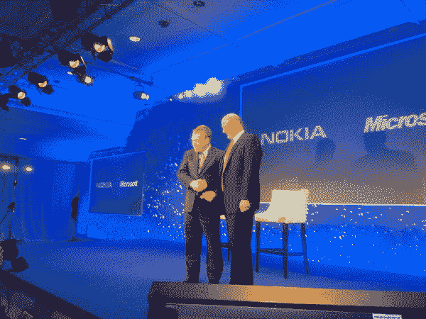

# 诺基亚微软就像雅虎必应——诺基亚作为创新者的时代已经结束

> 原文：<https://web.archive.org/web/https://techcrunch.com/2011/02/11/nokia-microsoft-is-like-yahoo-bing-nokias-days-as-innovator-are-over/>

# 诺基亚微软就像雅虎必应——诺基亚作为创新者的日子已经结束了

当我插上电源给我的 iPhone 去直播今天的诺基亚新闻发布会时，我无意中听到有人俯身说“这是你生命中最重要的一天”。这是诺基亚公关发言人在今天上台介绍诺基亚首席执行官史蒂文·埃洛普时听到的。这当然很重要，但不是很重要。今天，他的老板有效地结束了诺基亚作为一个独立生态系统的历史，放下了枪支，向 Windows Phone 的未来屈服。

对我来说，直接的比较是微软取代雅虎成为搜索引擎。在卡罗尔·巴茨的领导下，雅虎在搜索大战中向谷歌投降，并决定让别人来尝试:必应。从那天起，雅虎放弃了它悠久的创新传统。

今天发生了完全相同的事情。关于这个事件的一切都在尖叫。埃洛普是诺基亚的巴茨。他认为这完全是一笔商业交易。当然，他认识到了问题。但是他决定不打了。