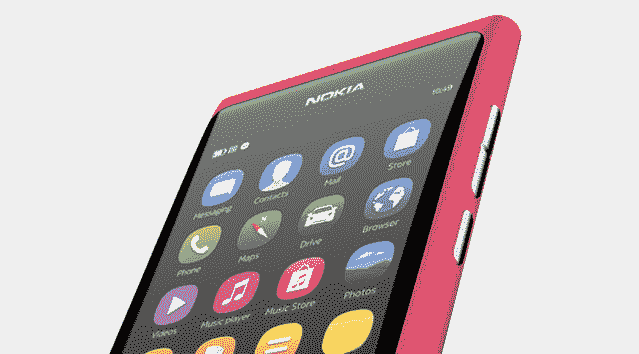

# 诺基亚 N9:你永远不会买到的最神奇的手机 TechCrunch

> 原文：<https://web.archive.org/web/https://techcrunch.com/2011/10/15/nokia-n9-the-most-amazing-phone-youll-never-buy/>

在我毫不隐讳地指出我想实实在在地试一试之后，诺基亚很友好地借给我一部[诺基亚 N9](https://web.archive.org/web/20230205044250/http://swipe.nokia.com/) ，这是它的第一部也几乎肯定是最后一部 [MeeGo](https://web.archive.org/web/20230205044250/https://meego.com/) 驱动的智能手机。在玩了一天之后，我会告诉你为什么我认为这是一款可以与最好的智能手机相媲美的非凡智能手机，以及为什么你可能不买它会更好。

我先解释一下，我没有资格成为一名专业的智能手机评论者。我们有以前的嘎吱嘎吱齿轮和 MobileCrunch 奴隶做那种东西。也就是说，这些年来，我用过各种形状和大小的智能手机，我非常清楚自己想要什么。

如果你正在寻找那些彻底的[实践评论](https://web.archive.org/web/20230205044250/http://www.gizmodo.com.au/2011/10/review-nokia-n9/)或一份[规格清单](https://web.archive.org/web/20230205044250/http://www.zdnet.com/blog/cell-phones/heres-the-nokia-n9-meego-phone-and-you-cant-have-it-review/6706)，请到别处看看。好吗？好吧。

TL；DR:诺基亚 N9 的硬件、操作系统和预装应用程序几乎都非常好，它们之间的紧密集成造就了顶级的用户体验。不幸的是，价格太高，而且市场上没有足够的应用程序。

全面审查:

诺基亚 N9 无疑是我用过的最舒适、最快捷、设计最周到的手机之一。到目前为止，我已经使用了很多 iPhones 和 Android 手机，知道我在说什么。

N9 有很多令人喜欢的地方:触摸屏的质量和响应能力，漂亮的“滑动”功能，(一体式)硬件的总体外观和感觉，导航和“驱动”应用程序，曲面玻璃，相机质量，通知工作的方式，即将到来的更新 river view，没有按钮，内置 NFC 功能，等等。一份非常非常扎实的工作，诺基亚。

它也有自己的怪癖，我敢说，就像任何设备一样，还有一个令人惊讶的蹩脚的预装 Webkit 浏览器(没有标签，没有收藏夹，没有“稍后阅读”，有时还会出现奇怪的渲染)。你也不能个性化背景(除了锁屏)或给它添加效果——这是我对 Android 手机越来越感兴趣的事情。iPhone 用户会想念他们的文件夹。

那么，为什么我——或许还有你——永远不会买它呢？两个主要原因。

第一，手机太贵。N9 的 16 GB 版本售价 480 欧元(约合 650 美元)，64 GB 版本的税前价格为 560 欧元(约合 755 美元)。

我明白其中的道理。这是一款高端手机，诺基亚希望它的价格能符合人们对这款手机的感受。如果它上市不是晚了 2 年，这也是一个可以接受的价格。

不幸的是，在我们现在生活的世界里，你可以以大致相同或更低的价格买到一部像样的 iPhone 或 Android 手机，所以 N9 根本无法在价格上竞争。

第二个原因不太客观，但也很明显:市场上令人震惊的应用缺乏(这些天被称为[诺基亚商店](https://web.archive.org/web/20230205044250/http://store.nokia.com/))。这不是灾难性的。这款手机预装了地图、驾驶、Skype、脸书、Twitter、愤怒的小鸟(lite)、AccuWeather、YouTube 等应用。你可以很容易地安装应用程序，如 Foursquare 和商店里的一些不错的游戏，而且是免费的。

但差不多就是这样，这是个问题。

我知道我可以拿起任何 Android 手机或 iPhone，安装 Yammer 应用程序，并立即与我的 TechCrunch 同事合作(好吧，当应用程序做它应该做的事情时，情况并非总是如此)。我可以安装亚马逊(Amazon)的 Kindle 应用程序，并在我上次注销的页面上开始阅读我最近下载的电子书。我可以安装《NYT》和《华尔街日报》的应用来了解最新的世界新闻，还可以下载 Pulse 来阅读我订阅的新闻。我可以安装 Shazam，并在任何地方识别和购买音乐。我可以下载 Viber，免费给朋友打电话发短信。

在诺基亚 N9 上，这些都是不可能的。我昨天与之交谈的公司代表说，它会变得更好，开发者只需要更加了解跨平台应用框架 [Qt](https://web.archive.org/web/20230205044250/http://qt.nokia.com/) ，以及他们如何移植现有的应用程序，以便它们可以在 MeeGo 上运行。

也许吧，但这需要时间，正如我之前所说，诺基亚在这场游戏中已经迟到了。

这是一个悲伤而奇怪的悖论:这款手机如此漂亮，运行如此流畅，以至于我真的很难放下 N9，但我可以诚实地说，在这个充斥着更好的选择的世界里，我永远不会建议任何人出去购买它，尤其是在这个价格上。