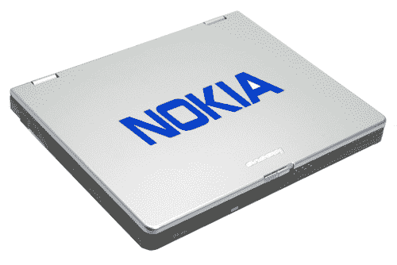

# 诺基亚考虑涉足笔记本电脑行业 

> 原文：<https://web.archive.org/web/https://techcrunch.com/2009/02/25/nokia-thinking-about-dabbling-in-the-laptop-biz/>

# 诺基亚考虑涉足笔记本电脑行业

今天早上早些时候，在芬兰的 YLE(想想英国广播公司，但芬兰语)，诺基亚首席执行官康培凯被问及该公司是否有计划扩展到笔记本电脑市场。果然，他的反应是:

> “我们也在非常积极地寻找这个机会。”

是啊。很奇怪，对吧？诺基亚，制造笔记本电脑？一开始我们也觉得很奇怪。然后我们又想了一会儿——这有点道理。

首先，我们回忆了我们去[诺基亚损坏测试实验室](https://web.archive.org/web/20221110131727/http://www.mobilecrunch.com/2008/12/01/an-in-depth-look-at-nokias-hardware-damage-labs/)的旅程，在那里诺基亚砸碎、刮擦、冻结和掉落他们生产的每一件硬件。除了少数对自己的产品引以为豪的制造商之外，笔记本电脑市场充斥着质量低劣的垃圾。如果诺基亚对笔记本电脑的压力测试和他们对手机的测试一样努力，我们肯定会考虑买一台。我们还得再去一趟他们的粉碎实验室，看他们再一次用大棒砸东西——当然，你知道，为了科学之类的东西。

然后我们思考了一下他们即将推出的产品，其中最引人注目的是[N97](https://web.archive.org/web/20221110131727/http://www.crunchgear.com/2008/12/02/nokia-world-2008-nokia-n97/)——这是手机最接近笔记本电脑的产品。把它变大一点，把操作系统充实一点，你就有了一台笔记本电脑。嗯，你已经有了一台*上网本*——而这正是我们认为诺基亚可能会发展的方向。这纯粹是猜测，但我们不会对诺基亚在未来一两年内推出运行 Symbian Foundation 制造的(或 Maemo)操作系统的上网本感到丝毫惊讶。我们现在只能保持警惕。