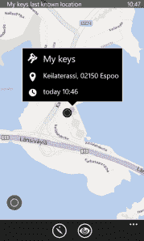

# 诺基亚推出售价 30 美元的 NFC 标签，用于追踪你手机的行踪

> 原文：<https://web.archive.org/web/https://techcrunch.com/2014/02/19/nokia-treasure-tag/>

诺基亚发布了一种新的配件，旨在确保其 Lumia 智能手机的用户永远不会离开他们的手机。或者至少，当他们带着带标签的钥匙或包离开家时，他们会被提醒拿起他们的手机。反之亦然。

名为 [Treasure Tag](https://web.archive.org/web/20221007191555/http://conversations.nokia.com/2014/02/19/never-lose-valuables-nokia-treasure-tag/) 的智能表链可以通过 NFC 或蓝牙 4.0 与运行 Lumia Black update 的 Lumia 智能手机配对，以连接这两个设备——这样，如果其中一个移动到另一个的范围之外，两者都会发出警报，提醒用户他们最喜欢的小工具一切都不好。

现在有很多创业公司在制作失物招领小发明。其中之一， 瓷砖 ，也就是我们去年夏天，成功聚敛260 万美元的众筹才开始疯狂 拥挤 。现在，诺基亚也加入了竞争行列——尽管大多数失物招领处的初创公司不会把宝藏标签视为任何形式的竞争。

首先，诺基亚的系统目前是一个封闭的系统，仅限于与 Lumia 智能手机的子集一起使用，而不允许标记任何种类的珍贵物品(无生命或其他)。(*诺基亚表示，未来还会有支持 Android 和 iOS 设备的 Treasure Tag 第三方应用。)

诺基亚的标签还提供了 一个非常有限的功能集，而不是一些更复杂的追踪器标签概念。例如，尽管 Tile 的计划是建立一个其他 Tile 用户的分布式网络，以便用户社区可以扩大其定位范围，但 Treasure Tag 并不那么智能，只有手机和 Tag 之间的配对链接可以继续。

所以，比如说，当你把钥匙放在口袋里而不是手机里去厕所的时候，它的闹钟就会响起来。(闹钟可以通过[对应的应用](https://web.archive.org/web/20221007191555/http://www.windowsphone.com/en-us/store/app/nokia-treasure-tag/026c771b-473d-4593-b5db-e43cc8a3117b)静音或进入睡眠状态，或者你可以长按标签本身来停用它——所有这些听起来都有点麻烦。)

宝藏标签系统还支持在应用程序内的地图上定位丢失的标签物品，如你的钥匙或包——或者如果你在它的范围内，它就会定位。它只能报告最后已知的位置，所以如果物品被移动了，它就不会出现了。

如果你想给多件物品贴上标签，把它们和你的手机联系起来，你需要购买多个宝贝标签。多达四个不同的标签可以同时连接到手机上，能够为每个标签分配现成的图标(如按键图标)，或使用照片，以减少管理多个标签的混乱。

无论哪种方式，与一些追踪器初创公司的竞争相比，标签本身相对较大——每个宝藏标签大约是 30 x 30 x 10mm 毫米的火柴盒大小——这并不是一个解决健忘的优雅解决方案。例如，忘记在你的钱包里放一个标签，就像你可以用像 [Protag Elite](https://web.archive.org/web/20221007191555/https://beta.techcrunch.com/2013/08/06/protag-elite/) 这样的东西一样。

每个宝藏标签的电池寿命被限定为“长达六个月”。用户可更换的标准纽扣电池为每个标签供电。

诺基亚表示，预计这款宝藏标签将于 4 月份通过全球零售商上市，售价为€24.90 英镑(29.90 美元)。颜色选择是明亮的黄色和青色，诺基亚也用于其手机系列，以及白色或黑色。