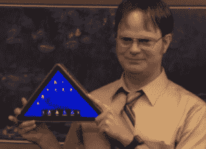

# 诺基亚疯狂的可弯曲动能概念让你大吃一惊？看这个！

> 原文：<https://web.archive.org/web/http://techcrunch.com/2011/11/10/nokias-crazy-bendy-kinetic-concept-blew-your-mind-watch-this/>

# 诺基亚疯狂的可弯曲动能概念让你大吃一惊？看这个！

诺基亚已经完全为未来做好了准备。他们已经推出了一个[完全疯狂的灵活运动界面概念](https://web.archive.org/web/20230205034036/https://techcrunch.com/2011/10/26/crazy-nokia-kinetic-concept-does-the-twist/)，现在他们甚至为它起草了一个实现:人形。不，这款手机看起来不像一个以你为主题的动作玩偶，而是一个泪珠形状(这可能是我对这个概念最大的不满)。

我不打算对视频中包含的内容进行过多的描述，因为你自己可以很容易地看到。然而，我要说，与诺基亚早期的柔性屏幕概念相比，这是最棒的。一件真正引起我注意的事情是电触觉反馈的想法。看起来很漂亮，但如果能拍一张天鹅绒或木头的照片，感受一下那种质感，那就太棒了。

不过，我不确定我对这个形状的感觉。拿在手里，我敢肯定这个概念实际上比我们通常的直板手机舒服得多。但是(这是一个很大的但是)，你如何考虑任何事情的角落？此时，我们经常在手机上看视频和图片。网页碰巧是矩形的，就像你在手机上看到的任何东西一样。

 我肯定有办法绕过这个问题，但从矩形到泪滴形似乎是一个太大的飞跃。这让我想起了 Dwight 让办公室*的每个人*出售 Sabre 金字塔，一个三角形的平板电脑。这似乎很疯狂，但在虚构的斯克兰顿版本中，宾夕法尼亚州的人们似乎仍然对[“释放金字塔的力量”感兴趣。也许诺基亚也是如此。](https://web.archive.org/web/20230205034036/http://www.hulu.com/watch/284699/the-office-power-of-the-pyramid)

话说回来，如果这个概念真的实现了，也不是很久以后的事了。等待时欣赏视频。

【YouTube http://www.youtube.com/watch?v=SegLUbBJDhA&w=640&h=360]

[via [Engadget](https://web.archive.org/web/20230205034036/http://www.engadget.com/2011/11/10/nokias-humanform-concept-phone-not-shaped-like-us-video/)