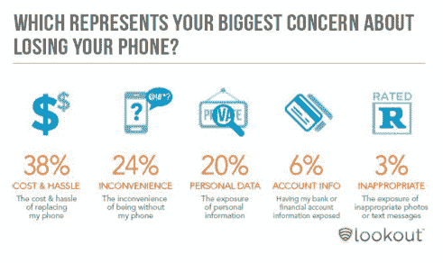
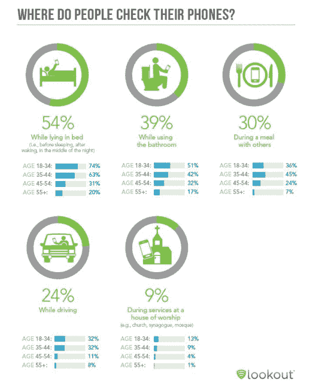

# 诺莫恐惧症发作！Lookout 表示，74%的用户对手机丢失感到恐慌；58%的人无法离开手机超过一小时 TechCrunch

> 原文：<https://web.archive.org/web/http://techcrunch.com/2012/06/21/nomophobia-attacks-harris-says-74-of-users-panic-over-phone-loss-58-of-us-cant-stay-away-from-mobiles-for-more-than-an-hour/>

# 诺莫恐惧症发作！Lookout 表示，74%的用户对手机丢失感到恐慌；58%的人不能离开手机超过一个小时

转向智能手机和使用应用程序的更沉浸式体验正在对移动手机在我们生活中的地位产生重大影响。移动安全开发商 Lookout 利用哈里斯互动委托的数据进行的一项新调查[移动思维研究](https://web.archive.org/web/20230209125047/https://www.mylookout.com/resources/reports/mobile-mindset)发现，美国五分之三的智能手机用户不检查手机的时间不会超过一个小时。

该报告还包含一些数据，说明我们在手机方面的优先事项。大约 94%的人担心丢失他们的设备——大约 74%的人说他们在过去丢失手机时感到恐慌(14%的人描述他们的状态为“绝望”，7%的人描述为“生病”)。但主要原因不是担心个人信息的丢失，而是更换信息的成本、麻烦和不便。

虽然 38%的人抱怨更换丢失手机的成本，24%的人说丢失手机会很不方便(合计 62%)，但只有 29%的人在丢失手机时会担心个人详细信息、账户信息或不当内容。

这表明人们对个人信息和安全的态度比一些人想象的更放松；或者说，如今人们并没有真正在他们的设备上存储这么多信息——或者说，他们并不知道他们可以存储多少信息。

Lookout 的分析师在报告中写道:“我们怀疑，那些使用智能手机进行银行业务、发送色情短信和进行露骨拍照的用户，实际上是担心自己的财务状况和不可提及的事情被泄露，但我们的数据显示，他们更关心没有手机的时间，以及拿回手机的成本。”。

这是一个有点讽刺的结论，因为报告专员 Lookout 的应用程序面向的是那些希望在丢失设备时跟踪设备的用户——如果找不到设备，就远程擦除设备。

专注于使用手机也意味着我们在任何地方都在使用手机。最常见的地方？睡觉时(54%)，上厕所时紧随其后(39%)，吃饭时排在第三(30%)。

正如你所看到的，不同年龄组的使用情况有所不同，在几乎所有年龄分类中，18-34 岁的人通常比老年人更热衷于使用手机。例如，调查进一步发现，虽然 58%是一小时电话检查的平均值，但对于 18-34 岁的人来说，这一比例实际上是 68%。同样，当手机消失时，男性往往对手机有更多的情绪反应，男性的情绪反应得分高于女性。

哈里斯互动调查于 2012 年 5 月 8 日至 10 日在美国在线进行，共有 2097 名受访者参与。

[图片:Zoonabar， [Flickr](https://web.archive.org/web/20230209125047/http://www.flickr.com/photos/zoonabar/7400618086/sizes/m/in/photostream/)