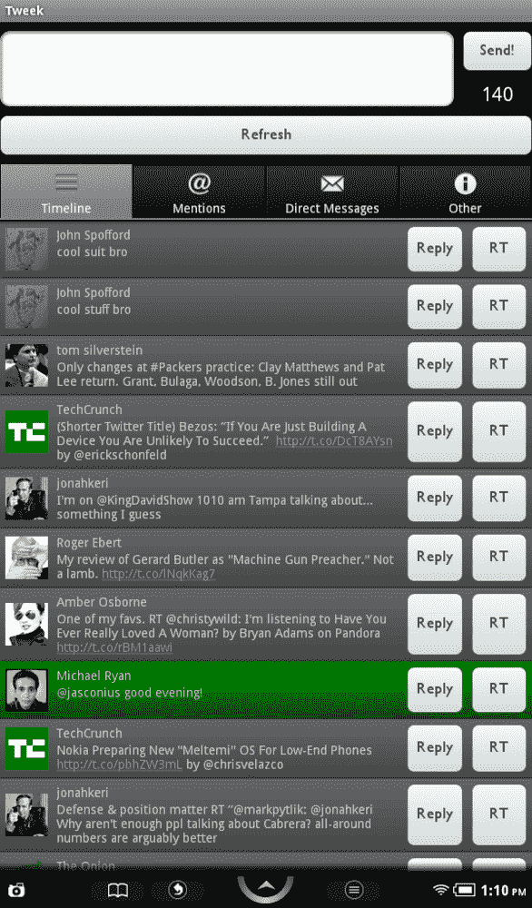

# Nook Color 推出首个专用 Twitter 应用 

> 原文：<https://web.archive.org/web/http://techcrunch.com/2011/10/07/nook-color-gets-its-first-dedicated-twitter-app/>

# Nook Color 获得了它的第一个专用 Twitter 应用

Nook Color 今天获得了第一个专门的 Twitter 应用程序，这是一个由位于坦帕的精品软件咨询公司 [DIG](https://web.archive.org/web/20230203080331/http://www.desetto.com/) 开发的名为 [Tweek](https://web.archive.org/web/20230203080331/http://search.barnesandnoble.com/Tweek/DIG/e/2940043861702) 的应用程序。需要说明的是，这款*并不是 Nook Color 上第一款支持 Twitter 的应用*。例如，已经有了 Seesmic，它提供了访问 Twitter、脸书、Google Buzz 等等的功能。与此同时，名人推文汇集了 300 多名名人的想法。

然而，Tweek 是第一个专门为 Nook Color 设计的 Twitter 应用程序。它有推特，只有推特，除了推特什么都没有。

这款应用包含了 Twitter 客户端的标准功能，比如发布更新、查看和回复@回复、阅读和撰写直接消息以及关注 Twitter 趋势。顶部有一个“刷新”按钮来更新流，在每个 Twitter 状态更新旁边，提供了“回复”和“RT”按钮。

这款应用的配色方案是深黑色和灰色，希望你喜欢，因为目前没有办法定制用户界面。

Tweek 售价 99 美分，填补了 Nook Color 用户的空白，他们希望自己的电子阅读器有一个基本的独立 Twitter 应用程序。你可以在 B & N 网站或你的手机上下载一份拷贝。

