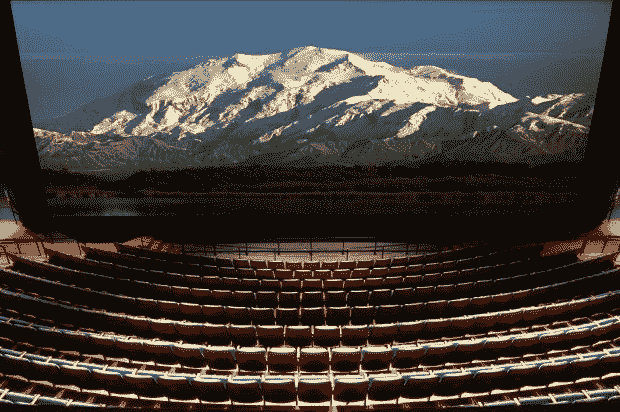

# 并非所有的 IMAX 屏幕都是一样的 TechCrunch

> 原文：<https://web.archive.org/web/http://techcrunch.com/2009/05/22/not-all-imax-screens-are-created-equal/>

# 并非所有的 IMAX 屏幕都是一样的

你知道吗，并不是所有的 IMAX 屏幕都是同样大小的？我不知道。似乎为了扩大市场，该公司在一些影院安装了较小的屏幕。演员兼喜剧演员阿齐兹·安萨里(*观察和报道*)不喜欢他当地的剧院有现在被一些人称为 LIEMAX 的东西。

[Wired 采访了 IMAX 的 CEO](https://web.archive.org/web/20230203191222/http://www.wired.com/underwire/2009/05/imax-ceo-screen-size-isnt-everything/)发现确实如此，并不是所有的 IMAX 屏幕都是一样的尺寸。传统上，IMAX 屏幕约为 72 英尺，但该公司妥协了，以便在更多市场安装更多系统。然而，据这位首席执行官称，IMAX 的特别之处不仅仅在于屏幕。

这些 IMAX-lite 影院显然是为了进一步提升 IMAX 体验而改造的。投影仪升级了，音响系统增强了，座位也移动了，这样观众就能感受到更大的屏幕。至少首席执行官是这么说的。
查看 [IMAX 还是 LIEMAX？](https://web.archive.org/web/20230203191222/http://maps.google.com/maps/ms?hl=en&ie=UTF8&msa=0&t=h&msid=113621990356540393221.000469b6c5915161c3667&source=embed&ll=36.210347,-86.68539&spn=48.885745,117.773438)放大地图

不过，我不知道我是否会支付额外的费用去这些影院看电影。如果我要去看 IMAX 电影，我想要一个巨大的银幕。使用这个[谷歌地图指南](https://web.archive.org/web/20230203191222/http://maps.google.com/maps/ms?hl=en&ie=UTF8&msa=0&t=h&msid=113621990356540393221.000469b6c5915161c3667&ll=36.210347,-86.68539&spn=48.885745,117.773438&z=3&source=embed)看看你当地的 IMAX 是否是 LIEMAX。