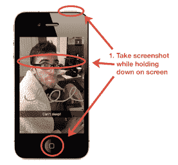
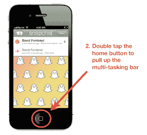

# 不那么短暂的信息:新的 SnapChat“黑客”让用户永远保存照片 TechCrunch

> 原文：<https://web.archive.org/web/https://techcrunch.com/2013/01/22/not-so-ephemeral-messaging-new-snapchat-hack-lets-users-save-photos-forever/>

尽管 SnapChat 让科技记者和 25 岁以上的人摸不着头脑——这是下一个 Instagram，还是一个大规模的色情短信阴谋？—这款应用已经成功地将短暂(或者自我毁灭，如果你对整个不可能完成的任务感兴趣的话)的信息传递带入了主流。该应用一直忙于积累超过 10 亿张“快照”，据报道正在筹集一轮巨额资金，[扎克伯格本人迫不及待地参与了脸书新推出的“SnapChat 克隆版”Poke 的编码和发布](https://web.archive.org/web/20221209040650/https://beta.techcrunch.com/2012/12/21/mark-zuckerberg-voice-of-poke/)

尽管如此，证据已经浮出水面，可能威胁到 SnapChat 的短暂信息私人世界，让那些无辜的照片或色情短信曝光。[亚历克西亚通过 Buzzfeed 报道了 SnapChat 的第一个“安全漏洞”](https://web.archive.org/web/20221209040650/https://beta.techcrunch.com/2012/12/28/for-sex-reasons/)，该漏洞显示，用户可以通过存储在 iPhones 和其他 iOS 设备上的临时文件访问“快照”。虽然亚历克西亚提出了一个很好的观点，即除了科技记者之外，很少有人会费心去发掘这些快照，但我们现在已经注意到另一种黑客攻击，它允许用户在他们的 iOS 设备上捕捉“快照”，而不需要你使用 iExplorer 或 iFunBox。

相反，这种黑客可以让你通过几个简单的步骤轻松保存“快照”的截图，只需要 SnapChat 和你的多任务栏。

大学生、黑客和网页设计师 Raj Vir 告诉我们，“许多人不知道的是，通过 SnapChat 发送的照片可以很容易地保存，”他认为这可能会“威胁到该应用程序非常短暂的本质。”

怎么会？通常，当用户拍摄 SnapChat 照片的截图时，发送者会立即得到通知，但是，根据 Vir 的说法，事实证明有可能拍摄“秘密截图”，而事实上根本不会通知发送者。

但不要只相信拉吉的话，自己试试。

 它是这样工作的:

*   在查看 SnapChat 照片时，通过同时按下主屏幕和电源按钮来拍摄屏幕截图，同时确保继续按住屏幕以确保拍摄到照片。
*   截图后，照片不会显示在屏幕上，您将被带回到您的快照列表。
*   照片过期前，双击 home 键调出多任务栏。一旦你提出来，SnapChat 就不会识别你的截图。

如果你完成了上面的步骤，你的相机会保存一张截图，发送者不会知道。

 这是为什么？Vir 解释说，这与 SnapChat 在 iOS 中检测截图的方式有关。截图会中断屏幕上的任何触摸事件，因此 SnapChat 会拦截触摸取消事件，确定您已经截图。然而，其他一些事件也会中断触摸事件:即通知和多任务栏。

他说，如果应用程序进入后台或变得不活跃，SnapChat 通常会通过取消对图片的截图检测来解决这一问题，所以如果你截图然后召唤多任务栏——如上所述——SnapChat 会确定该操作是截图，而不是替代选项。

从 Vir 的测试来看，这种方法在 iOS 上所有版本的 SnapChat 上都有效。然而，它在脸书的 Poke 上不起作用，这应该是 SnapChat 团队感兴趣的。或者不是。SnapChat 首席执行官埃文·斯皮格尔对上次报告的黑客攻击不屑一顾，似乎并不担心。然而，这很容易，任何 SnapChat 新手都可以做到——即使它需要一些手指的灵活性，如果你愿意，还需要一点小技巧。

当然，虽然 SnapChat 可能能够在不移山的情况下堵住这个漏洞，但 Vir 表示，iOS 没有官方的方法来检测截图，因此即使这个问题得到解决，也可能会出现另一种方法，并且有几种方法——尽管更复杂——可以在 iOS 上不使用这种方法来拍摄秘密截图。关键是这个问题可能会持续下去。

它是否真的会对 SnapChat 短暂的照片魔力构成威胁还有待观察——可能不会——但这足以让用户在发送任何过于罪证的信息前三思。并不是说 SnapChat 曾经被用来发送罪证照片。我对此一无所知。没什么。

毕竟，自从扎克伯格和他的公司推出 Poke 以来，其他人[也纷纷效仿](https://web.archive.org/web/20221209040650/https://beta.techcrunch.com/2013/01/15/gryphn-updates-secure-sms-platform-to-better-compete-with-facebook-poke-snapchat/)推出 SnapChat 克隆产品，尽管有些人可能认为这会抑制这款应用的发展，但[仍然继续坚持](https://web.archive.org/web/20221209040650/https://beta.techcrunch.com/2012/12/28/data-shows-online-buzz-about-snapchat-is-skyrocketing-after-the-launch-of-facebook-poke/)。

这是一个色情的社交网络，引诱无辜的青少年进入一个巨大的色情短信圈，还是完全是别的什么？事实是，[正如 Jordan 敏锐地指出的](https://web.archive.org/web/20221209040650/https://beta.techcrunch.com/2012/12/26/inside-snapchat-the-little-photo-sharing-app-that-launched-a-sexting-scare/)，在社交媒体的世界里，一切都是公开的，保持积极的剩余/数字自我形象会有很大的压力。短暂的或自我毁灭的消息应用给用户机会在隐私方面变得愚蠢——有争议——而不与他们的整个社交网络分享。当然这会导致色情短信，但 SnapChat 上的大多数流量远没有这么色情。

不管怎样，这绝对不是色情短信阴谋。SnapChat 已经开始限制照片信息，将它变成一种记忆，而不是永久和永远有形的东西——因此它引起了共鸣。这些类型的黑客攻击是否会导致这些原则的瓦解还有待观察，但我猜测可能不会。无论是一部电影还是一项价值十亿美元的业务，这种短暂的信息都会一直存在。

感谢 Raj Vir 的帮助，并让我们注意到这一点。