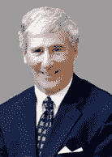

# 领导力笔记:像史蒂夫·乔布斯一样。。。比尔·坎贝尔和安迪·格罗夫 

> 原文：<https://web.archive.org/web/https://techcrunch.com/2010/03/14/notes-on-leadership-jobs-grove-campbel/>

***编者按**:当风险资本家投资早期创业公司时，他们投资的更多的是公司的创始人，以及他们带领员工度过最不可能的环境，将想法从萌芽变成真正的盈利企业的能力。在这篇客座博文中，风险投资公司[的](https://web.archive.org/web/20221208023442/http://www.crunchbase.com/financial-organization/andreessen-horowitz)[本·霍洛维茨](https://web.archive.org/web/20221208023442/http://www.crunchbase.com/person/ben-horowitz)安德森·霍洛维茨解释了他和他的联合创始人马克·安德森在投资创业公司之前寻找的领导特质。他们的一些投资包括 [Skype](https://web.archive.org/web/20221208023442/https://beta.techcrunch.com/2009/11/19/ebay-skype-sale/) 、 [Zynga](https://web.archive.org/web/20221208023442/https://beta.techcrunch.com/2009/12/15/zynga-takes-180-million-venture-round-cue-russian-mafia-jokes/) 、 [Factual](https://web.archive.org/web/20221208023442/https://beta.techcrunch.com/2010/02/03/factual-1-million-seed/) 和 [RockMelt](https://web.archive.org/web/20221208023442/https://beta.techcrunch.com/2009/08/14/the-rockmelt-mystery-is-it-just-a-facebook-browser-or-will-it-break-the-mold/) 。在成为投资伙伴之前，霍洛维茨和安德森共同创立了 Opsware，并以 16 亿美元的价格卖给了惠普，在此之前，霍洛维茨是网景公司的高管。*

在 Andreessen Horowitz，我们喜欢由创始人来管理公司。原因有很多(这也将是未来一篇博文的主题)。因此，我们花了大量时间来思考成为一名创始 CEO 所需的特质。或许，成为一名成功的创始 CEO 最重要的特质是领导力。那么什么是领导力，我们如何在 CEO 的工作环境中思考领导力？伟大的领导者是天生的还是后天培养的？

大多数人对领导力的定义与最高法院大法官波特·斯图尔特对色情作品的著名定义如出一辙，他说:“当我看到它时，我就知道了。”

一个更好的定义来自前国务卿科林·鲍威尔，他说:“当人们会出于好奇而跟随你到任何地方时，你已经成为一个优秀的领导人。”就我们的目的而言，我们可以将其概括为衡量领导者素质的标准:希望追随她的人的数量、质量和多样性。

那么是什么让人们想要追随一个领导者呢？我们寻找 3 个关键特征:

*   清晰表达愿景的能力
*   正确的抱负
*   实现愿景的能力

让我们把这些按顺序排好。

**清晰表达愿景的能力——史蒂夫·乔布斯的特质**

领导者能否清晰地阐述一个有趣的、动态的、令人信服的愿景？更重要的是，在事情分崩离析的情况下，领导能做到这一点吗？更具体地说，当公司发展到对任何员工来说继续在那里工作都没有客观的财务意义时，领导者是否能够清晰地表达一个足够有说服力的愿景，让人们出于好奇而留下来？

我相信乔布斯作为一个有远见的领导者，迄今为止最大的成就是:a)在 NeXT 公司失去光泽很久之后，让这么多超级天才继续追随他；然后 b)在公司濒临破产的时候，让苹果的员工接受他的愿景。很难想象其他领导人会如此引人注目，以至于他们可以连续做这些事情，这就是为什么我们称之为史蒂夫·乔布斯的属性。

**正确的志向——比尔·坎贝尔属性**

安迪·格罗夫曾经说过，一家公司需要雄心勃勃的高管来实现其目标。然而，至关重要的是，这些高管要有“正确的抱负”:对公司成功的抱负，而不是“错误的抱负”:对自己成功的抱负。

我们社会中最大的误解之一是，成为 CEO 的先决条件是自私、无情和冷酷无情。其实正好相反，原因很明显。任何成功的 CEO 必须做的第一件事就是让真正优秀的人为她工作。聪明的人不愿意为那些头脑中没有自己利益的人工作。

我们大多数人在职业生涯中都经历过这种情况:一位聪明、雄心勃勃、努力工作的高管，没有人愿意为他工作，结果，他的表现比人们想象的要差得多。

真正伟大的领导者会创造一种环境，让员工觉得 CEO 关心员工比关心自己多得多。在这种环境中，令人惊奇的事情发生了:大量员工相信这是他们的公司，并据此行事。随着公司的发展壮大，这些员工成为整个组织的质量控制。他们设定了所有未来员工必须遵守的工作标准。比如，“嘿，你需要在那个数据表上做得更好——你在搞砸我的公司。”

我把这种特征称为比尔·坎贝尔属性，以我的朋友比尔的名字命名，他是我见过的最棒的。如果你和在比尔管理的许多组织中工作过的人交谈，他们会把这些组织称为“我的组织”或“我的公司”他在这方面的领导力如此令人难以置信的强大，很大一部分原因是他是完全真实的。他很乐意为他的员工牺牲自己的经济、名誉、荣耀和奖励。当你与比尔交谈时，你会感觉到他非常关心你和你要说的话，因为他确实如此。所有这些都体现在他的行动和后续行动中。

**实现愿景的能力——安迪·格罗夫属性**

我们领导力凳子的最后一条腿是能力，简单明了。如果我认同这个愿景，并且相信领导关心我，我认为她真的能实现这个愿景吗？我会跟随她进入没有地图的丛林，并相信她会带我离开那里吗？

我喜欢称之为安迪·格罗夫属性。安迪·格罗夫将永远是我心目中首席执行官能力的典范。他获得了电气工程博士学位，写出了我读过的最好的管理学著作( *[高产出管理](https://web.archive.org/web/20221208023442/http://www.amazon.com/High-Output-Management-Andrew-Grove/dp/0679762884)* )，孜孜不倦地精进自己的手艺。他不仅写了很多优秀的管理书籍，还在任职期间在英特尔教授管理课程。

在他的经典著作 *[中，格罗夫详细讲述了带领英特尔从内存业务向微处理器业务戏剧性转型的故事。这样做，他放弃了几乎所有的收入。他谦逊地称赞公司里的其他人比他更早得出了战略结论，但迅速而成功地领导公司完成转型的功劳属于格罗夫博士。作为一家 16 岁的大型上市公司，改变你的主要业务会带来很多问题。正如安迪在与他的一名员工的一次事件中所描述的:](https://web.archive.org/web/20221208023442/http://www.amazon.com/Only-Paranoid-Survive-Andrew-Grove/dp/0385482582)*

> 其中一个人咄咄逼人地攻击我，问道:“这是不是意味着你不从事内存行业也能想象出英特尔？”我使劲咽了口唾沫，说:“是的，我想我可以。”一切都失控了。

尽管这种激进的策略震惊了他的许多优秀员工，但最终公司还是信任了安迪。他们相信他会围绕一个全新的业务来重建他们的公司。这种信任被证明是非常正确的。

那么，伟大的领导者是天生的还是后天培养的？

让我们一次看一个属性:

*   愿景的表达——毫无疑问，有些人比其他人更擅长讲故事。然而，通过专注和努力，任何人都可以在这方面有很大的提高，这也是事实。所有首席执行官都应该致力于领导力的愿景部分。
*   利益一致——我不确定比尔·坎贝尔属性是否无法学习，但我非常确定它是无法教授的。在这三者中，这一个最符合“生而不造”的标准。
*   实现愿景的能力——这一属性绝对可以实现；也许这就是为什么安迪·格罗夫对无能的容忍度传奇般的低。的确，能力的敌人有时是自信。首席执行官永远不应该过于自信，以至于停止提高自己的技能。

最后，领导力的一些属性比其他属性更容易改进，但每位首席执行官都应该在这三个方面下功夫。