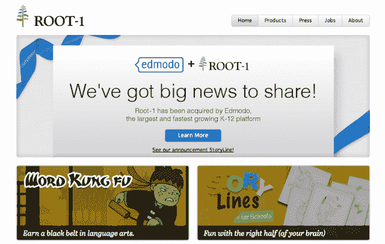

# Edmodo 现在拥有 1800 万用户，首次收购 Root-1，成为教育应用市场 

> 原文：<https://web.archive.org/web/https://techcrunch.com/2013/03/06/now-18m-users-strong-edmodo-makes-its-first-acquisition-in-root-1-to-become-the-app-market-for-education/>

在公立学校担任技术人员多年后，杰夫·奥哈拉和尼古拉斯·博格在 2008 年创办了 [Edmodo](https://web.archive.org/web/20221006180911/http://www.edmodo.com/) 来解决他们认为师生关系中存在的巨大差距:教师需要一种更好、更安全的方式来与学生联系和交流。然而，随着去年年初其 API 的推出，允许开发人员在其平台上开发应用程序，这个最初作为社交网络工具的工具——有点像教育领域的脸书或 Yammer 最近已经发展成为教育应用程序的市场。

从那时起，Edmodo 面向第三方开发者的平台已经发展到支持 400 多个应用程序，是教育领域最大用户群之一的三倍，目前注册用户超过 1800 万。为了帮助它进一步扩展其不断增长的应用平台，Edmodo 本周宣布进行了首次收购，收购了总部位于帕洛阿尔托的教育应用制造商 [Root-1](https://web.archive.org/web/20221006180911/http://www.root-1.com/) ，金额未披露。

虽然两家公司都拒绝透露收购条款，但埃德蒙多·首席运营官·克里斯托·赫特表示，Root-1 的整个团队都将加入埃德蒙多，联合创始人马尼什·科塔里和凯坦·科塔里将帮助领导平台战略和增长，而谷歌早期员工维布·米塔尔将领导 R&D，联合创始人亚当·斯特平斯基将在埃德蒙多的工程团队中担任“关键角色”。

通过此次收购，Edmodo 不仅为其 70 名员工增加了更多的技术人才，而且现在还能够利用 Root-1 的五个教育应用，包括其 OpenMinds 平台，该平台允许教师和学生将学习内容转化为应用。这家初创公司开发了 OpenMinds，让教育工作者和教育开发人员能够快速转换他们的工作表和项目，重新将它们转换为移动设备和网络的测验、抽认卡、谜题和游戏。

本质上，这允许技术团队更容易地访问从第三方上传的内容，以便他们可以将更多的注意力放在设计和基础设施上。在教师方面，关键的增值是 OpenMinds 使教育工作者能够为课堂策划应用和教育内容，并真正更多地参与如何创建数字学习体验并将其呈现给学生。

随着教育技术领域的成熟，InBloom 等工具开始让数据变得更容易访问和携带，Edmodo 希望其平台成为数字教育领域底层结构的一部分。为了做到这一点，这家初创公司的目标是通过成为课堂学习工具和内容的市场和中央分销渠道，使自己成为不可替代的公用事业。

像 TeachersPayTeachers [这样的市场正在蓬勃发展，为教师提供了一个集中的市场](https://web.archive.org/web/20221006180911/https://beta.techcrunch.com/2012/09/30/how-technology-is-empowering-teachers-minting-millionaires-and-improving-education/)，他们可以在那里分享和购买课程计划和其他教育内容。当然，TpT 帮助老师们赚了一大笔钱也是有帮助的。网络已经开始为教师和学生提供越来越多的教育内容分发和共享渠道，并且，展望未来，谁将自己定位在这种交流的中心，谁就会发现自己处于一个强有力的位置。

在这个新的数字教育市场中，教师也将寻找更好的方法来将噪音转化为信号，并需要一种方法来利用有组织的发现和搜索学习工具。 [Noodle 在某个时候可能会成为](https://web.archive.org/web/20221006180911/https://beta.techcrunch.com/2012/05/02/noodle-education-launch/)这个搜索和监管引擎，而 [eSpark Learning](https://web.archive.org/web/20221006180911/https://beta.techcrunch.com/2012/09/02/espark-raise-luke-shepard/) 正在寻求为教育建立更好的分发、社交发现和支付解决方案，同时让学生能够将教育应用程序管理到定制的学习资料和播放列表中。

虽然有很多公司怀有类似的愿望，拥有 4700 万美元的银行存款和 1800 万注册用户，但在这一点上，没有人能真正与 Edmodo 相提并论，Edmodo 已经成为新一代教育科技初创公司的最大成员之一。诚然，Edmodo 的盈利战略在很大程度上仍处于初期阶段，但随着该平台现在提供数百种免费和付费应用程序(从付费应用程序中抽取一定比例的收入)，这种情况将开始改变。拥有 1800 万人的网络，Edmodo 并不着急。

关于此次收购的更多信息，[点击这里](https://web.archive.org/web/20221006180911/http://blog.edmodo.com/2013/03/05/edmodo-acquires-education-technology-start-up-root-1/)查看 Edmodo 的博客文章。

