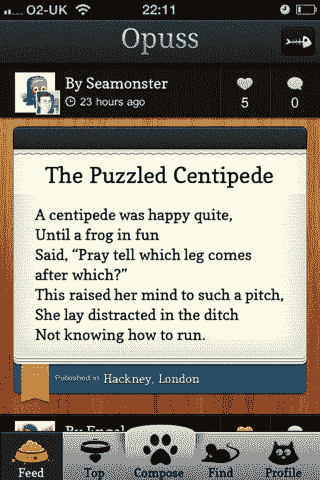

# 现在在 iPhone 上:Opuss，一个 insta gram For Words 

> 原文：<https://web.archive.org/web/http://techcrunch.com/2011/12/07/now-on-the-iphone-opuss-an-instagram-for-words/>

注意了，潮人们:你们现在可以把你们的诗歌带走了。(潮人[还](https://web.archive.org/web/20230209124822/http://www.youtube.com/watch?v=rk9d8SPLcZ4&feature=related)喜欢诗骂吗？我不知道)。无论如何，有一个新的 iPhone 应用程序叫做 [Opuss](https://web.archive.org/web/20230209124822/http://itunes.apple.com/us/app/opuss/id473948939?mt=8) ，它自称是“文字的 Instagram”但要明确的是，对于诗歌来说，不一定非得是*而是*。它还可以用来保存和分享心爱的名言、笑话、食谱、评论、故事或任何你觉得需要写的东西…但不是推特。

我不得不承认，Opuss 是一个非常漂亮的应用程序，尽管我并不完全接受这个概念。首席技术官亚当·尼尔森表示，这款应用应该是一款成熟的 Twitter，但我打开应用时看到的第一个条目有点幼稚。

为了让你开心，这首诗叫做“萤火虫”

事情是这样的:

我希望我是一只萤火虫
萤火虫永远不会闷闷不乐，
因为当太阳照耀你的屁股时，你怎么会暴躁呢？

(信用:loz)

好的。嗯。是啊。

话虽如此，但在这里读到一些更高质量的诗歌会很好(抱歉，loz)，因为应用程序本身看起来很棒。我知道用起来会很有趣。

下载并安装 Opuss 后，该应用程序会简单地指导您如何使用其按钮和功能。通常，我觉得“走查”很烦人，而且碍事(我的哲学是:如果你的应用需要一个解释者，你需要重新开始)，但出于某种原因，我发现自己实际上在读 Opuss 教程。当所描述的按钮在底部亮起时，你在每个屏幕上滑动。底部甚至有 iPhone 主屏幕式的点，指示你当前的页面和位置。

一本像样的教程看起来是这么简单的一件事，其实不然。我见过一些*严重的*灾难，似乎是手绘圆圈和手写笔记描述了一个应用程序的元素。所以干杯，奥普斯，就这样。

使用该应用程序也非常简单。您可以查看订阅源、按类别筛选、关注他人、评论、喜欢和分享。

我不明白这个应用程序的猫主题——爪印、项圈和小猫图标填充了整个应用程序。*(哦，puss？* ) *更新:Oooh，opus。奥普斯。好的。呵。*我也不确定在 Twitter 时代，一个应用程序是否有追随和支持人们言论的粘性。但这款应用看起来不错，鉴于该公司缺乏资金，这一点更令人印象深刻。

Opuss 是 Seamonster Ltd. 的产品，这是一家总部位于伦敦的公司，员工包括前 [Probability](https://web.archive.org/web/20230209124822/http://www.probability.co.uk/pbty/) 首席技术官、现任 Seamonster 首席技术官(兼临时首席执行官)、技术总监兼联合创始人 Jeff Hodnett 和创意总监 Chris Knight。

从[这里](https://web.archive.org/web/20230209124822/http://itunes.apple.com/us/app/opuss/id473948939?mt=8)你可以自己试试。

【T2