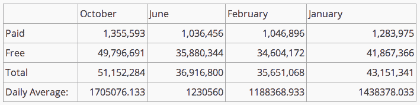

# 现在每天有 400 万次下载，自去年 10 月以来，Windows 商店增长了 135% 

> 原文：<https://web.archive.org/web/https://techcrunch.com/2014/02/27/now-serving-4m-downloads-daily-the-windows-store-has-grown-135-since-october/>

# 现在每天有 400 万的下载量，自去年 10 月以来，Windows 商店增长了 135%

埋在 MWC 幻灯片中，微软宣布它现在每天从 Windows 8.x 的应用程序市场 Windows Store 提供 400 万次应用程序下载

每天 400 万次下载相当于每月 1.2 亿次，或者每年 14 亿次。这个数字基本上躲过了更大的媒体雷达——归功于 [wind8apps](https://web.archive.org/web/20221127125847/http://wind8apps.com/windows-store-downloads-daily/?utm_source=twitterfeed&utm_medium=twitter) ！这意味着即使几天过去了，我们还有工作要做。

(此前，微软在开发者门户上列出了 Windows 商店的详细下载信息。一旦我[开始覆盖数据](https://web.archive.org/web/20221127125847/https://beta.techcrunch.com/2013/11/11/microsofts-windows-store-averaged-1-7m-daily-downloads-in-october-up-nearly-40-from-june/)，微软[先是限制](https://web.archive.org/web/20221127125847/https://beta.techcrunch.com/2013/12/03/paid-game-downloads-spike-34-on-the-windows-store-in-november-but-microsoft-obscures-other-data-points/)，然后[一起猛拉](https://web.archive.org/web/20221127125847/http://blogs.windows.com/windows/b/appbuilder/archive/2013/12/09/windows-store-trends-nov-2013-update.aspx)。该公司承诺让开发者了解 Windows 商店的最新情况。到目前为止，在近三个月的时间里，已经有两篇博文发表。但是我跑题了。)

我们有完整数据的上个月是 10 月，在对个人电脑市场至关重要的假日销售周期之前。因此，我们有前期和后期数据进行比较。为了提醒你，下面是微软公布的数字，这些数字已经被编辑过了(我的数学工作；所提供的是孤立的):

因此，10 月份 Windows Store 的下载量超过了 5110 万次。与目前每天 400 万的速度相比(暗示每月总数:1.2 亿)，你可以很快计算出，自 10 月以来，Windows Store 的下载量增长了 134.6)。这在不到半年的时间里增长了 100%以上。

比你预期的要好？我也对这个数字感到惊讶。以至于我[找到了包含数据点](https://web.archive.org/web/20221127125847/https://twitter.com/mrseb/status/437560759506456576/photo/1)的原始幻灯片，并与微软再次确认了这个数字。

iOS 的 App Store 仍然比 Windows Store 大大约十亿分之一。去年 6 月，iOS 达到了[500 亿的应用下载量大关](https://web.archive.org/web/20221127125847/https://beta.techcrunch.com/2013/06/10/apples-app-store-hits-50-billion-downloads-paid-out-10-billion-to-developers/)。那太多了。

但是，Windows Store 的数据之所以有趣，并不是因为与苹果在积分榜上的数据相比，这是一个很大的数字；相反，它证明了 Windows 8.x 平台实际上可以提供大规模的应用下载量，这可能会引起更多开发者的兴趣。

我怀疑 Windows 8.x 是否有一个具体的门槛，必须跨越这个门槛才能得到更认真的对待，但突破 9 位数的月下载率可能很重要，即使只是象征性的。

图片由 FLICKR 用户爱丁堡印刷城下 [CC BY 2.0](https://web.archive.org/web/20221127125847/http://creativecommons.org/licenses/by/2.0/) 许可(图片已裁剪)