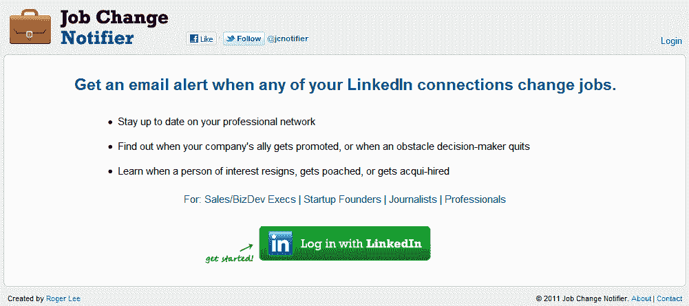

# 现在，你可以使用 LinkedIn 了解最新的招聘(和解雇)信息

> 原文：<https://web.archive.org/web/https://techcrunch.com/2011/07/08/now-you-can-use-linkedin-to-stay-up-to-date-on-whos-getting-hired-and-fired/>

 今天， [LinkedIn 超过 Myspace](https://web.archive.org/web/20230205005039/https://techcrunch.com/2011/07/08/linkedin-surpasses-myspace-for-u-s-visitors-to-become-no-2-social-network-twitter-not-far-behind/) 成为美国第二大社交网络。自[于 5 月](https://web.archive.org/web/20230205005039/https://techcrunch.com/2011/05/19/linkedin-ipo-shares-pop-84-percent-on-first-trade/)上市以来，LinkedIn 的流量激增，并在 6 月达到创纪录的 3390 万独立访客。

利用职业社交网络的持续增长，[PaperG](https://web.archive.org/web/20230205005039/http://www.rogerlee.com/)的联合创始人[李劼](https://web.archive.org/web/20230205005039/http://www.rogerlee.com/)建立了一个很酷的小服务，恰如其分地叫做[工作变动通知](https://web.archive.org/web/20230205005039/http://www.jobchangenotifier.com/)。你可能已经猜到了，当你的 LinkedIn 联系人换工作时，Lee 的服务可以让你跟踪并接收通知。

因此，该服务允许用户跟踪“感兴趣的人”，无论他们是初创公司的创始人、高管，以了解他们何时辞职、被挖走或被录用。这项服务也可能对企业对企业的初创公司和向其他企业出售产品的公司有用，因为它允许他们发现自己的盟友何时得到提升或进入决策角色。这也是一个在你的职业网络中保持最新状态的简单方法，祝贺你的朋友和联系人得到了你一直关注的工作。

Lee 使用 LinkedIn 的 API 建立了这个网站，但与 LinkedIn 没有任何关系，尽管他说 LinkedIn 的员工已经联系过他，他们对这个网站表示了兴趣。

当然，并不是每个人都会在工作变动后立即更新 LinkedIn 上的个人资料，尤其是那些被解雇的人，而且工作变动和 LinkedIn 上相应的更新之间通常会有一段时间的滞后，但这仍然是了解你的联系人职业变动的最快方法。

使用该网站很容易，设置也很快:用户只需输入他们的电子邮件地址来接收提醒，选择他们想要跟踪的 LinkedIn 连接，然后 bada bing，bada boom，你就可以跟踪了。

虽然工作变动通知程序几天前才推出，但该网站已经跟踪了超过 30 万份个人资料，并且每天都在增加大量的个人资料。虽然李开复还不能给我一个很好的使用分析的分类，但他确实说该网站已经在初创公司、销售和业务开发主管、招聘人员以及不出所料的 LinkedIn 员工中流行起来。

李开复表示，LinkedIn 已经问过他是否有兴趣为他们工作，但他无意离开 PaperG。([我们早在八月份就报道过 PaperG](https://web.archive.org/web/20230205005039/https://techcrunch.com/2010/08/23/papergs-flyerboard-latimes-media-loca/)。)到目前为止，通知只能通过电子邮件获得，但根据早期用户的反馈和需求，随着流量的增加，Lee 可能会增加更多的通知渠道。

这是一个很棒的工具，它给 TechCrunch 的作者们提供了另一种方式来监视所有那些向上流动的专业人士，所以回去工作吧。因为我们会一直看着。

**更新:**似乎今天 Boston.com 也报道了类似的服务[，类似于工作变动通知，但针对招聘人员。该公司名为](https://web.archive.org/web/20230205005039/http://www.boston.com/business/technology/innoeco/2011/07/bullhorn_tunes_in_to_social_me.html) [Bullhorn](https://web.archive.org/web/20230205005039/http://www.bullhornreach.com/) (他们制作的软件也是如此)，其功能名为 Radar*“试图在人才积极寻找新工作之前识别人才”*。有意思。也值得一看。