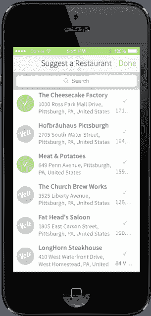

# NoWait 是一款可以让你从手机上加入餐厅等候名单的应用程序，它已经覆盖全国 

> 原文：<https://web.archive.org/web/https://techcrunch.com/2014/01/30/nowait-the-app-that-lets-you-join-a-restaurant-wait-list-from-your-phone-goes-nationwide/>

该公司表示，面向餐厅的移动等待列表服务 NoWait T1 正在扩大其面向消费者的移动应用 T3 在 T2 的推广，以覆盖全国的食客。该应用程序向你显示附近餐馆的列表、等待时间和距离，并让你通过手机加入等待名单。它于去年 9 月首次进入市场，服务于诺瓦克的家乡匹兹堡，在三个月的时间里，它从五家餐馆增加到五十家。本周，NoWait 计划在全美范围内再增加 100 家餐馆。

首席执行官威尔·赛克斯说，到今年年底，诺瓦克预计将开设 1000 家餐厅。“过去两年我们一直在播种市场，我们将向现有的客户群推广，”他解释道。

NoWait 的餐厅合作伙伴是那些使用该公司基于 iPad 的主机和桌子管理系统的人，该系统取代并增强了传统的餐厅蜂鸣器。如今，有“数千家”餐厅在使用 NoWait 平台。

赛克斯拒绝透露有多少餐馆为这项服务的[高级等级](https://web.archive.org/web/20230130001655/http://nowaitapp.com/pricing)付费，根据餐馆的规模和数量，每月从 59 美元到 199 美元不等。然而，该公司在船上有几家著名的餐厅和连锁店，包括德克萨斯路屋，TGI 星期五餐厅，Chili's 和 Buffalo Wild Wings 的特许经营店，它将在本季度推出 On The Border 和 First Watch。

该公司表示，其餐厅合作伙伴目前每月接待超过 310 万名食客，高于一年前的 70 万人。迄今为止，它总共接待了 3000 万名食客。

目前，就餐者会收到短信，提醒他们桌子准备好了，餐馆也可以在那个时候发出简短的营销信息，例如，为了促销特色菜或开胃菜。几周后，该计划将推出一个推送通知功能，与 NoWait 消费者应用程序配合使用。这样，用餐者可以搜索餐厅，将他们的名字添加到列表中，然后在一个更无缝的体验中接收警报。

如果你喜欢的餐馆不在，这个应用程序会让你投票选择 NoWait 可以在以后展示这些餐馆，作为其推销的一部分。

在这条路上，Sykes 看到 NoWait 扩展到其他领域，包括可能的保留地，或者消费者必须排队等候的任何地方，从医院到酒店。“我们首先解决的是餐饮业——我们认为我们正在改变人们外出就餐的行为方式，”赛克斯说。“但我们未来肯定会考虑(预订)市场，”他补充道。

与此同时，更新后的 NoWait 消费者应用可以在 iTunes 和 [Google Play](https://web.archive.org/web/20230130001655/https://play.google.com/store/apps/details?id=com.nowaitapp.consumer) 下载[。](https://web.archive.org/web/20230130001655/https://itunes.apple.com/us/app/nowait-restaurant-guide-wait/id691617940)

餐厅座位管理和预订是一个拥挤的市场，其他人 [OpenTable](https://web.archive.org/web/20230130001655/http://www.opentable.com/Info/Restaurateurs/software.aspx) ， [NoshList](https://web.archive.org/web/20230130001655/http://www.nosh.com/list) ， [Livebookings](https://web.archive.org/web/20230130001655/http://www.livebookings.us/) ， [DinerConnection](https://web.archive.org/web/20230130001655/http://www.dinerconnection.com/) ， [WaitList Manager](https://web.archive.org/web/20230130001655/http://itunes.apple.com/us/app/wait-list-manager-hd/id379844520?mt=8) ， [TurnStar](https://web.archive.org/web/20230130001655/http://www.turnstar.com/) ， [Table's Ready](https://web.archive.org/web/20230130001655/http://www.tablesready.com/) ， [NexTable](https://web.archive.org/web/20230130001655/http://home.nextable.com/) ，以及更多的人在同一个空间竞争。但是随着 BuzzTable 出售给 POS 制造商 Leapset 和 OpenTable 收购 Quickcue，最近出现了一些整合。事实证明，这可能对诺瓦克有好处。