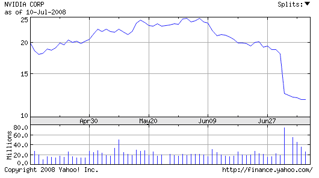

# Nvidia 试图掩盖有缺陷的 GPUs 

> 原文：<https://web.archive.org/web/https://techcrunch.com/2008/07/10/nvidia-tries-to-cover-up-defective-gpus/>

# 英伟达试图掩盖有缺陷的图形处理器

现已确认所有 [Nvidia](https://web.archive.org/web/20230311004828/http://www.crunchbase.com/company/nvidia) G84、G86 芯片均有缺陷。分析师最初认为，只有[惠普](https://web.archive.org/web/20230311004828/http://www.crunchbase.com/company/hewlett-packard)收到的那批才是坏的，但其他消息来源称，G84 和 G86 全面使用相同的专用集成电路，这意味着有缺陷的图形处理器将比最初预期的多得多。

部分原因也在于英伟达不愿承认问题比他们最初预期的要严重得多。根据《T4 问询报》的查理·德默坚所说，英伟达一直在向每一位分析师提供个性化的故事，试图掩盖事态的严重性。在最近宣布第二季度预期收入下降后，他们的股票遭受了打击，损失了三分之一以上的价值。第二季度预期收入最初在 10.8 亿至 11.1 亿美元之间，后来又降至 8.75 亿至 9.5 亿美元之间。此外，据报道，Nvidia 将在有缺陷的设备上遭受 1.5 亿至 2 亿美元的损失。其他消息来源认为，损失会更大，这将损害该公司已经受损的股票。

这可能只是英伟达艰难时期的开始。G84 和 G86 芯片组用于各种笔记本电脑，包括行业领先的惠普、[戴尔](https://web.archive.org/web/20230311004828/http://www.crunchbase.com/company/dell)和[苹果](https://web.archive.org/web/20230311004828/http://www.crunchbase.com/company/apple)等。密切关注英伟达的股票；如果他们不尽快想出解决方案，很可能会耗尽公司本季度的所有现金。

