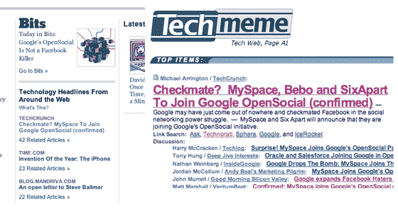

# 纽约时报博客作者诉 TechMeme 

> 原文：<https://web.archive.org/web/https://techcrunch.com/2007/11/03/nytimes-blogrunner-v-techmeme/>

周四，我们报道了纽约时报博客 T4 产品的正式发布。Blogrunner 被特别定位为一个类似于 Techmeme 的博客新闻聚合器，尽管当算法不能完全胜任任务时(Techmeme 是 100%基于算法的新闻)，它会以人性化的方式帮助挑选好的故事。

当我们写下最初的故事时，我们说我们会报告 Blogrunner 和 Techmeme 各自给我们带来了多少流量。这是我们测试的完美一天，因为我们关于 [MySpace 加入 Google OpenSocial](https://web.archive.org/web/20221209122241/http://www.beta.techcrunch.com/2007/11/01/confirmed-myspace-to-join-google-opensocial/) 的报道是这两个网站当天大部分时间的头条新闻。

我们不是在比较苹果和苹果。虽然同样的故事出现在两个网站的顶部，但 blogrunner 只是纽约时报科技版的一个专题，而在 TechMeme 则是整个节目。但纽约时报比 TechMeme 大得多的事实仍然让我怀疑他们的总流量会更高。九月康姆斯克说纽约时报有 1450 万独立访问者。TechMeme 太小了，康姆斯克无法统计，所以他们的独立访客可能不到 50 万。

尽管如此，差别还是很惊人。《纽约时报》给我们送来了 150 名访客(另外 70 名来自 blogrunner.com)。但是这 220 名访客与 TechMeme 在 24 小时内的 4500 名访客进行了比较。

如此之少的巨大流量似乎从纽约时报过滤到博客层面。这可能是由于位置的原因，或者也许读者还不习惯 blogrunner 也许随着时间的推移，他们会越来越喜欢它。

除非我另有看法，否则 TechMeme 是博客圈里的饮水机。这是我们一起去讲故事的地方——有些故事引起了周围每个人的注意，而另一些故事只是小声说，没人听到。但它是我们所有人每时每刻都在的地方。很难伤害到它。