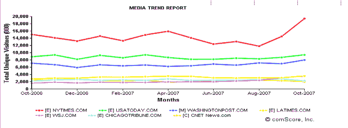
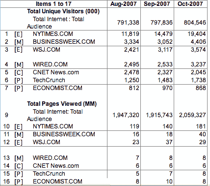
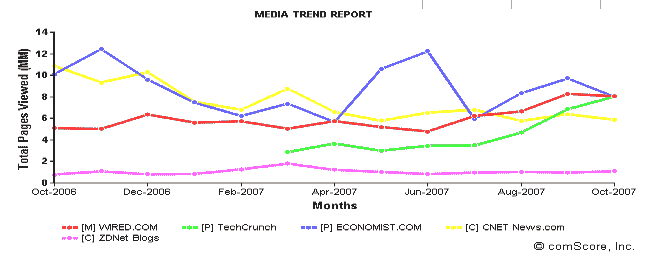

# 纽约时报暴涨，CNet 暴跌 

> 原文：<https://web.archive.org/web/https://techcrunch.com/2007/12/10/nytimes-surges-cnet-slumps/>

# 纽约时报暴涨，CNet 暴跌

自从九月中旬[NYTimes.com 扫除了](https://web.archive.org/web/20221207194957/http://www.beta.techcrunch.com/2007/09/18/the-end-of-the-pay-for-content-model-is-nigh/)其订阅付费墙(又名时代精选)的最后几块石头后，它的流量一直在飙升。根据 comScore 的数据，从 8 月底到 10 月底，它在全球范围内获得了 750 万读者(11 月的数字还没有出来)。增长了 64%(总数达到 1940 万)。同样，全球月浏览量同期飙升 52%，至 1.81 亿次。其他主要新闻媒体，如 BusinessWeek.com(10 月份有 440 万读者)、WSJ.com(360 万，有订户墙)和 Wired.com(320 万)在秋季也有所增长，但没有 NYTimes.com 那么引人注目。

【T2

从这个角度来看，仅在 10 月份，纽约时报的读者就增加了 490 万。这是 CNet News.com 200 万读者总数的两倍多，令人遗憾的是，这似乎是少数几个访问量下降的媒体网站之一(从 8 月份的 250 万)。News.com 的页面浏览量也很平稳，自 8 月以来每月 600 万次。相比之下，comScore 显示 10 月份 TechCrunch(包括我们的姐妹网站 [CrunchGear](https://web.archive.org/web/20221207194957/http://www.crunchgear.com/) )在全球的月浏览量为 800 万(我们在 9 月份超过了 News.com)，它还显示我们在 10 月份的全球在线读者人数为 170 万。以下是来自 comScore 的各种新闻网站的实际全球数据:

有趣的是，这里有一张图表显示了 Wired.com、News.com、Economist.com、TechCrunch(带有 CrunchGear)和 ZDNet 博客在过去一年的浏览量。TechCrunch 是绿线。

