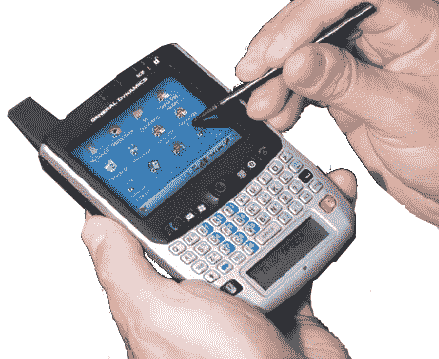
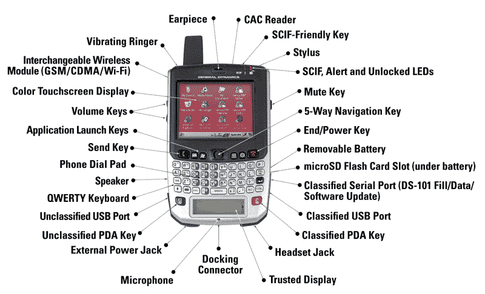

# 奥巴马将保留他的黑莓手机

> 原文：<https://web.archive.org/web/https://techcrunch.com/2009/01/16/obama-to-keep-his-blackberry/>

# 奥巴马将保留他的黑莓手机

科技界对当选总统欧巴马是否能保留他心爱的黑莓手机的猜测[如火如荼](https://web.archive.org/web/20221201164326/http://www.crunchgear.com/2009/01/12/barackberry-may-bite-the-bullet/)。据美国广播公司世界新闻报道，他将只能保留它供个人使用。任何与政府有关的事情都必须通过国家安全局批准的电话来处理。智能手机选项 Sectera Edge 是美国国家安全局批准的砖式手机。(跳转后的图片)。不管怎样，对巴拉克来说是好事。没有什么比失去你的黑莓手机更糟糕的了。
 