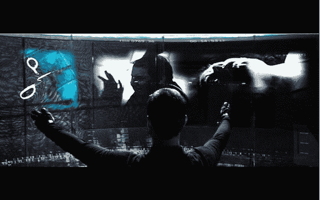
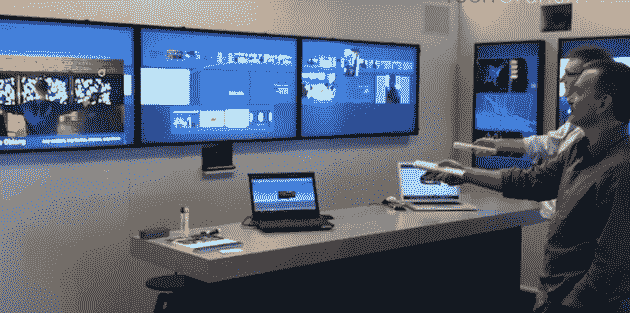
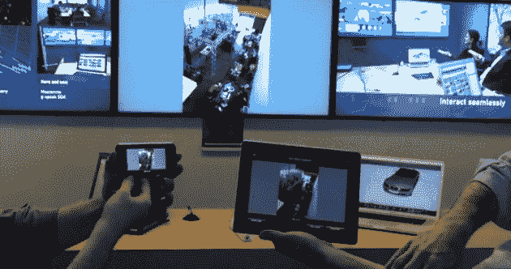
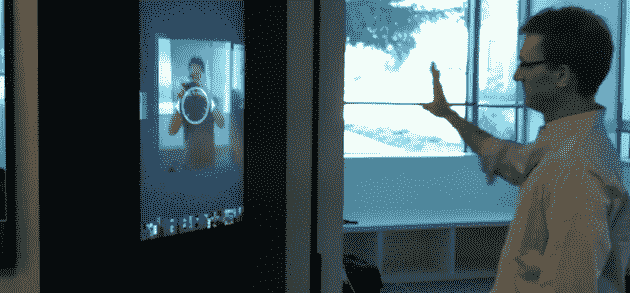

# Oblong 构建了计算的未来。我见过。用过了。太美了。

> 原文：<https://web.archive.org/web/http://techcrunch.com/2011/06/23/oblong-mezzanine/>

“这是下一个麦金塔级别的颠覆。”

在过去的几年里，我几乎关注了技术领域的每一个新事物，并写了很多相关的文章。但是，当这么多的东西不仅不是革命性的，甚至经常不是进化性的，我们很难不变得愤世嫉俗。相反，我看到的大部分只是简单的[衍生](https://web.archive.org/web/20230205002050/https://techcrunch.com/2011/03/05/the-app-wall/)，坦率地说，很无聊。但是每隔一段时间就会出现一些真正改变游戏规则的事情。它恢复了我对技术的信心。这是描述我本周会见 [Oblong Industries](https://web.archive.org/web/20230205002050/http://oblong.com/) 时所见所闻的最佳方式。

Oblong 正在研究的技术绝不是衍生的或无聊的——它们绝对是革命性的。它们将塑造计算机的未来。

我明白这种说法听起来绝对夸张——尤其是从一个已经写了[次](https://web.archive.org/web/20230205002050/https://techcrunch.com/2010/07/27/apple-magic-trackpad-mouse/)[关于老鼠](https://web.archive.org/web/20230205002050/https://techcrunch.com/2011/06/03/windows-ate-the-mouse/)死亡的家伙口中。但是我鼓励你跳到这篇文章的底部，看看视频。我将尝试解释我所看到的，以及与 Oblong 首席执行官 Kwindla Hultman Kramer 和首席科学家 John Underkoffler 讨论的内容。但是真正做到技术公正(超越使用它)的唯一方法是看到它的实际应用。

如果你认识 Underkoffler 的名字，可能是因为你去年看过他的 TED 演讲。他展示了 Oblong 开发的 g-speak SOE(空间操作环境)技术，赢得了观众的喝彩。如果这看起来很熟悉，那是因为 Underkoffler 也是史蒂夫斯皮尔伯格 2002 年电影《T2》《T3》《少数派报告》《T4》《T5》背后的制片人的顾问。是的，所有这些超赞的手势计算场景都是他的作品。在过去十年左右的时间里，他一直致力于通过 Oblong 将这项技术引入现实世界。他们越来越接近了。非常接近。

继去年的 TED 演讲之后，[我写了一篇文章提到](https://web.archive.org/web/20230205002050/https://techcrunch.com/2010/02/16/oblong-industries-minority-report/)2008 年我在西班牙看过一个简短的演示，我不被允许谈论这个。演示的是 Oblong 的技术。太棒了。但这只是一个视频演示。两天前，我亲眼看到并使用了 Oblong 构建的第一个系统。该产品名为 Mezzanine，也就是克雷默所说的“Oblong 的第一个收缩包装交钥匙系统”。“这是我们多年来开发的技术堆栈的第一部分，”他说。

那是什么呢？

夹层是一个空间操作环境，用于会议室和其他大型会议区域。外围设备各不相同，但我使用的系统由三个大屏幕组成，前面和中间，两个垂直排列的屏幕在右边的墙上，一个白板在左边的墙上，两个摄像头(一个在前面指向你，一个在侧面指向白板)。交互的要点是两个“魔杖”，稍后我会详细解释。该系统可以与房间内任何连接到网络的设备协同工作，包括笔记本电脑、iPhone、iPad 等。

Mezzanine 的想法是让人们聚集在一个房间里，以最能想象的协作方式来综合信息。“我们想让每个人的像素都在一个共享的工作空间中，在那里它们会发生碰撞，”克莱默说。“关键是让每个人都能控制正在发生的事情，”他继续说道。这意味着从你的笔记本电脑、iPhone、iPad 上与三个主屏幕上的数据进行互动，直接用魔杖在屏幕上互动，甚至通过带有网络浏览器的设备远程互动。

使用这些控件，任何人都可以重新排列数据，将新数据推入流中，突出显示特定的内容，并将内容排队以供以后讨论。也许最好的思考方式是把它看作一首信息交响曲，房间里的每个人都可以指挥。同样，这有点难以描述，但当你看到它时，它就是有意义的。

并且[它只是工作](https://web.archive.org/web/20230205002050/https://techcrunch.com/2011/06/08/apple-icloud-google-cloud/)，借用苹果式的思考产品的方式。我拿起一根魔杖，不到两分钟，我就完全知道自己在做什么。我可以在屏幕上传输数据。我可以放大某些数据。我可以裁剪和处理其他数据。我可以缩小显示所有可用信息的完整视图。令人难以置信的是这一切感觉是如此的自然。下一次我不得不使用 PowerPoint 做演示时，我会想开枪自杀。

说到魔杖配件，最好的思考方式是想到一个类固醇的任天堂 Wiimote。它有点像 Wiimote，更精确，功能更强大。它有三个面，根据你手里哪个面朝上，做不同的事情。你用手移动它，换边，做不同的事情。例如，一边允许你抓取数据，而另一边允许你控制数据。例如，也许你在连接到夹层系统的计算机上打开了 Photoshop 你可以使用魔杖直接在你面前的大屏幕上操作它。

魔杖是一个完全空间化的装置。你可以把它向上指，用作推/拉杆。真的很酷。

但是为什么用魔杖而不是用手呢，a-la *少数派报告*？Underkoffler 解释说，因为我们还没有完全实现。好吧，让我换个说法。*技术*是有的，但是大规模实施起来还是太贵了。它仍然需要手套来确保精确的精确度。是的，微软 Kinect 做了一些，但与 Oblong 的目标相比，这是相当初级的。“从哲学上讲，作为一家公司，我们绝对致力于高保真和高端体验。“商品化的东西还没有出现，”克莱默说。

尽管如此，Kramer 和 Ubderkoffler 都同意 Wii 和 Kinect 这样的消费者技术在帮助人们过渡到这些未来的计算概念方面是完美的。克雷默还特别提到了首次在 iPhone 中使用、现在在 iPad 中展示的多点触控技术。“我们真的认为鼠标将在未来几年消失，”他说。

[谢谢](https://web.archive.org/web/20230205002050/https://techcrunch.com/2010/07/27/the-mouse-is-dead/)。

“记住，为鼠标设计的应用程序需要一段时间来完善，”克莱默说。“直到 20 世纪 80 年代末，鼠标才真正做到像素完美。即使在那时，消费者阶层也不存在，”他继续说道，并指出，正如鼠标演变成今天的工具一样，触摸和手势将是下一个目标。

“当你致力于这种类型的事情时，你必须解决一堆新的用户界面问题。我们的总体目标是改变世界上每个人使用电脑的方式，”克莱默说。“这是下一个麦金塔级别的颠覆，”他继续说道(把我上面引用的话带回到上下文中)。

但首先，Oblong 知道他们需要能够将相对实惠的产品推向市场。再说一遍，这就是夹层的意义所在。“我们的目标是改变人们一起工作的方式，”克莱默在一份稍微不那么雄心勃勃的声明中解释道。通过 Mezzanine，他们开始创造一种“向前倾斜”和“向后倾斜”的体验，这意味着你可以观看和互动。“企业 IT 部门对在笔记本电脑上安装新东西持怀疑态度，”克莱默指出，解释了他们为什么为连接到夹层的电脑创建网络控制界面。对于像 iPhone 和 iPad 这样的设备，它们有本地应用程序来与 Mezzanine 交互。

克莱默说，另一方面是舒适度。“你希望能够走进一个房间，使用你随身携带的任何设备上的系统，”他说。或者如果你什么也没带，那也是魔杖发挥作用的地方。

与克莱默和安德科夫勒交谈，你真的会感觉到这个系统投入了多少心思。例如，Underkoffler 提出了“约翰·马尔科维奇问题”(指的是电影*是约翰·马尔科维奇*中有一个场景，其中世界上的每个人都是约翰·马尔科维奇)。你不希望捕捉屏幕上正在呈现的一部分，并最终重新呈现一部分演示文稿。同样，所有这些事情都必须在后端和 UI 级别解决。Underkoffler 说他们已经解决了几乎所有的问题，但是仍然有工作要做来完善计算的未来。

“我们建立软件基础设施来利用这些东西的发展方向，”Kramer 说。“我们最关心的一个形容词是‘能干’。通过我们的软件，我们希望提供一种巨大的方式来证明事物的能力，”他继续说道，将他们所建造的东西比作一架钢琴。“任何人都会弹钢琴。他补充道:“我们构建的用户界面散发出一种虚拟的性能。

Mezzanine 的第三大部分是应用服务器。本质上，Oblong 将允许开发人员编写自己的夹层应用程序，他们有一个针对它的 SDK。这是他们真正感到兴奋的事情——看看其他人想出了什么。按照这些思路，现在的计划是在今年秋天发布整个 g-speak 平台(再次为 Mezzanine 和*少数派报告*——你已经看到的东西)用于非商业用途。

Mezzanine 本身已经被一些大的早期合作伙伴使用(例如波音)，但是计划在今年秋天正式推出。克莱默拒绝透露定价细节，称他们仍在微调。但夹层是你可以从 Oblong 那里全额购买的东西，如果你需要支持，他们会提供的。再说一次，目标市场大体上是“会议室”——但是深入下去，他们预计夹层应用于从董事会议到工程会议到创意会议再到销售会议的所有场合。

凭借他们现有的合作关系，Oblong 已经实现了正现金流(自去年以来一直如此)。自 2007 年 880 万美元的首轮融资以来，他们还没有筹集到资金。

好吧，夹层很壮观，但是我们什么时候才能在家里看到这种东西呢？“我们相信，我们在工作场所实现的同样体验也应该在你的客厅里实现，”克莱默说。“我们所有阅读 TechCrunch 的人都使用相当多的屏幕，所以我们需要到达那里，”他继续说道。与此同时，“我们还没有接近完成，”Underkoffler 补充道。“公平地说，这将需要大约三年时间才能完全进入消费电子设备，”他继续说道，并指出最大的障碍只是成本，并将其降至消费者的合理水平。

下面的视频将向您展示我所看到的行动中的夹层。注意一些小事情，比如用魔杖在大屏幕上操纵汽车，以及如何在笔记本电脑上实时移动汽车。再说一遍，这一切只是工作。还可以观看一个基于手势的无魔杖系统的快速演示，Oblong 希望很快发布该系统，用于零售标牌和其他会议室类型的情况。在那下面，找到很多人已经看过的 g-speak 演示视频。

[vimeo 2229299 w=630]