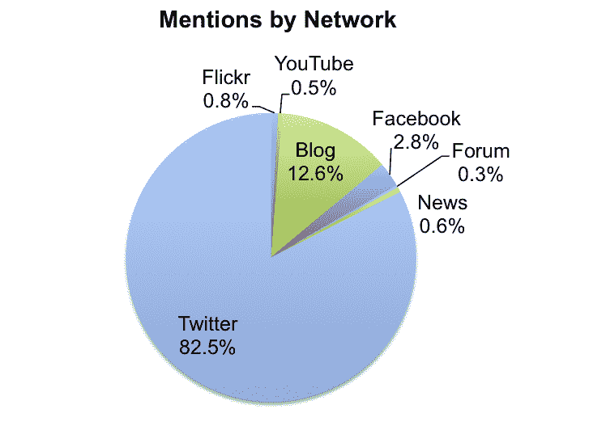
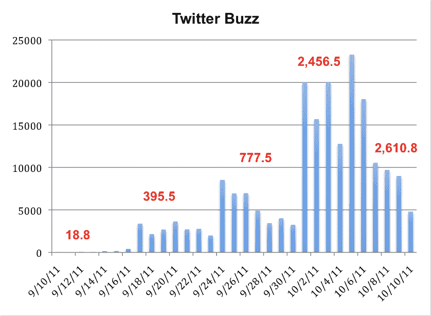

# #OccupyWallSt Twitter 分析显示，Tweets 在周末达到峰值 

> 原文：<https://web.archive.org/web/http://techcrunch.com/2011/10/11/occupywallst-twitter-analysis-shows-tweets-peaking-on-weekends/>

社交媒体营销机构 Attention 已经将注意力(*呻吟声*)转移到 Twitter 上被称为“占领华尔街”(Occupy Wall Street，又名# [)的美国抗议运动上。根据今天](https://web.archive.org/web/20230203154945/http://twitter.com/#!/search/%23OccupyWallSt)[透露的数据](https://web.archive.org/web/20230203154945/http://blog.attentionusa.com/2011/10/occupy-twitter-data-reveals-passion/)，推特是分享抗议相关信息的首选网络，有 82.5%的提及率，相比之下，脸书只有 2.8%，YouTube 只有 0.5%，个人博客只有 12.5%。

该公司表示，数据分析还显示，Twitter 活动在周末增加，这是一个独特的趋势，与大多数基于 Twitter 的社交媒体模式不同。

Attention 指出，通常，Twitter 趋势在工作日达到顶峰，通常是在一周的中期，因为人们在办公桌上而不是在工作时发 Twitter。但是#OccupyWallSt 的趋势正好相反:推文在周末激增，表明人们实际上是在利用空闲时间支持这项事业并提高意识。

分析师在他们的分析中收集了从 9 月 10 日到 10 月 10 日的数据。在布鲁克林大桥上大规模逮捕抗议者导致了 10 月 1 日的活动高峰，活动一直持续到 10 月 6 日。

在跟踪每天的平均提及次数时，该公司发现第一周很少——每天只有 18.8 次。9 月 17 日占领开始后，本周的平均提及率上升了 2004%。接下来的一周增加了 97%，在布鲁克林大桥逮捕事件后，提及次数再次增加了 216%。*(详见下图)。*

自从逮捕后，提及率下降了(没有从监狱发微博？)，而且上周末没有像往常一样出现活动高峰。也就是说，运动本身仍在继续。(见 [Erick 早先的帖子](https://web.archive.org/web/20230203154945/https://techcrunch.com/2011/10/10/grokking-occupywallst/)详述了围绕抗议活动的社交媒体努力)。

抗议本身是一个明显的例子，表明一股破坏性力量似乎直接从我们经济衰退的灰烬中涌现出来，已经成为一场日益壮大的运动，愤怒的公民要求……那么，他们要求什么呢？这是个问题。这些运动的参与者都有自己加入的理由，无论是对失业和缺乏就业前景的愤怒，企业肥猫的贪婪，华盛顿领导层犯下的错误，美国梦的破灭，还是他们自制的标语牌和标语所表明的其他几十种抱怨。

至少这个团体中的一些人已经起草了一份可操作的要求清单，但这条新闻似乎没有像[新闻](https://web.archive.org/web/20230203154945/http://www.washingtonpost.com/blogs/celebritology/post/kanye-west-the-occupy-wall-street-celebrity-of-the-day/2011/10/10/gIQA8FYpaL_blog.html)和的[新闻那样受到媒体的关注，哦，天哪，Twitter 趋势(是的，这里有罪)或者好莱坞名人和艺术家如坎耶·韦斯特、拉塞尔·西蒙斯、李尔·韦恩、小汉克·威廉姆斯、苏珊·萨拉登、马克·鲁弗洛、罗西妮·巴尔、小野洋子、亚历克·鲍德温、蒂姆·罗宾斯和迈克尔·摩尔(毫无疑问已经在拍摄他的下一部纪录片)的参与。](https://web.archive.org/web/20230203154945/http://www.washingtonpost.com/blogs/click-track/post/kanye-west-occupies-wall-street-lil-wayne-uploads-public-service-announcement-hank-williams-jr-snaps-at-the-media-in-song/2011/10/11/gIQAxBdQcL_blog.html)

如果你想知道上述数据的准确性，注意力代表了像美泰、威瑞森和佩珀里奇农场这样的知名品牌，拥有 125 名员工，分布在纽约、伦敦和洛杉矶。换句话说，就社交媒体监测而言，这是一家声誉不错的公司。

*女孩要在智能手机上发微博了？照片经由[http://occupyweb.org](https://web.archive.org/web/20230203154945/http://occupyweb.org/)。*