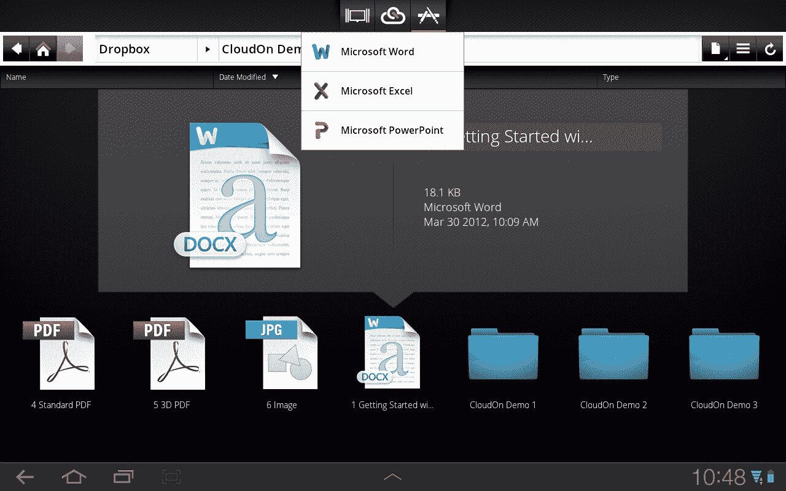
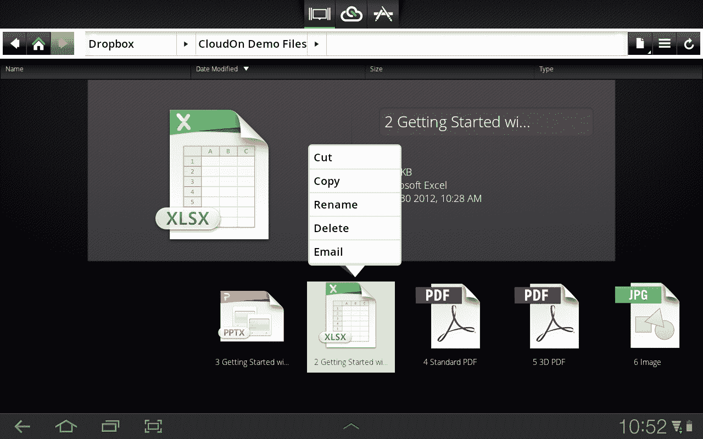

# “iPad 上的 Office”应用 CloudOn 筹集了 1600 万美元，正在增加小组协作 TechCrunch

> 原文：<https://web.archive.org/web/https://techcrunch.com/2012/06/21/office-on-the-ipad-app-cloudon-raises-16-million-is-adding-group-collaboration/>

[cloud on](https://web.archive.org/web/20230128194549/http://site.cloudon.com/)——是的，这家因[将微软 Office 带到 iPad](https://web.archive.org/web/20230128194549/https://techcrunch.com/2012/04/10/ms-office-app-cloudon-ramps-up-productivity-on-the-ipad-with-box-and-adobe-reader-support/) 而闻名的公司——刚刚完成了一轮 1600 万美元的 B 轮融资，由[社交+资本合伙企业](https://web.archive.org/web/20230128194549/http://www.crunchbase.com/financial-organization/the-social-capital-partnership)牵头，参与方包括 [Translink Capital](https://web.archive.org/web/20230128194549/http://www.crunchbase.com/financial-organization/translink-capital) 以及现有投资者 [Foundation Capital](https://web.archive.org/web/20230128194549/http://www.crunchbase.com/financial-organization/foundation-capital) 和[Rembrandt Venture Partners](https://web.archive.org/web/20230128194549/http://www.crunchbase.com/financial-organization/rembrant-venture-partners)。[社交+资本公司的普通合伙人马蒙·哈米德](https://web.archive.org/web/20230128194549/http://www.crunchbase.com/person/mamoon-hamid-2)现在将作为资金的一部分加入 CloudOn 的董事会。

这次提价反映了对 iPad 上传统生产力软件的需求，但也暗示了这家初创公司的更大计划，它的愿景是重新想象生产力在新的移动时代应该如何运作。

对于那些不熟悉的人来说，这款应用程序允许用户查看、编辑、保存和共享他们的文件，以及从 Dropbox、box 和 Google Drive 等云存储服务中访问文件。在 Office 中，编辑甚至包括在 Word 中跟踪修改、在 Excel 中操作数据透视表以及在完整演示模式下查看 PowerPoint 幻灯片等功能，这些功能在非官方解决方案中是不一定会出现的。

虽然是新的，CloudOn 已经相当受欢迎了。在 2012 年 1 月首次亮相五个月后，它的应用程序下载量超过了 100 万次，并在苹果应用商店的几个排行榜上占据了榜首。推出后成为免费应用第一，iPad 生产力应用第一，至今保持在生产力应用前十。该公司还在全球 19 个国家推出了 iPad 版本，最近还推出了 Android 平板电脑版本，并在其中 18 个国家的不同时间点上取得了免费应用和生产力应用的第一名。

有了这笔额外的资金，CloudOn 的目标之一是继续向北美和欧洲以外的更多地区进行全球扩张，并在今年下半年推出其智能手机服务版本。据首席执行官 Milind Gadekar 称，该公司已经看到了来自南美的许多兴趣，并有具体的计划，下一步将触及巴西、日本和新加坡。他说，到第三季度，目标是在全球范围内推出。

## 面向群体的 CloudOn 即将到来

虽然对 CloudOn 用户来说，最大的吸引力无疑是在 iPad 上访问微软 Office，但该公司显然已经与其他生产力参与者合作，包括 Adobe、Dropbox、box 和谷歌，以努力增强服务，而不仅仅是一个“iPad 上的微软 Office”应用程序。毕竟，如果微软在 iPad 上推出 Office，CloudOn 可能会有麻烦，如果这是它唯一的游戏的话。

加德卡也知道这一点。“我们的未来是重新定义生产力。他说:“我们不仅仅是让你在 iPad 上办公。“我们确信微软将在 iPad 上推出自己的 Office 版本。我们的观点是，需要能够改变体验，以便人们不仅可以与文件互动，还可以与文件中的信息互动。”从短期来看，这意味着团队协作。

CloudOn 现在正在 Office 的基础上构建额外的功能，这些功能将支持注释和群组对话等功能。“在不久的将来，我们将实现群体生产力，这样多人将处理同一文档，可以共享信息，并可以跟踪围绕信息的对话。这最终会带来更丰富的工作体验，”Gadekar 解释道。是的，他指的是跨平台——谷歌、微软等。“传统上，我们已经看到三个筒仓被创建——微软筒仓、苹果筒仓和谷歌筒仓——它们从应用程序到设备到云存储进行集成，而没有任何与其他筒仓互操作的兴趣。他说:“我们认为，‘让终端用户来选择’。

顺便提一下，加德卡指出，客户对苹果 iCloud 或 iWork 集成的需求并不多，这很有趣，因为 90%以上的客户群都在 iPad 上。这可能与 CloudOn 目前看到的客户类型有关:学生、中小企业、政府以及在企业中背着 it 部门采用 CloudOn 的个人。

哦，对于那些好奇的人，是的， [CloudOn 是合法的](https://web.archive.org/web/20230128194549/http://help.cloudon.com/knowledgebase/articles/57737-is-cloudon-legal)。它已经通过适当的渠道许可了微软的技术，并且遵守各自的许可协议。但是许可需要钱，这就是为什么 Gadekar 说随着团体协作功能的引入，货币化将在今年晚些时候开始。

这家位于帕洛阿尔托和以色列的公司现在有一个近 30 人的团队，并且仍在招聘，但近期没有搬迁的计划。这款应用目前可以从[这里](https://web.archive.org/web/20230128194549/http://site.cloudon.com/product/)免费下载。