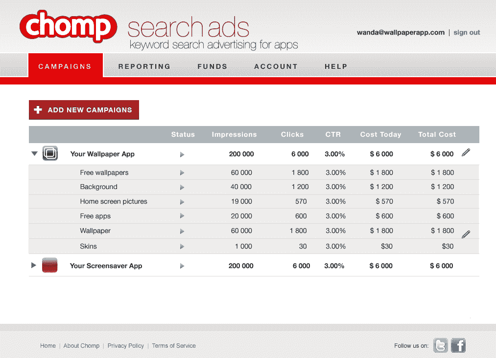
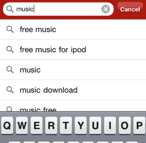

# 哦，嘿，谷歌:Chomp 推出了自己的应用搜索 AdWords 为 iPhone 带来实时搜索 

> 原文：<https://web.archive.org/web/https://techcrunch.com/2011/09/27/oh-hey-google-chomp-launches-its-own-adwords-for-app-search-brings-realtime-search-to-iphone/>

两周前，我们报道了 Chomp T1 的新闻，它将在威瑞森的应用商店为所有 Android 手机提供 T2 搜索。今天，app search early player 宣布了一些更大的消息，这一次广告商和开发者将受益。

今天推出的私人测试版是“Chomp Search Ads”，这是一个新程序，允许开发者对关键词或短语进行竞价，将他们的广告发送给在应用搜索引擎中搜索这些词的用户。然后，广告引擎根据潜在客户当前正在搜索的应用，将应用广告与最相关的潜在客户进行匹配，使广告不那么烦人，对消费者来说更相关，对开发者来说更有利可图。

在其私人测试的早期阶段，Chomp 将向一组精选的广告客户开放其搜索广告引擎，其中 [Milk](https://web.archive.org/web/20221207144232/http://milkinc.com/) 和 [Zaarly](https://web.archive.org/web/20221207144232/http://www.zaarly.com/) 是首批参与的两家公司。

Milk(和 Digg)创始人凯文·罗斯表示:“能够向正在寻找类似产品的人宣传 Oink 应用程序，这是一种我们从未见过的定位方式。”。对于广告商和开发者来说，这种额外的定位绝对是巨大的。只考虑市场。[根据 Gartner](https://web.archive.org/web/20221207144232/https://beta.techcrunch.com/2011/01/26/mobile-app-store-15-billion-2011/) 的数据，Erick 在 1 月份报告称，2010 年应用广告支出为 8.93 亿美元，预计到 2014 年应用总收入将飙升至 500 亿美元，其中高达 200 亿美元可能用于应用广告。

和 Chomp 这样的应用搜索引擎更相关的是什么？每月有超过 2 亿 iOS 和 Android 用户搜索应用。不用说，如果广告引擎的实施进展顺利，匹配达到标准，这可能是 Chomp 的一个巨大举措，可能会鼓励开发者(他们将应用收入的 20%至 30%用于营销等。)蜂拥而来。

至于它将如何工作？像谷歌的 AdWords 一样，Chomp 搜索广告将是一种基于拍卖的服务，开发者可以建立一个账户，并向账户中预先注入广告美元。根据 Chomp 的新闻稿，届时 Chomp 将“推荐搜索词，开发者可以为这些关键词出价，为给定的关键词或短语设定每日最高支出和最高出价”。

Chomp 将根据出价和相关性显示广告，只有当用户通过“Get It”按钮点击广告时，开发者的账户才会被收费。而且，就像谷歌为网络广告所做的一样，这家初创公司将为用户提供活动报告和分析，以衡量他们的广告费用的有效性。

这里的价值主张可能非常高，因为传统的应用程序广告没有跟上网络广告的速度，很少考虑到交付的广告与消费者的相关性。许多应用程序展示广告无法提供有意义的结果，因此许多开发者都避免将广告集成到他们的应用程序中。只是不值得花那么多钱。但是如果 Chomp 能够实现它的承诺，这将是开发者、消费者以及 Chomp 的一大胜利。

这家初创公司的搜索广告在 T4 ads.chomp.com 的私人测试版中有售。

 此外，该应用搜索引擎发布了一款针对 iPhone 的重新设计的应用，补充了其搜索广告功能，该应用拥有一个新的界面，并带来了将在威瑞森应用商店上线的功能，如基于关键字、类型和类别发现新应用的能力，而不仅仅是通过名称搜索。

Chomp for iPhone 的新设计有一个突出的搜索框，集成了谷歌现在理所当然的实时搜索实现。这意味着，从用户在手机的搜索栏中输入一个字母的那一刻起，Chomp 的新搜索就开始自动显示结果。Chomp 联合创始人本·基格兰(Ben Keighran)表示，搜索结果现在还会显示大型“应用程序卡”，包括应用程序的名称、价格、评论评级和一个“获取”按钮，为用户提供了一种自然的方式来获得应用程序的基本概念及其与搜索的相关性。

Chomp 的主屏幕还将包括基于趋势的十大建议搜索词(同时显示这些应用的预览图标)，以及五个用户推荐的主题标题，可以基于类别和“相关搜索”功能进行搜索。

当心应用程序搜索引擎，Chomp 在其平台上添加搜索广告并增强其搜索功能，正使其越来越接近成为应用程序搜索引擎的谷歌，而越来越远离 AltaVista。

更多信息，[点击这里](https://web.archive.org/web/20221207144232/http://itunes.apple.com/us/app/chomp/id348286549?mt=8)查看 iTunes 上的 Chomp。