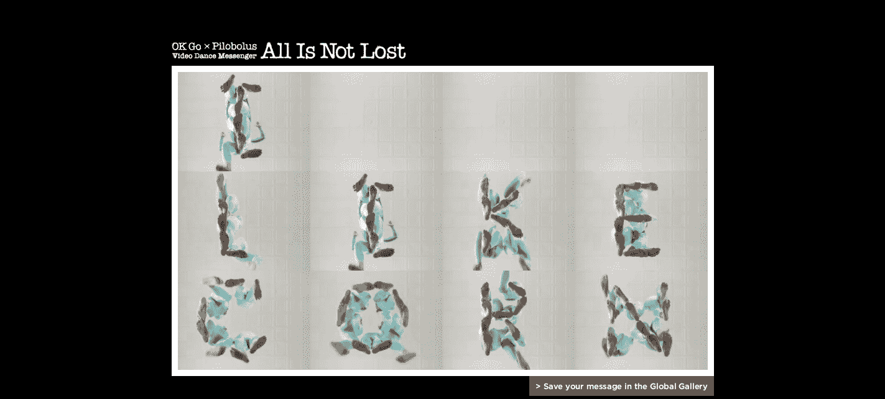

# OK Go 的最新视频让你强迫乐队成员执行你邪恶的命令 

> 原文：<https://web.archive.org/web/http://techcrunch.com/2011/07/28/ok-gos-latest-video-lets-you-force-band-members-to-do-your-evil-bidding/>

# OK Go 的最新视频让你强迫乐队成员执行你邪恶的命令

如果你运行的是 Chrome，并且你喜欢带有扭曲美学的王子变音超级流行音乐，那么你很幸运。乐队 [OK Go](https://web.archive.org/web/20230203040429/http://en.wikipedia.org/wiki/OK_Go) 与[舞蹈公司 Pilobolus](https://web.archive.org/web/20230203040429/http://www.pilobolus.com/home.jsp) 合作，为他们的歌曲《并非一切都失去了》制作了一个非常独特的视频

视频本身非常简单——你让一群人穿着弹力纤维在干净的地板上跑来跑去，所以当他们躺下时，你几乎可以说出每个人的宗教信仰。然而，视频与 chrome 互动的方式——创建依赖的窗口、万花筒和其他狂野的效果——然后使用预设的舞蹈脚字母表将你自己的信息放入视频——非常酷。

你可以[在这里](https://web.archive.org/web/20230203040429/http://www.allisnotlo.st/index_en.html)看/玩视频。该视频是与谷歌的 Chrome 项目[一起制作的。](https://web.archive.org/web/20230203040429/http://www.google.co.jp/chrome/intl/ja/playwithchrome.html)

以下是我的信息:

现在我必须把丹·科诺普卡被打烂的屁股从我的脑海中抹去。