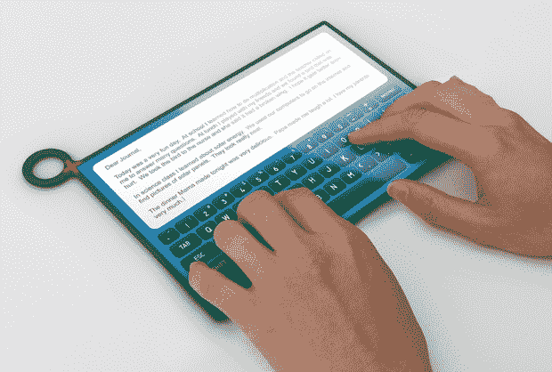

# OLPC 平板电脑将采用双模式屏幕，运行安卓系统，参加 2011 年 CES 

> 原文：<https://web.archive.org/web/https://techcrunch.com/2010/05/27/olpc-tablet-to-have-dual-mode-screen-run-android-be-at-ces-2011/>

# OLPC 平板电脑将有双模屏幕，运行安卓系统，在 2011 年消费电子展

[每个孩子一台笔记本电脑](https://web.archive.org/web/20221210071415/http://www.crunchgear.com/tag/olpc/)项目的负责人尼古拉斯·尼葛洛庞帝展示了 XO-3 平板电脑的一些渲染图，[在](https://web.archive.org/web/20221210071415/http://blog.laptop.org/2010/05/27/xo3-marvell-and-olpc/)[麻省理工学院媒体实验室活动](https://web.archive.org/web/20221210071415/http://blog.laptop.org/2010/05/27/xo3-marvell-and-olpc/)上宣布了几个新细节。这次展示是与 Marvell 的合作，其极低成本的莫比平板电脑设计在几个月前浮出水面。他们正在与 Marvell ( [和 Pixel Qi，据报道为](https://web.archive.org/web/20221210071415/http://www.crunchgear.com/2010/03/31/olpc-and-pixel-qi-sitting-in-a-tree-c-r-o-s-s-l-i-c-e-n-s-i-n-g/))合作生产这款新平板电脑，他们希望这款平板电脑的价格仅为 75 美元。

Negroponte 说，这种平板电脑将在 2011 年的 CES 上展示，但不会是最终版本:主要的困难是让结构全是塑料的，到 2011 年初，他们可能仍将不得不依赖玻璃屏幕。他说，虽然最终产品可能会采用他们自己的定制操作系统，但它首先会使用 ARM 处理器并运行 Android。我们将看到的第一个原型会更像莫比，而不是 XO，所以不要对这些渲染抱有太大希望。