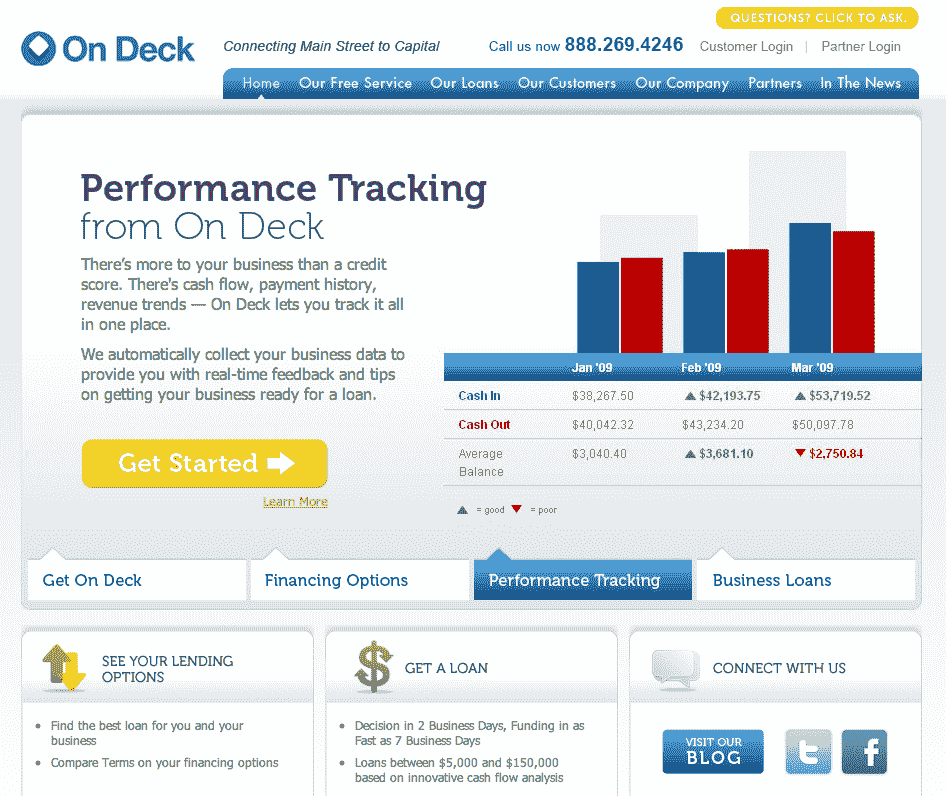

# On Deck 筹集了 1900 万美元，将主街企业与 Capital TechCrunch 联系起来

> 原文：<https://web.archive.org/web/http://techcrunch.com/2011/08/04/on-deck-raises-19-million-to-connect-main-street-businesses-with-capital/>

帮助小企业与资本联系的平台 Deck Capital 已经在 C 轮融资中筹集了 1900 万美元。今年 1 月，这家初创公司从 [SAP Ventures](https://web.archive.org/web/20230205030205/http://www.crunchbase.com/financial-organization/sap-ventures) 获得了 1500 万美元，最近又从总部位于纽约的私人投资公司 SF Capital Group 获得了 400 万美元。作为新资金的一部分，旧金山资本集团总裁尼尔·沃尔森将加入 Deck 的董事会。Wolfson 加入了 SAP 董事总经理 David Hartwig 的行列，他在公司投资后加入了董事会。在 Deck 上已经从包括 [Contour Venture Partners](https://web.archive.org/web/20230205030205/http://www.crunchbase.com/financial-organization/contour-ventures) 、[首轮资本](https://web.archive.org/web/20230205030205/http://www.crunchbase.com/financial-organization/first-round-capital)、[科斯拉风险投资](https://web.archive.org/web/20230205030205/http://www.crunchbase.com/financial-organization/khosla-ventures)、 [RRE 风险投资](https://web.archive.org/web/20230205030205/http://www.crunchbase.com/financial-organization/rre-ventures)和[乡村风险投资](https://web.archive.org/web/20230205030205/http://www.crunchbase.com/financial-organization/village-ventures)在内的投资者那里筹集了总计 3800 万美元。

Deck 最近运行良好，它的销售和业务开发团队增加了两名高级管理人员，在芝加哥举行的[克林顿全球倡议](https://web.archive.org/web/20230205030205/http://www.clintonglobalinitiative.org/)论坛上亮相，2011 年客户收购(客户数量达到 4000 家)和贷款申请的逐月增长翻了一番，现在已经为小企业提供了超过 1 . 25 亿美元的资本(平均贷款规模为 3 万美元)。你可以在这里阅读我们对甲板上[的原始报道](https://web.archive.org/web/20230205030205/https://techcrunch.com/2011/05/19/smart-lending-on-deck-gives-your-startup-a-credit-score-so-you-can-secure-a-loan/)。

On Deck 于 2006 年推出，使用数据聚合和电子支付技术的混合，带来了评估小型企业健康状况的替代形式，以有效地将资本引入中小型企业。虽然 TechCrunch 和其他科技出版物经常报道创业公司从风险投资公司和天使投资人那里筹集大笔资金(咳咳，就像这位)，但事实是，美国有大量小企业无法从高实力的风险公司筹集资金。

传统上，缅因街上许多夫妻店获得资金的途径是申请银行贷款。因此，不仅企业缺乏获得风险资本的渠道，而且这个市场也没有得到这些传统银行贷款的充分服务。

在甲板上认为，主要街道企业面临的根本问题不是信贷和资本问题(因为它经常被诊断)，而是一个时间和技术问题。那是什么意思？中小企业通常负担不起(或缺乏专业知识)完成冗长的贷款包，另一方面，银行不愿意承担(无可否认令人望而却步的)承销低于 25 万美元融资空间的费用——更不用说低于 10 万美元的融资，因为这一过程更加繁琐。

因此，在评估贷款申请时，银行在很大程度上被迫依赖企业主的个人信用评分，这往往是企业健康状况的高度不准确的反映。因此，On Deck 通过利用调查大量数据点的软件来解决这一问题，这些数据点包括该企业有多少客户、现金流、销售额和已登记的投诉——所有这些都是为了找出该企业是否足以偿还贷款。

因此，该公司提供了所谓的“甲板分数”，而不是企业主的个人信用分数，这是一种商业信用分数，旨在为贷款人提供一种有效的衡量小企业信誉的方法。桌面乐谱是与 Equifax 合作开发的。

由于该初创公司的平台允许企业创建商户档案，该档案链接到电子数据源，包括在线银行、会计和商户处理(并聚合社会、税收和行业数据)，银行和贷款机构可以更容易地访问中小企业的完整财务档案。这让贷款人免去了自己收集数据或依靠个人信用评分来评估信用的麻烦。

考虑到目前有 500 万家企业拥有 25 名或更少的员工，美国经济 40%的工作岗位都依赖于这一部分，Deck 在促进这些企业的承销方面提供了非常有价值的服务，其新的资本注入将确保这家初创公司继续为服务不足的(和相当大的)市场带来颠覆性的技术。

欲了解更多信息，请点击这里。

