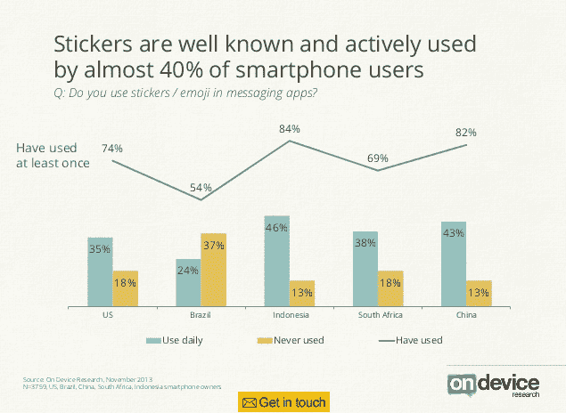

# WhatsApp 主导全球移动 Android/iOS 消息应用地图，但 BBM 获得了一席之地

> 原文：<https://web.archive.org/web/https://techcrunch.com/2013/11/26/on-device-mobile-messaging-apps/>

移动通讯应用前景[仍然是高度地理分散的](https://web.archive.org/web/20230316062822/https://techcrunch.com/2012/12/04/global-messaging-market/)，不同的通讯服务在不同的全球地区表现良好。尽管持续的本地化变化，消息老将 [WhatsApp](https://web.archive.org/web/20230316062822/http://www.crunchbase.com/company/whatsapp) 仍在多个全球地区占据主导地位，尽管相对较新的 Android 和 iOS 的 T4——黑莓信使(BBM)在这两个平台的社交聊天地图上获得了一席之地。

根据移动市场研究公司[在设备](https://web.archive.org/web/20230316062822/http://www.crunchbase.com/company/on-device-research)上对美国、巴西、南非、印度尼西亚和中国的 3，759 名 Android 和 iOS 用户进行的[调查](https://web.archive.org/web/20230316062822/http://www.slideshare.net/OnDevice/messenger-wars-how-facebook-lost-its-lead)，WhatsApp 是南非、巴西和印度尼西亚领先的社交消息应用，在美国排名第二，这使其地理分布优于脸书的 Messenger 应用(仅在美国领先，在巴西和南非排名第二)。

此外，在美国。在 Facebook Messenger 领先的地方，WhatsApp 的使用率也不落后——尤其是在 16-24 岁年龄段:

数据还指出，这两个即时通讯应用在美国市场上的重叠相对较少，只有四分之一的美国智能手机用户同时使用 Facebook Messenger 和 WhatsApp，大多数操作系统用户坚持使用其中一个。

在 Device 的五个调查市场中，44%的移动用户表示他们每周至少使用一次 WhatsApp，而 35%的用户表示他们每周至少使用一次 Facebook Messenger。中国的微信应用排名第三，超过四分之一(28%)的受访者每周至少使用一次。

但黑莓 BBM 应用的出现突显了移动通讯领域的活力——该应用仅在几周前针对安卓和 iOS 发布，但已成为受访市场中第五大最常用的社交通讯应用。

在所有五个市场中，On Device 的数据显示，17%的受访者每周至少使用一次 BBM，仅次于 Twitter (19%)，领先于 Skype (16%)。对于一个平台新手来说还不错，尤其是在[如此艰难的开始](https://web.archive.org/web/20230316062822/https://techcrunch.com/2013/09/22/bbm-android-ios-launch/)之后。

谈到具体的市场数据，根据 On Device 的数据，BBM 在南非排名第三，在印度尼西亚排名第二，在这两个国家分别有 34%和 37%的受访者使用 (在南非排在 WhatsApp 和 Facebook Messenger 之后；以及印尼的 WhatsApp)。

南非和印尼是黑莓历史上表现强劲的两个市场，因此显然仍有足够多的手机用户在 BBM 网络上有朋友，为该公司的跨平台 BBM 游戏带来动力。我们也不要忘记 BBM 从 2005 年就已经存在了——所以它实际上是移动通讯的老爷爷，尽管它最终从黑莓自己的 rails 中解放出来免费运行。

该公司显然正在尽其所能，在关键的传统市场上最大化其品牌力量，以创造 BBM 势头。今天[宣布](https://web.archive.org/web/20230316062822/http://press.blackberry.com/press/2013/leading-oems-to-preinstall-bbm-on-android-based-smartphones-.html)BBM 将从下个月开始预装在各种 Android 设备上，这些设备来自非洲、印度、印度尼西亚、拉丁美洲和中东的原始设备制造商。

该公司今天表示，这些地区的智能手机将包括 BBM 开箱即用的设备，包括 Be、金铃子、Celkon、EVERCOSS、IMO、Micromax、米托、Snexian、Spice、TECNO、TiPhone 和 Zen。

BBM 应用程序也将继续在 Google Play 上免费下载，但预装提高了它的知名度，降低了使用门槛，因此这是一个巨大的优势。从原始设备制造商的角度来看，这些家伙将他们的硬件与一个在他们各自的市场上仍然知名和受欢迎的品牌联系起来，以使他们的手机从其他低成本“机器人”中脱颖而出。

> 在美国，只有 16-24 岁年龄段的人大量使用 SnapChat

“BBM 在印尼非常受欢迎，因为它可以在 Android 上使用，所以已经成为我们客户的必备消息应用。因此，我们很高兴与黑莓的 BBM 团队合作，在我们的设备上预装 BBM，让我们的客户比以往任何时候都更容易连接到 BBM 联系人并开始聊天，”EVERCOSS 首席营销官 Janto Djojo 说，这是伴随 BBM 预装新闻的多个支持声明之一。

回到设备上的调查，受访市场中用户安装的即时通讯应用的平均数量差异很大，从的 4.2 个(平均)印尼和南非的 4.1 个，到巴西的 2.6 个，中国的 2.4 个，以及最低的美国的 2.1 个

BBM 在用户对使用多种即时通讯应用更加开放的市场上获得了最大的吸引力，这或许不是巧合，因为它不必担心试图取代 WhatsApp 或脸书。

调查显示，中国的微信也在崛起。On Device 的数据显示，这款应用——在国内市场被称为微信，但在国际市场被称为微信——正在“溢出中国”，五分之一(20%)的印度尼西亚人和 18%的南非智能手机用户表示他们现在每周都使用它。

该调查还涉及 SnapChat——一款短暂的照片分享应用，最近几周吸引了巨大的兴趣，此前有报道称其拒绝了脸书 30 亿美元的收购要约。关于【SnapChat 的用户群到底有多大的问题一直存在，因为这家初创公司没有透露。它更喜欢谈论分享的照片([每天 4 亿张](https://web.archive.org/web/20230316062822/https://techcrunch.com/2013/11/19/snapchat-reportedly-sees-more-daily-photos-than-facebook/)——尽管其中一些照片可能会发给多人)。

尽管人们对 SnapChat 很感兴趣，但 On Device 在调查的所有市场中都没有发现这款应用的大量使用——唯一的例外是美国 16-24 岁年龄段的用户。该年龄段的受访用户中有五分之一(20%)表示每周至少使用一次，而 25 岁以上的受访用户中只有 3%的人这样做。所以很明显，美国青少年是一个非常有利可图的群体。

该调查还涉及贴纸——一种流行的移动通讯应用货币化方法。数据显示，近 40%的受访智能手机用户积极使用贴纸，不同市场的使用率有所不同，从高达 46%的印度尼西亚人(表示他们每天都使用贴纸)到不到四分之一(24%)的巴西人。

当谈到实际支付像素时，超过五分之一的受访移动用户表示，他们至少为消息应用中的贴纸/表情符号支付过一次。

