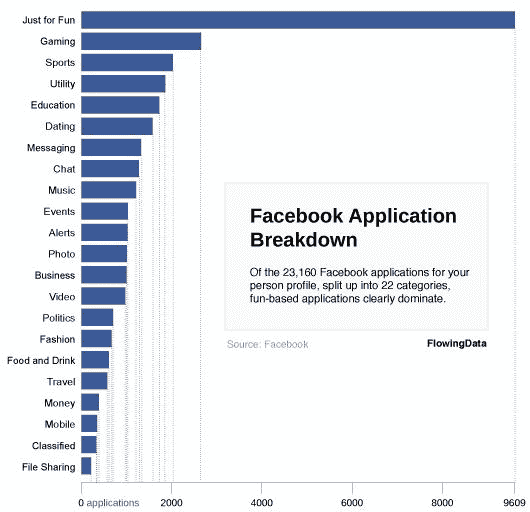

# 在脸书，女孩和男孩只想找乐子 

> 原文：<https://web.archive.org/web/https://techcrunch.com/2008/05/02/on-facebook-girls-and-boys-just-want-to-have-fun/>

# 在脸书，女孩和男孩只想玩得开心

如果你需要任何证据来证明脸书的头号活动是在偷懒，上图来自[流动数据](https://web.archive.org/web/20221209130849/http://flowingdata.com/2008/05/01/chart-of-the-day-a-breakdown-of-facebook-applications/)显示了按类别分类的申请数量。脸书上的 23160 个应用程序中，大约有一半属于“仅仅为了娱乐”或“游戏”类别。“约会”和“聊天”也排在前列。“金钱”、“分类广告”和“文件共享”是最不受欢迎的。

脸书可以说是一个市场。显而易见，应用程序开发人员正在追逐他们使用最多的类别。这并不奇怪，但像这样的图表确实说明了这一点。