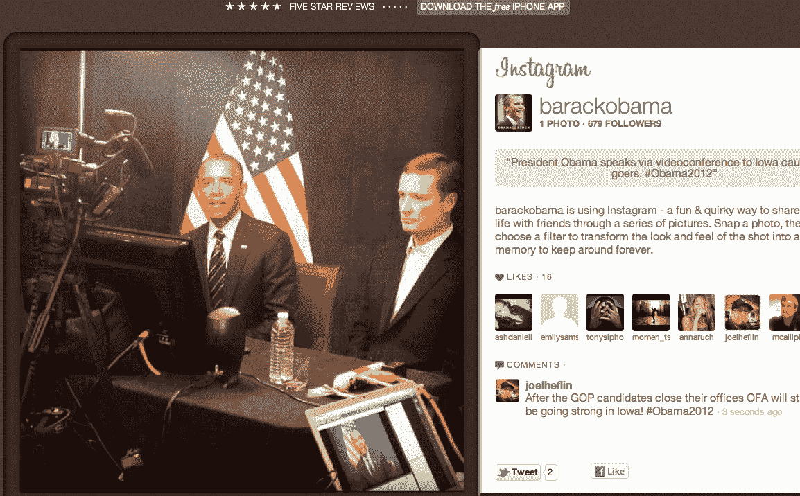

# 在爱荷华州党团会议当天，巴拉克奥巴马加入 insta gram TechCrunch

> 原文：<https://web.archive.org/web/https://techcrunch.com/2012/01/03/on-the-day-of-the-iowa-caucus-barack-obama-joins-instagram/>

# 在爱荷华州党团会议当天，巴拉克·奥巴马加入了 Instagram

游戏开始了。爱荷华州党团会议(这很重要，因为它启动了投票，并被视为哪个总统候选人有机会赢得共和党提名的指标)的结果在美国中部时间今晚 7 点左右开始涌入。根据分析家和初步民意调查，到目前为止，罗恩·保罗、里克·桑托勒姆和米特·罗姆尼之间的竞争看起来将是三方竞争。

巴拉克·奥巴马总统在竞选活动中一直擅长社交媒体，他巧合地利用这段媒体密切关注的时间加入了照片分享宠儿 Instagram，取名为[@巴拉克·奥巴马](https://web.archive.org/web/20230214145118/http://web.stagram.com/n/barackobama)——此外还为[搜索词“爱荷华州会议”购买了推广推文。](https://web.archive.org/web/20230214145118/https://twitter.com/#!/search/Iowa%20caucus)

虽然奥巴马总统和白宫在 Flickr 上有照片分享账户，在 Google+、Foursquare、脸书，当然还有 Twitter 上也有社交账户，但这是奥巴马第一次使用纯移动平台。Instagram 现在有超过 1500 万用户，上传了超过 4 亿张照片。令人印象深刻的统计数据考虑到它尚未触及 Android。

当然，这并不一定意味着黑莓迷奥巴马会买一部 iPhone，他的团队会管理这个账户，但可能会让他偶尔使用他们的手机。

Instagram 首席执行官[凯文·斯特罗姆](https://web.archive.org/web/20230214145118/http://www.crunchbase.com/person/kevin-systrom)在[博客文章](https://web.archive.org/web/20230214145118/http://blog.instagram.com/post/15270799594/welcome-to-instagram-president-barack-obama)中写道:

> “随着 2012 年美国总统大选的临近，我们看到 Instagram 上的政治报道越来越多。NBC 新闻、ABC 世界新闻和华盛顿邮报等新闻机构一直在全国范围内分享辩论和市政厅会议的幕后照片，为我们提供了 2012 年选举的独特视角。随着 2012 年选举日的临近，我们期待看到竞选活动、记者和选民如何使用 Instagram，通过照片讲述 2012 年总统大选的故事。”

和..这是他的第一张照片，他自己对与会者讲话…看起来他没有使用滤镜 [#nofilter](https://web.archive.org/web/20230214145118/https://twitter.com/#!/search/%23nofilter) ，如果他使用了，那很可能是“Jefe”或“Rise”这很难说。

