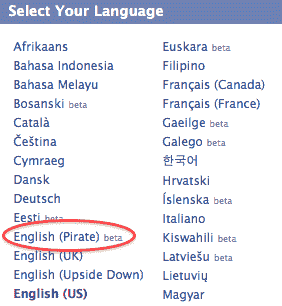
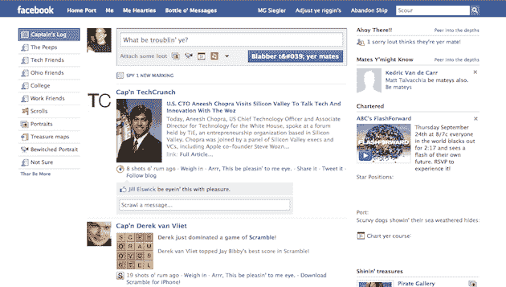
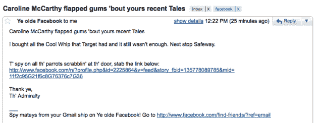
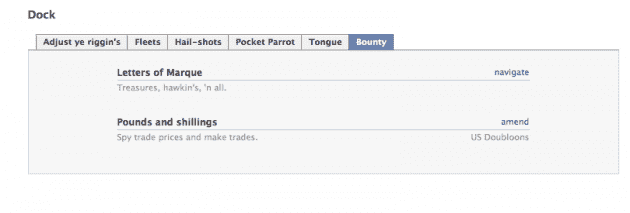
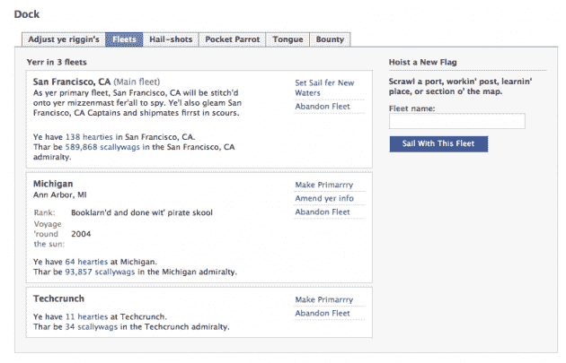

# 脸书又一次在网络 上举办了“像海盗一样说话日”

> 原文：<https://web.archive.org/web/https://techcrunch.com/2009/09/19/once-again-facebook-owns-talk-like-a-pirate-day-on-the-web/>

# 脸书又一次在网络上发起了“像海盗一样说话日”

去年，脸书[在](https://web.archive.org/web/20230326021344/https://techcrunch.com/2009/09/15/facebook-launches-its-own-labs-product-called-prototypes/)[海盗日](https://web.archive.org/web/20230326021344/http://en.wikipedia.org/wiki/International_Talk_Like_a_Pirate_Day)上推出了一种新的“海盗”语言，相当搞笑。自然，今年[又回来了](https://web.archive.org/web/20230326021344/http://www.insidefacebook.com/2009/09/18/prepare-yerselves-for-pirate-day-on-facebook-this-saturday/)，而且可能会更棒。

最令人印象深刻的是脸书对细节的关注(甚至连电子邮件和新桌面通知都被翻译了)。在过去的一年里，脸书发生了很大的变化，但看起来他们已经成功地将这一切转移到了“海盗之舌”上。奇怪的是，在盗版语言中唯一看起来不太好的是状态更新按钮，它用代码代替了“to”中的“o”。

去年，FriendFeed 也参加了“像海盗一样说话日”活动，但是到目前为止，他们今年还没有任何消息。当然，他们现在为脸书工作，所以也许他们在那里有所贡献。此外，谷歌似乎还没有在他们的主页上做任何事情来纪念这一时刻，这很奇怪，因为这种日子似乎是他们的拿手好戏。但是从去年开始,[谷歌盗版](https://web.archive.org/web/20230326021344/http://www.google.com/webhp?hl=xx-pirate&tab=iw)仍然存在。

下面找到一些脸书盗版的截图。要自己使用脸书的盗版语言，点击主页右下角的语言链接(你也可以在设置部分更改)。

