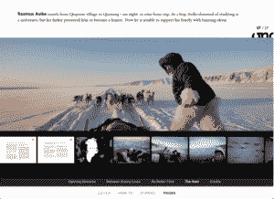

# Once Magazine 为您的 iPad 带来引人注目的新闻摄影技术 

> 原文：<https://web.archive.org/web/http://techcrunch.com/2011/10/14/once-magazine-brings-compelling-photojournalism-to-your-ipad/>

你还记得新闻摄影和摄影报道曾经是新闻阅读体验中更重要的部分吗？诚然，那是印刷出版业独领风骚的时代，以图片为中心的新闻杂志是美国出版业中发行量最高的期刊。没有比《生活》杂志更好的例子了，它在巅峰时期每周售出 1350 万份。

然而， [Life 的](https://web.archive.org/web/20230205034342/http://en.wikipedia.org/wiki/Life_(magazine))印刷版在这些年里慢慢消失了(在多次重新启动后，终于在 2007 年关闭了印刷版)，正如数字技术迫使出版商和媒体机构改变其内容的分发和货币化方式一样，新闻摄影似乎也迫切需要一针强心剂。

由于我们智能手机上的摄像头和无数的照片应用程序和工具，使得存储、显示和分享我们的照片变得轻而易举，摄影和照片分享已经变得越来越受欢迎。虽然在线相册和幻灯片已经变得无处不在，但真正呈现叙事(甚至分享新闻)的高质量新闻摄影和图片故事还没有实现飞跃。

[初创公司 Once Magazine](https://web.archive.org/web/20230205034342/http://oncemagazine.com/) 于 8 月份在 App Store 上正式发布了第一期，它希望通过提供一系列专门为 iPad 编辑和设计的策划图片故事，为新闻摄影注入新的活力。与专业摄影师和作家合作，创造完整的故事，而不仅仅是从网上聚集的照片(这里没有幻灯片)，Once 希望接触到所有喜欢摄影故事的人，无论他们认为自己是专业人士还是 Instagram 的临时用户。这是平板电脑时代的生活杂志。

(为了充分披露，我应该说，我已经认识创始人和编辑好几年了，并认为他们是亲密的朋友。虽然我在该杂志中没有个人经济利益，但我承认我有偏见，因为我希望他们获得名誉和荣耀。虽然，不可否认的是，这可以适用于我报道的所有创业公司。)

虽然印刷出版和新闻摄影可能会步恐龙的后尘，但每天，人们都会向他们的脸书和 Flickr 画廊、Path 和 Instagram 上传数百万张图片，而且对以不值得打盹的叙事方式呈现的引人入胜和可共享的图片内容的需求仍在不断增长。([刚问曲目](https://web.archive.org/web/20230205034342/https://techcrunch.com/2011/10/14/your-photos-as-stories-tracks-goes-after-the-experience-graph-with-new-ios-app/))。)

然而，由于 iPad 用户目前求助于在 Safari 中查看照片库和故事，而摄影师仍然固定在照片预算以光速枯竭的印刷出版物上，Once 希望利用销售数据的新可用性和网络读者消费习惯的变化，提供一种新的解决方案。

在这个行业中，贡献者努力从他们的数字内容中赚钱，出版物也同样竭尽全力赚钱，Once 希望提供一种补偿(和收入)模式，可以解决这两个痛点。首先，该杂志最初在 App Store 上免费推出[，但今天该团队发布了新的付费版本，这意味着它的问题现在既可以在应用内购买，也可以通过打折的月度订阅获得。(其费用分别为每期 2.99 美元或每月 1.99 美元，重复计费。)](https://web.archive.org/web/20230205034342/http://itunes.apple.com/us/app/once-magazine/id458029981?mt=8)

 为了吸引摄影师，Once 将把 App Store 销售的所有收入分成两半(当然是在苹果拿走 30%的分成之后)。目前，该杂志是免费广告，但展望未来，Once 将慢慢加入广告，并将开始通过应用商店销售流行照片的实体照片。

虽然 Once 仅上线一个多月，但这家初创公司的独特模式已经将[戴夫·艾格斯](https://web.archive.org/web/20230205034342/http://en.wikipedia.org/wiki/Dave_Eggers)(获奖作家、《野生动物在哪里》的编剧之一，也是《麦克斯威尼》和《826 瓦伦西亚》的创始人)以及普利策奖获奖摄影师[文森特·拉福雷](https://web.archive.org/web/20230205034342/http://en.wikipedia.org/wiki/Vincent_Laforet)加入其顾问委员会。更重要的是，像[克雷格·沃克](https://web.archive.org/web/20230205034342/http://www.pulitzer.org/works/2010-Feature-Photography)这样的普利策奖获奖摄影师，他们为一个私人测试版贡献了作品，继续排队参加这个曾经的实验。

这似乎主要是因为该杂志是专门为 iPad 设计的。从一开始，这就是重点——不像大多数出版物的轨迹，它们从印刷产品开始，然后粗暴地将其离线内容转移到数字媒体和应用商店。希望从零开始将允许 Once 绕过传统印刷模式固有的包袱，并在竞争中领先一步。

至于杂志的内容，一般来说，每期《Once》会包括三个专题故事，每个专题故事都由一篇多页长的短文介绍。每个专题将包括平均 20 至 25 张照片，并辅以字幕、音频剪辑和互动图形。

由于 iPad 2 显示屏的高分辨率(每英寸 132 像素，分辨率为 1024×768 像素)，在 iPad 上浏览这些照片比阅读纸质杂志更令人愉快。界面直观，易于使用，并提供足够的补充铃声和口哨声，而不会分散对展览明星的注意力:令人兴奋的照片。

当然，专注于 iPad 的杂志的一个问题是，Once 没有吸引现成读者的优势。虽然该团队不必担心传统上与印刷出版相关的成本(和开销)，但用户获取无疑将是这家初创公司前进的最大障碍。为了克服这一点，朋友兼 Once 创始人杰克逊·索尔维告诉我，该团队正在考虑各种方式与现有出版物合作，可能会向高流量网站提供他们故事的挑逗版本，以换取 Once 应用程序的突出链接。

 更重要的是，随着苹果[在所有支持 iOS 5 的设备上突出显示报摊](https://web.archive.org/web/20230205034342/https://techcrunch.com/2011/10/12/the-ios-newsstand-is-open-for-business/)，这很可能成为下载和眼球的绝佳来源，不仅是一次，而是所有出版商。

正如 Nomad Editions(其分享模式与 Once 类似，但贡献者的 rev 分享比例较小)的首席执行官马克·埃德米斯顿(Mark Edmiston)最近告诉约翰尼·比格斯(Johnny Biggs)的那样，以前发现自己的纯应用书籍在生活应用的弹幕中丢失并被读者忽略的出版物，Newsstand 允许他们将内容放在前面和中心，他认为这对出版商的未来将是一个福音。

由于 Once 团队由之前在 Wired、Getty Images、McSweeney's 和 Mother Jones 工作过的人组成，因此有大量的出版经验，但由于 50:50 的 rev-sharing 模式，以及价格设定在不会吓跑潜在读者的水平，这家初创公司将不得不出售大量问题以维持运营。为了帮助寻求盈利，该团队在 3 月份筹集了一笔小规模的种子资金，目前正在积极寻求更大规模的第二轮融资。

有了一个设计精美的应用程序，其中包含一些著名摄影记者的惊人摄影作品，Once 实验已经有了一个良好的开端，但最大的问题是:这家初创公司的 rev-share 模式能否证明比当前的行业实践更能为摄影师和编辑带来利润——他们是否在利用摄影新闻的未来？或者这只是另一个错误的开始？

加入进来，让我们知道你的想法。[并在这里的 App Store 结账一次](https://web.archive.org/web/20230205034342/http://itunes.apple.com/us/app/once-magazine/id458029981?mt=8&ign-mpt=uo%3D4)。