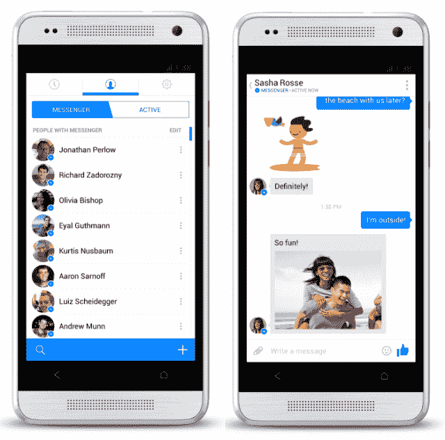
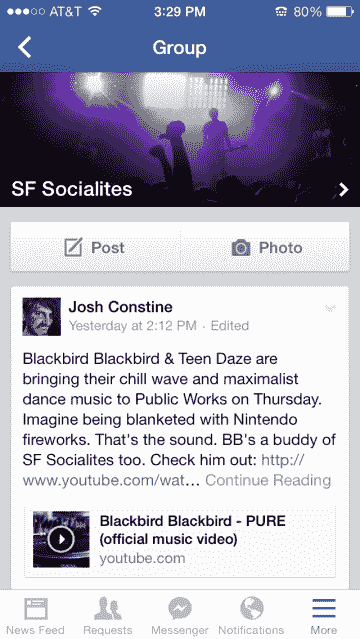

# 脸书征服移动市场的阴谋:粉碎自己

> 原文：<https://web.archive.org/web/https://techcrunch.com/2014/01/29/one-app-at-a-time/>

瑞士军刀不要在手机上切。打包太多的功能会使应用程序看起来臃肿而缓慢。也许比任何一家公司都更难让脸书繁忙的网站适应小屏幕。但通过 11 月份与脸书首席执行官马克·扎克伯格及其 Messenger 团队的谈话，一项让社交网络感觉跨设备倾斜的战略成为焦点。脸书计划一次征服一个应用程序。

考虑到脸书在独立应用上的两次尝试都以失败告终，你认为这很奇怪是情有可原的。

脸书在 2012 年建立了自己的[独立相机应用](https://web.archive.org/web/20230404054324/https://techcrunch.com/2012/05/24/facebook-camera/)，用于拍摄、过滤和分享照片，因为它目睹了 Instagram 的人气飙升。但脸书在 Camera 推出之前就收购了 Instagram，之后就再也没有发展。

2012 年 12 月，脸书在 12 天内克隆了 Snapchat，[将其命名为 Poke，](https://web.archive.org/web/20230404054324/https://techcrunch.com/2012/12/21/facebook-poke-app/)一款用于发送自我删除文本、照片和视频的应用。脸书曾有意收购 Snapchat，但遭到拒绝，因此它开发了自己的版本。但是有机社区的缺乏和对脸书隐私根深蒂固的担忧导致 Poke 迅速淡出，几乎没有对 Snapchat 造成影响。

现在脸书已经放弃了相机和扑克。虽然它们仍然可以在 App Store 中使用，但该公司向我证实，它们已经贬值，不会再得到更多的积极开发。

但是脸书寻求建立一个独立应用的军火库才刚刚开始。

正如首席执行官马克·扎克伯格在今天的财报电话会议上所说，“我们在 Messenger、Groups 和 Instagram 等产品上的工作应该明确的一个主题是，我们对脸书的愿景是创造一系列产品，帮助你与任何你想要的观众分享任何你想要的内容。”

华尔街似乎喜欢这种说法。脸书的股价在盘后交易中上涨了 12%，如果它在明天开市前保持在 60 美元的历史高点。

## 释放 Messenger

11 月，当我驱车前往位于 Hacker Way 1 号的脸书门洛帕克总部时，迎接我的是一个熟悉的 15 英尺高的大拇指。但在几周前，脸书大学校园入口处的广告牌上已经印有它未来的象征:新的信使图标。如果有任何疑问，推出完全重新设计的 Messenger 应用程序对该公司来说是一件大事。

在过去的一年里，它目睹了轻薄时尚的消息应用程序在世界各地大受欢迎，它们使用人们的电话簿来启动他们的社交图表。WhatsApp 是 Messenger 最大、最直接的竞争对手，它现在拥有[4.3 亿用户](https://web.archive.org/web/20230404054324/https://techcrunch.com/2014/01/20/whatsapp-dld/)。得益于脸书无法企及的增长，中国的微信拥有 2.72 亿活跃用户。截至 11 月，日本贴纸信息应用 [Line 拥有 3 亿用户](https://web.archive.org/web/20230404054324/http://www.engadget.com/2013/11/25/line-messaging-app-300-million/)，拥有自己游戏平台的韩国 [KakaoTalk](https://web.archive.org/web/20230404054324/http://www.techinasia.com/10-helped-kakaotalk-grow-startup-giant-live-blog/) 拥有 1.3 亿用户。与此同时，脸书正面临来自谷歌的移动聊天工具 messenger 和 Twitter 新推出的直接消息的日益激烈的竞争。

于是脸书着手[重建信使](https://web.archive.org/web/20230404054324/https://techcrunch.com/2013/11/13/facebook-phone-number-messenger/)。11 月，它上市了，我有机会和它的开发团队坐在一起:产品设计经理卢克·伍兹、产品经理彼得·马丁纳奇和脸书增长和分析副总裁哈维尔·奥利万。2011 年 3 月，脸书收购了 Beluga，这款更名版的群发信息应用终于有了自己的身份。你可以在下面观看我对脸书总部团队的采访:

这一设计得到了彻底的革新，与脸书蹩脚的一体化主应用程序的外观大相径庭。沉重的脸书蓝顶横幅不见了。事实上，“脸书”这个词几乎没有出现在 Messenger 中，它的标志和海军色调也被取消了。相反，它充满了轻松的空白和简化的导航。

伍兹自豪地向我解释说:“你可以看出这是一个不同的应用程序。这不像以前的信使。图标不同，颜色也不同。我们想让你认识到这是新的。随着时间的推移，我们会让它变得越来越独特，越来越清楚它是一个独立的产品。”

 Messenger 甚至听起来都不一样。它有自己的一系列精心编写的发送和接收信息的音调，但也有一些新的，比如一点点键盘敲击声，告诉你你的对话伙伴正在打字。它针对脸书的可爱贴纸进行了优化，让人们快速生动地表达复杂的情绪。新的指标告诉你，如果一个朋友在网上，在没有 Messenger 的手机上，或者安装了 Messenger，将更有可能快速响应。

脸书甚至允许你给不在脸书的人发信息。Martinazzi 告诉我“在你的生活中有很多图表。你发过邮件的每个人，你的手机上都有你的通讯录，你还有你的脸书图表。”脸书集成了这些功能，让你可以在 Messenger 中通过电话号码给别人发短信，这样，如果你想与之交谈的人在社交网络上没有个人资料，你就不必再使用短信了。这一直是脸书信息竞争对手的一个话题，现在已经被消除了。

但最大的变化不是应用程序的外观或工作方式，而是你如何使用它。11 月，在第三方开发者闭门会议的舞台上，扎克伯格坦率地和我谈论了 2014 年脸书的移动市场:

> “我们对 Messenger 做的另一件事是，一旦你有了独立的 Messenger 应用程序，我们实际上就把 Messenger 从脸书的主应用程序中去掉了。我们这样做的原因是，我们发现，在脸书应用程序中把它作为二等品，会让回复信息有更多摩擦，所以我们希望人们在这方面使用更专注的体验。”

扎克伯格将主应用中的功能称为“二等品”,这是他如何看待脸书移动战略演变的一个重要指标。

此前，脸书的主要应用程序有自己的消息选项卡，如果你也有 Messenger，这是多余的，令人困惑。不清楚该用哪个来回复，加载整个主要的脸书应用程序来获取信息也很慢。因此，脸书重新推出了这款应用，如果你安装了 Messenger，但在脸书应用中点击“消息”标签，你会很快切换到 Messenger 应用。

Olivan 告诉我“我们已经意识到，我们试图在同一个应用程序中同时放入太多的东西。”Martinazzi 接着强调:“要做移动业务，你必须时刻保持速度。独立应用程序加载速度更快。”

被弹来弹去有点奇怪，应用程序切换取代了从家里移植到脸书 iOS 应用程序的令人愉快的叠加消息气泡，称为聊天头。但总的来说，新的 Messenger 给人的感觉是它实际上是为移动设备而设计的，而不是被脸书的网站塞进一个小屏幕里。

而且用户喜欢。马克·扎克伯格今天在脸书 2013 年第四季度收益电话会议上表示，“在过去的三个月中，使用 Messenger 的人数增长了 70%以上，我们看到发送的消息数量也有了大幅增长。今年上半年，我们将推出更多 Messenger 产品。”

然而，这并不是脸书唯一开发的应用。扎克伯格希望将这种感觉和参与度增加到更多的功能中。

## 一流的独立演员

在舞台上，面对一群第三方开发者和员工，但没有媒体，扎克伯格坦率地与我谈论了 2014 年脸书的移动业务将会是什么样子。我询问了他对分拆脸书功能的想法，以吸引手机至上的年轻观众。扎克伯格说(强调我的):

> 我们刚刚发布了这个大型 Messenger，Instagram 的到来确实塑造了我们的想法，即如何建立这些社区，并在全球范围内最大限度地发挥一个应用程序的影响力，而不是本地影响力。因此，我认为我们在脸书移动应用程序中已经有一段时间的想法是，我们可能会添加的**体验，无论是团体还是活动**或类似的事情，都可以影响到很多人，因为绝大多数手机都有脸书，人们每天都在使用脸书。
> 
> 人们在移动设备上花费的时间大约有 20%是在脸书，因此将这些经历捆绑在一起是播种它们的好方法。**但如果你有类似群组的东西，它在脸书的主要应用程序中总是处于二等地位，**或者甚至是消息传递。**为了让这些事情能够真正发挥出它们的全部潜力，我认为随着时间的推移，我们必须创造更多具体的体验。**您现在看到我们通过 Messenger 做到了这一点…
> 
> …现在有一个大问题，我们不知道这种情况会持续多久。是的，显然你不想有 30 个不同的脸书应用程序。所以我们需要弄清楚它到底会走向何方，但总的来说，我确实认为随着时间的推移，你会想要走向更多这些专注的体验。

脸书在重组人才方面做了大量工作，这样每个团队都可以开发自己的移动产品。在今天的收益电话会议上，它宣布首次超过了一半，现在其广告收入的 53%来自移动。但是，扎克伯格在上面的引用中揭示的向独立应用程序的转变，真正使脸书成为“移动优先公司”。

在接下来的一年里，我们可能会看到脸书给小团队更多的自由来构建应用程序，这些应用程序可以确定特定的用例并取悦特定的受众。这与 The Verge 的 Ellis Hamburger 的消息来源一致，该消息来源称脸书计划在 2014 年推出一套独立的应用程序。今天，在脸书 2014 年第四季度财报电话会议上，扎克伯格证实，公司专注于开发独立的应用程序，让人们与不同规模的受众分享不同类型的内容，而不是通过新闻订阅分享给所有朋友。

正如扎克伯格所建议的，群组和事件可以是两个分开的功能。早在 2010 年 10 月，脸书就推出了以网络为先的产品 Groups，自脸书开始认真对待移动业务以来，它一直没有太大变化。但今天，扎克伯格说现在有超过 5 亿人使用脸书群，暗示脸书可能会试图利用这种兴趣开发一个独立的群应用程序。

与此同时，事件已经成为脸书最独特的特征之一。这是一个组织和推广生日聚会、文化活动、俱乐部之夜等活动的热门场所。虽然 Eventbrite 经常被组织者用来举办售票活动，但对于聚集人们参加免费活动来说，脸书无疑是最受欢迎的选择。一个独立的活动应用程序可以为用户提供即将到来的活动的日历，发现他们没有被邀请的附近活动，以及他们朋友的生日，这可能会在脸书最外向的用户中获得巨大的吸引力。

很快，脸书预计将推出一种全新的新闻阅读体验，我们在一年前第一次听到这种体验。最近， [Re/code 的 Mike Isaac 报道说](https://web.archive.org/web/20230404054324/http://recode.net/2014/01/14/facebook-could-launch-its-flipboard-like-news-reader-this-month/)这种产品被称为 Paper，它将让人们分享来自各种出版商及其朋友的新闻故事，其中一些故事是由脸书的人类编辑策划的。

[ **太平洋标准时间 2014 年 1 月 30 日上午 5 点更新**:脸书今天宣布即将推出 [Paper，一款策划的视觉新闻阅读器应用](https://web.archive.org/web/20230404054324/https://techcrunch.com/2014/01/30/facebook-paper/)，很好地实现了这一独立应用战略。iOS 应用由脸书创意实验室打造，这是一项新举措，旨在让公司内部的小团队建立新的体验，而不用担心会搞砸核心的脸书应用。]

所有这些都围绕着扎克伯格在今天的财报电话会议上概述的一个新观点:人们不只是想立刻与所有的朋友分享。他们希望与各种规模的观众分享不同类型的内容。这意味着与爱人、一小群朋友、一大群熟人或普通大众分享状态更新和照片，以及链接、游戏、聚会等。

这种灵活性让脸书可以托管你以前害怕分享的内容，因为你害怕惹恼兴趣不同的人。自脸书推出以来的近 10 年里，“脸书朋友”这一称谓发生了很大变化。虽然曾经只是来自同一所大学的人，但现在它包括了家庭、同事和远方的熟人。只有这么多适合与大家分享。

脸书试图让我们建立可以刺激“微共享”的好友列表，但失败了，但催化剂可能会为不同的共享社区提供完全不同的应用。如果这一策略奏效，它可以保护脸书免受单一用途手机竞争对手的“千刀万剐”。

扎克伯格在财报电话会议结束时表示:“我们希望打造一些与你所认为的今日脸书不同的伟大体验。”。让世界变得更加紧密的途径是从切断脸书与自身的联系开始。

*【图片鸣谢: [Shutterstock](https://web.archive.org/web/20230404054324/http://shutterstock.com/) 合成；克里斯托夫·陶齐埃*