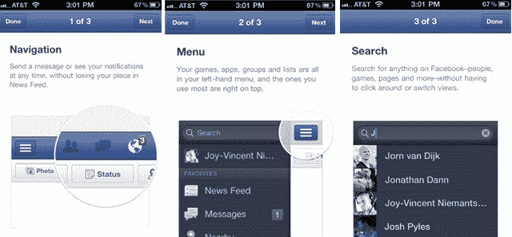
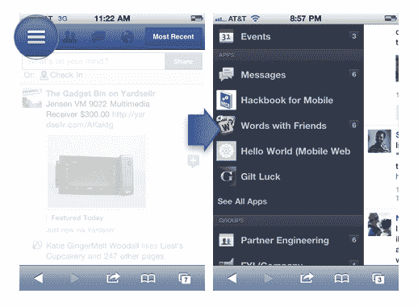

# 一款应用统治一切 

> 原文：<https://web.archive.org/web/http://techcrunch.com/2011/10/10/one-app-to-rule/>

这不是我的老朋友吗[新的脸书应用开发者页面](https://web.archive.org/web/20230203060211/https://developers.facebook.com/docs/guides/mobile/) …是的，[几周前神秘更新的](https://web.archive.org/web/20230203060211/https://techcrunch.com/2011/09/28/this-sure-looks-a-lot-like-facebooks-project-spartan-screenshots/)脸书移动开发者页面正式上线，解释了同步的脸书移动平台将如何在其 iPhone、iPad、web 以及最终的 Android 应用上工作(有时这些事情是如此虎头蛇尾)。

而且，不像我下载新的脸书 iPhone 应用程序时得到的简单的三步教程(见下)，这个[开发者情况说明书](https://web.archive.org/web/20230203060211/https://developers.facebook.com/docs/guides/mobile/)有更多关于这些变化背后的动机的信息。

从表面上看，新的移动脸书体验的核心是让应用开发者对脸书平台感到满意和满足。在今天发布的更新中，网络应用和 iOS 应用现在都有突出的朋友、信息和通知图标。脸书强调，如果用户受到朋友的邀请，通知将允许用户关注指向 iOS 或网络应用的链接，这是对开发者共生关系的认可——同样，用户将能够通过点击新闻订阅中的链接来访问应用。

该文件还表明，脸书希望成为所有应用聚合者的另一个标志 Timeline 将很快进入移动领域。

也许让他们的开发者在脸书的跨平台移动集成中感到温暖舒适的最大一步是书签，它允许你从脸书移动内部导航到一个应用程序。书签对于寻求增加病毒传播的开发者来说是一个福音；我已经下载了一个 iOS 应用程序，仅仅因为它被脸书(“与朋友交谈”)收藏了，我认为脸书将推动足够的应用程序下载，从而能够收取会员费。脸书告诉脸书内部人士，他们的政策是不“讨论这些细节”

【T2

也许新功能中唯一不完全是开发者升级版的是[规定开发者不能在他们的 iOS 原生或网络应用上使用脸书积分](https://web.archive.org/web/20230203060211/http://www.businessinsider.com/facebook-caved-to-apple-on-mobile-platform-2011-10)，但即使这样也因为脸书和苹果都拿同样的 30%提成而减轻了——所以无论如何开发者都被骗了。

虽然你认为他们最终会将两者联系起来，但我的脸书 Web 应用程序目前只能让我选择访问具有相应 HTML5 应用程序的应用程序，我的脸书 iOS 应用程序只能显示具有相应 iOS 应用程序的应用程序。我问脸书他们是否会在所有平台上同时包含 HTML5 和 iOS 应用，他们还没有回复我。

或许是因为他们仍然在扩充应用程序？他们的 HTML5“应用展示”目前是 [slim pickins。](https://web.archive.org/web/20230203060211/http://www.facebookmobileweb.com/showcase/)