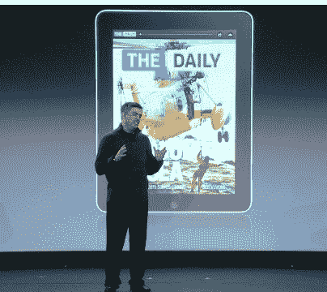

# 一键订阅 iPad 

> 原文：<https://web.archive.org/web/http://techcrunch.com/2011/02/02/one-click-subscriptions-come-to-the-ipad/>

# 一键订阅来到 iPad

苹果高管 Eddy Cue [今天](https://web.archive.org/web/20230202235832/https://techcrunch.com/2011/02/02/the-daily-event-liveblog-follow-along-as-the-newspaper-hits-the-information-age/)在*每日*发布会上宣布，正如预期的那样，苹果将启用新闻应用的订阅价格。每周(99 美分)或每年(39.99 美元)将有一次点击订阅账单。苹果从日报开始，但是库伊说“你将很快听到其他出版物的公告。”

Cue 还指出，到目前为止，消费者已经下载了超过 2 亿个新闻应用程序，而且这还不包括订阅费用和普遍较差的体验。订阅计费解决了媒体公司的商业模式问题，但现在他们必须创造出引人注目的产品，让人们不仅愿意付费，而且愿意长期付费。

当被问及*日报*是否会出现在其他平板电脑上时，鲁珀特·默多克说，“随着其他平板电脑的出现，我们希望出现在所有主要的平板电脑上。”但他也指出，“我们相信今年，也许明年属于苹果。”

**相关**:

[每日动手操作(演示视频)](https://web.archive.org/web/20230202235832/https://techcrunch.com/2011/02/02/daily-demo-video/)

[每日事件 Liveblog:跟随报纸进入信息时代](https://web.archive.org/web/20230202235832/https://techcrunch.com/2011/02/02/the-daily-event-liveblog-follow-along-as-the-newspaper-hits-the-information-age/)

[日报是给谁看的？](https://web.archive.org/web/20230202235832/https://techcrunch.com/2011/02/02/who-is-the-daily-for/)

[默多克:《每日邮报》的价格是每天 0.14 美元，或者每周 0.99 美元](https://web.archive.org/web/20230202235832/https://techcrunch.com/2011/02/02/murdoch-the-daily-will-cost-0-14-per-day-or-1-per-week/)

我们会看到《每日邮报》的安卓版的几率有多大？

[鲁珀特·默多克:“新时代需要新新闻”](https://web.archive.org/web/20230202235832/https://techcrunch.com/2011/02/02/rupert-murdoch-new-times-demand-new-journalism/)