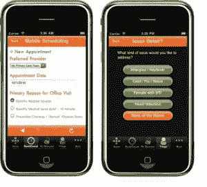

# One Medical 为现代医生办公室筹集了 2000 万美元 TechCrunch

> 原文：<https://web.archive.org/web/https://techcrunch.com/2011/09/05/one-medical-raises-20-million/>

现在是 2011 年，但是当谈到面向病人的技术时，大多数医生的办公室仍然停留在 20 世纪 90 年代。接待员可能有一台电脑来管理预约，但通常你仍然在纸上签名，在剪贴板上填写表格，你的医生依靠一捆松散的纸来检查你的医疗记录。汤姆·李(Tom Lee)正试图通过一家医疗集团(One Medical Group)彻底改变这种状况，这家由风险投资支持的初级保健机构是他几年前创立的，他目前担任首席执行官。

周五，他完成了由 Maverick Capital 领投的 2000 万美元的 E 轮融资，Benchmark、Oak Investment 和 DAG Ventures 也参与了融资。新一轮融资使自 2007 年以来筹集的资金总额达到 4650 万美元。

One Medical 在旧金山和纽约运营着 9 家医生诊所，今年将再开 5 家，并扩展到硅谷和华盛顿特区。患者可以在线预约、请求处方、获得数字化的实验室结果，并在线查看他们的个人健康总结。医生可以通过电子方式访问病历(一家医疗机构设计自己的电子病历时考虑的是医生和患者，而不是管理员)。拥有数字医疗记录的一个好处是，病人可以去任何诊所，因为每个医生都可以访问他们的记录。

 
新患者可以在线加入，并在线支付。它甚至有自己的 iPhone 应用程序来安排约会。可以通过电子邮件或 iPhone 应用解决的简单问题都以数字化方式完成，而不需要亲临现场。当病人进去时，办公室明亮、通风、现代。

所有这些技术都是现成系统和专有系统的结合，旨在降低管理成本，改善医生和患者的体验。Lee 将他的方法与 20 世纪 90 年代的医师实践管理运动进行了对比，这是一种投资时尚，将数百家医生办公室整合为更大的运营公司。“90 年代的 PPM 运动没有从根本上重新设计医生办公室的工作流程或改善体验，”Lee 说。ppm 是由管理员驱动的。一个医疗是医生推动的。它的方法是“重新设计医生的办公室，以更少的管理费用更加以病人为中心。”

大多数初级保健医生办公室每名医生雇用 3.5 至 4.5 名辅助人员，而一个医疗办公室只有 1.5 名或更少的辅助人员。它如何处理这些效率收益？“我们将这些投资重新投入到医患关系中，”Lee 解释道，“这样他们就有更多的时间来回答问题，并就医疗保健选择进行深入的讨论。”一家医疗机构接受大部分保险，但也收取 149 美元至 199 美元的年费，以支付所有额外的额外费用。

李开复本人在受够了医疗保健系统并去斯坦福大学商学院之前就接受了医学博士的培训。随后，他成为了 Epocrates 的联合创始人，这是一款受欢迎的移动应用程序，医生使用它来查找药物相互作用和护理患者。Lee 领导了 Epocrates 的移动和网络产品的设计。现在，他正在利用技术重新设计整个初级保健体验。