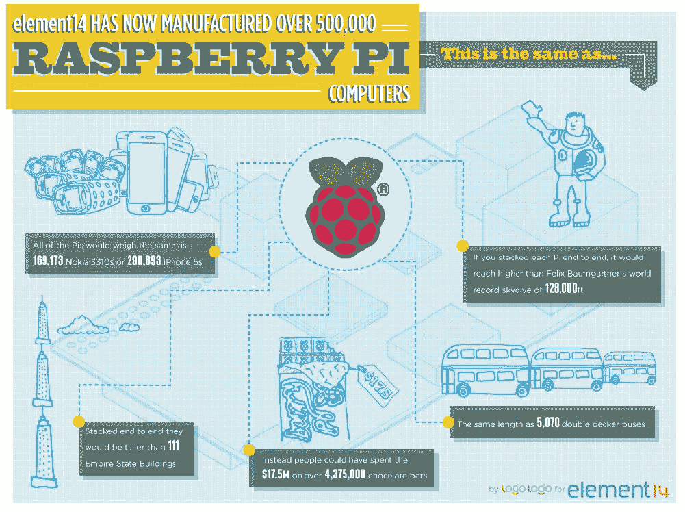

# 自推出以来，已售出 100 万块 Raspberry Pi 板 

> 原文：<https://web.archive.org/web/https://techcrunch.com/2013/01/12/one-million-raspberry-pi-have-been-sold-since-launch/>

# 自发布以来，已经售出 100 万块树莓 Pi 板

伴随着围绕 CES 的喧嚣，我们遗憾地错过了这个令人惊叹的里程碑，这是我很久以来见过的最伟大的小项目之一，[树莓派](https://web.archive.org/web/20221124021505/https://beta.techcrunch.com/tag/raspberry-pi/)。[到目前为止，这种微型计算机](https://web.archive.org/web/20221124021505/http://www.raspberrypi.org/archives/3011)估计已经售出一百万台，对于一个 35 美元的微型电路板来说，这是一个惊人的壮举，它可以直接启动到 Linux 的精简版本中。

element 14/Premier Farnell 公司的人今天宣布，仅他们一家就制造并销售了超过 50 万个树莓馅饼。他们只是两家官方经销商之一；我们还没有来自 RS Components 的最新数据，但是 Farnell 的消息表明我们已经卖出了第一百万个 Raspberry Pi。

为了庆祝，该公司发布了这个可爱的信息图，告诉我们，如果首尾相连，100 万个 Pis 将比 111 个帝国大厦还要高。

我们详细介绍了与 Pi 相关的[独特制造挑战](https://web.archive.org/web/20221124021505/https://beta.techcrunch.com/2012/12/24/making-raspberry-pi/),每天有 4000 个树莓 Pi 离开英国工厂，即每 7.5 秒一个。

Raspberry Pis 最终成为了迷你街机机柜和 DIY GSM 基站的大脑。它还运行 RISC 操作系统，更重要的是，这是孩子们学习如何使用电脑的一个好方法，而不用在硬件上花很多钱。

 *图片来自[法内尔/element14](https://web.archive.org/web/20221124021505/http://uk.farnell.com/)*