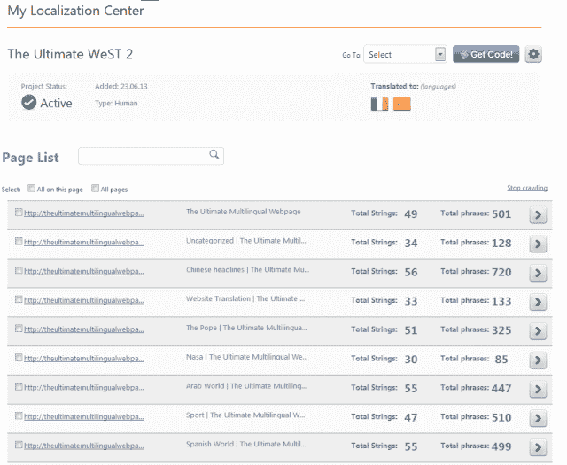
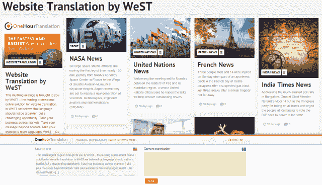

# 一小时翻译的专利技术能够快速准确地实时翻译在线内容 TechCrunch

> 原文：<https://web.archive.org/web/https://techcrunch.com/2013/08/11/onehourtranslation/>

# 一小时翻译的专利技术能够快速准确地实时翻译在线内容

[一小时翻译](https://web.archive.org/web/20230131010543/http://www.onehourtranslation.com/)成立于 2008 年，是历史最悠久、规模最大的在线翻译公司之一，在 100 个国家拥有超过 15，000 名活跃的翻译人员，涵盖超过 75 种语言。这家总部位于塞浦路斯的公司每月处理 100，000 个项目，客户范围从需要企业级多语言内容管理系统的大公司(包括丰田和壳牌)到寻找更好的替代方法来剪切和粘贴内容到 Google Translate 的小公司。

在过去的五年中，一小时翻译公司的首席执行官兼创始人 Ofer Shoshan 发现，随着公司寻求多元化进入全球市场，对在线翻译的需求不断增加。

“当某些市场出现金融危机时，我们看到这些市场的客户希望开始获得国际客户，”Shoshan 说。“在这种背景下，翻译市场表现不错。这是一个巨大的市场，去年价值超过 300 亿美元。”

尽管现在有许多在线翻译服务(包括 [Gengo](https://web.archive.org/web/20230131010543/https://techcrunch.com/2013/04/22/translation-platform-gengo-raises-12m-funding-round-led-by-intel-capital/) 、 [Conyac](https://web.archive.org/web/20230131010543/https://techcrunch.com/2013/06/27/conyac/) 和 [Dakwak](https://web.archive.org/web/20230131010543/https://techcrunch.com/2013/07/04/dakwak/) )，Shoshan 说一小时翻译的优势在于其规模、速度和专利技术。

该公司的专有产品包括其最新产品 [WeST](https://web.archive.org/web/20230131010543/http://www.onehourtranslation.com/translation/website-translation) (网站翻译的简称)。WeST 允许管理员通过插入几行代码为他们的网站添加多语言支持。一旦实施，WeST 会绘制所有网站文本，并自动向人工翻译发送更新。这允许持续翻译内容。一小时翻译的翻译记忆云是其另一项专利技术，通过消除重复短语的费用来降低翻译成本。该公司的平台还允许翻译的实时同行编辑，以保证质量。

虽然技术提高了翻译的速度和准确性，但一小时翻译最重要的资源仍然是其 15，000 名翻译，他们必须通过考试才能开始为公司工作。翻译人员只将内容翻译成他们的母语，包括专门从事文案和应用程序本地化以及法律、医疗和金融文档的人员。

想试试一小时翻译吗？该公司为第一批使用这个链接的 1000 名 TechCrunch 读者提供免费的主页翻译(任何一种语言多达 200 个单词)。