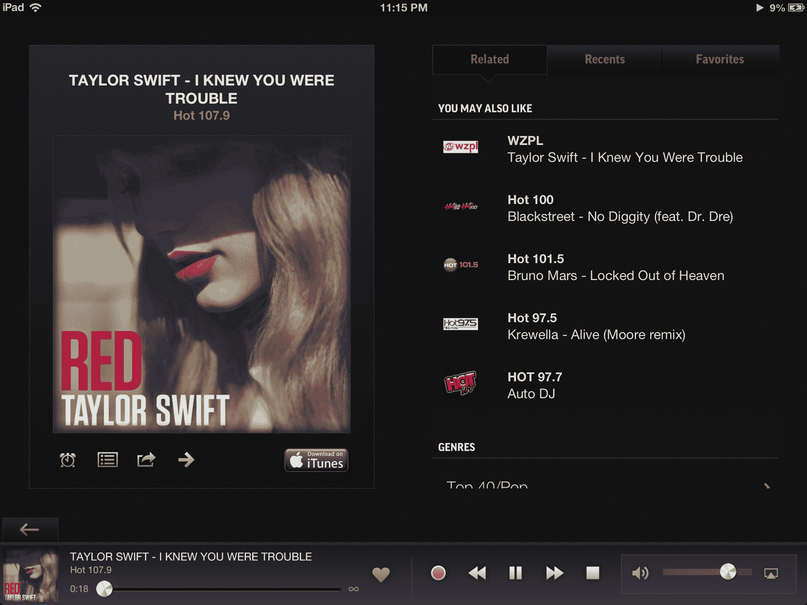

# 在线广播服务 TuneIn 增加了推荐引擎和 Google+登录集成 

> 原文：<https://web.archive.org/web/https://techcrunch.com/2013/02/28/online-radio-service-tunein-launches-new-discovery-engine-and-google-sign-in-integration/>

# 在线广播服务 TuneIn 增加了推荐引擎和 Google+登录集成

广受欢迎的在线电台服务 TuneIn 让用户收听来自世界各地的 7 万多家电台，该公司刚刚宣布推出 TuneIn Live，这是该公司帮助听众发现新音频内容的新服务。TuneIn 利用其从每月 4000 多万用户那里收集的数据，现在能够根据用户收听的电台、歌曲和艺术家向他们提供个性化的推荐。

TuneIn 的产品总监 Kristin George 告诉我们，这意味着该服务现在可以“每隔几秒钟推荐刚刚开始播放每个流派新内容的电台。”乔治还强调，“这只是开始。”TuneIn 花了大约 7 个月的时间将这项新技术纳入其服务中，“它现在允许发现发生在我们只梦想的水平上。”TuneIn 首席执行官约翰·唐汉姆(John Donham)在今天的一份声明中写道，该公司拥有 7 万个电台和超过 200 万个点播节目，这意味着该公司“最大的机会是发现”，但大量的内容也“对任何人来说都很难消化”

新的发现引擎现在可以在该公司的网站及其 iPad 应用程序中获得。它将在今年晚些时候登陆其他主要的移动平台。

TuneIn 也是谷歌昨天在 T4 发布 Google+登录的合作伙伴。现在，它已经集成了新的 Google+登录系统，TuneIn 将允许其用户在谷歌日历中为即将到来的直播事件设置提醒(我不确定预约收听广播的需求到底有多少，但我可以想象体育迷可能希望确保他们在自己的球队比赛时调到正确的电台)。