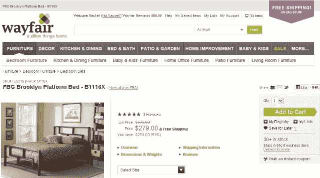

# 在线零售巨头 CSN 商店将其 200 多个购物网站整合为一个品牌:Wayfair.com TechCrunch

> 原文：<https://web.archive.org/web/http://techcrunch.com/2011/09/01/online-retail-giant-csn-stores-rolls-its-200-shopping-sites-into-one-brand-wayfair-com/>

# 在线零售巨头 CSN 商店将其 200 多个购物网站整合为一个品牌:Wayfair.com

**独家报道——**在线家居用品零售商 [CSN 商店](https://web.archive.org/web/20230203104708/http://www.csnstores.com/)在刚刚筹集了[数吨资金](https://web.archive.org/web/20230203104708/http://blogs.wsj.com/digits/2011/06/20/home-goods-retailer-csn-stores-raises-165-million/) ( [在其成立以来的第一轮机构融资中获得了 1.65 亿美元](https://web.archive.org/web/20230203104708/http://www.crunchbase.com/company/csnstores)风险投资)后，今天正在将其 200 多个购物网站整合成一个单一的电子商务网站，归入一个品牌:[Wayfair.com](https://web.archive.org/web/20230203104708/http://www.wayfair.com/)。

更名的传言由来已久，在宣布大规模融资时，该公司公开表示将整合其网站，并将名称改为 Wayfair.com，但今天看到的是新“大型网站”的实际推出。

Wayfair.com 推出了来自 5000 个品牌的 450 多万件商品，从家具到照明、炊具和其他家居和办公用品。

所以，向 CSN 的 200 多个店铺说再见吧，其中一些实际上是非常强大的品牌:从今天开始，Cookware.com、Luggage.com、Strollers.com 和 BedroomFurniture.com 等店铺都将被重定向到新的网站，并在 Wayfair.com 的保护伞下进行品牌和营销。

CSN 商店的首席执行官和联合创始人 Niraj Shah 告诉我，公司将在过渡期间保留域名一段时间，但他们会考虑在适当的时候卖掉它们(意思是当流量下降到足够低的时候，额外的访问者不再那么重要)。

无论从哪个角度来看，现在的 Wayfair.com CSN 商店都是一家主要的电子商务公司，尽管你可能从未听说过它。事实上，仅今年一年，该公司就有望实现 5 亿美元的销售额，高于 2010 年的 3.83 亿美元。

在过去的两年里，它的员工数量增加了一倍多，从 400 人增加到今天的 850 多人。该公司计划在年底前再招聘 200 名员工，使员工总数超过 1000 人。

该公司成立于 2002 年，其主要办事处位于马萨诸塞州的波士顿。

那么，为什么要改变到 Wayfair.com 呢？主要是因为显而易见的品牌原因:该公司长期以来一直在营销许多独立的网站上花费大量资金，现在他们可以专注于只做一个广告。

嗯，可能是三个:公司目前的品牌 [AllModern](https://web.archive.org/web/20230203104708/http://allmodern.com/) 和快闪销售网站 [Joss & Main](https://web.archive.org/web/20230203104708/http://jossandmain.com/) 将与 Wayfair.com 一起保留。

整合独立购物网站的其他原因是搜索引擎优化——在谷歌最近的熊猫更新后，这显然是非常需要的——以及基于购物者的集体购买历史向他们提供建议的新能力。

整个重建工作花了 18 个月(整合还需要 3 到 6 个月完成)，Shah 告诉我，最近获得的 1.65 亿美元融资中的很大一部分将用于“积极”营销和建立新品牌。

你觉得怎么样？

