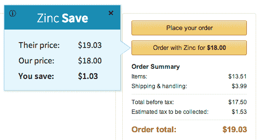

# 在线购物伴侣 Zinc Save 会自动查找顶级零售商的购物折扣 TechCrunch

> 原文：<https://web.archive.org/web/https://techcrunch.com/2014/03/14/online-shopping-companion-zinc-save-automatically-finds-discounts-for-puchases-from-top-retailers/>

网上购物者现在有了一种新工具，可以帮助他们在结账时省钱，而根本不用做太多工作。最近推出的购物伴侣 [Zinc Save](https://web.archive.org/web/20221007005454/https://www.zincsave.com/) 可以帮助你自动找到购物车中商品的最佳价格，然后按照你想要的方式支付，包括通过比特币或 Dwolla。

这项服务既可以作为谷歌 Chrome 的扩展，也可以作为浏览器书签，目前在主要零售商的网站上都有支持，包括亚马逊、沃尔玛、梅西百货和塔吉特百货。

Y Combinator 支持的初创公司由来自麻省理工学院的三位朋友马克斯·科利什、道格·菲格森和王志康创立，他们的灵感来自于他们早期的一个想法，即建立一个在线购物的 API。“许多在线零售商有用于数据检索的 API，但他们没有用于实际购买的 API。我们认为作为第三方，为他们创建这样的网站会很酷，”Kolysh 解释道。

这个仍在开发中的 API 将有助于订单自动化，或者有助于希望拥有自己的通用购物车的代销商网站，购物者可以一次性从多家零售商那里购买商品。但是在开发这个 API 的过程中，团队决定在上面构建他们自己的服务，以便“喂饱”它，这导致了面向消费者的附加组件 Zinc Save 的创建。

Y Combinator 项目进行到一半时，创始人转而全力关注锌储蓄。

“人们只是想省钱。他们不想在每次购物之前花半个小时去寻找最优惠的价格，去不同的网站，找出他们的最佳奖励卡，在 RetailMeNot 上寻找促销代码——整个过程可以很容易地为你节省几美元，”Kolysh 说。但是没人有时间。

有了 Zinc Save，一旦安装到浏览器中，该服务就会为您工作。当你进入你最喜欢的在线零售商的结账页面时，会出现一个新按钮，让你通过 Zinc Save 订购，以便获得折扣并通过你喜欢的方法付款，无论是信用卡还是借记卡，比特币还是 Dwolla。

有时，服务人员会从一个供应商网络中找到同样的商品，这些供应商提供的质量至少与你正要从零售商那里购买的商品相同，甚至更高。其他时候，它会简单地为你找到同一家零售商的折扣。就像省钱的浏览器扩展 [Honey](https://web.archive.org/web/20221007005454/http://joinhoney.com/) 一样，Zinc Save 会在适用的时候自动定位促销代码。但在其他情况下，它也可以暂停订单，等待价格下跌。

“对于亚马逊来说，我们使用动态价格计时，这样我们就可以知道什么时候是购买产品的最佳时间，”Kolysh 说，并指出只有在运输时间和费用不受影响的情况下，它才会暂停购买。

在比较购物的情况下，一些工作仍然是手工的，团队自己在网上搜索以找到最好的交易，然后下订单，客户可以通过 Zinc Save 仪表板进行监控和管理。尽管这个过程对他们来说可能需要更长的时间，但对购物者来说，节省是立竿见影的。Zinc Save 将在购买时计算该物品的预期折扣，即使他们无法找到预期的折扣，也将继续兑现该折扣。

当然，这个想法是，有时 Zinc Save 会发现*比最初向消费者承诺的*节省更多，这就是这项服务开始产生收入的地方。

Zinc Save 还为客户提供了一个集中的仪表板，他们可以在这里跟踪订单，并处理他们的客户服务问题，包括退货。此外，该公司已开始努力发展直接的商家合作伙伴关系，商家可以收到订单通知，并以更好的价格履行自己的库存。

然而，就目前而言，Zinc Save 专注于网上购物，而不是移动商务，后者有自己的一系列问题。

这家总部位于帕洛阿尔托(目前)的初创公司是一个三人团队，除了与 YC 相关的资金外，都是靠自己创业的。Zinc Save 扩展可从[这里下载](https://web.archive.org/web/20221007005454/https://www.zincsave.com/)。

【YouTube http://www.youtube.com/watch?v=GQ-bRdEmwqw？feature = player _ 嵌入式]

图片来源:Flickr 用户[朱塞佩·勒托·巴隆](https://web.archive.org/web/20221007005454/http://www.flickr.com/photos/fosforix/3007393167/)